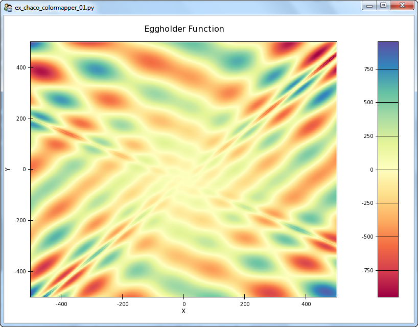
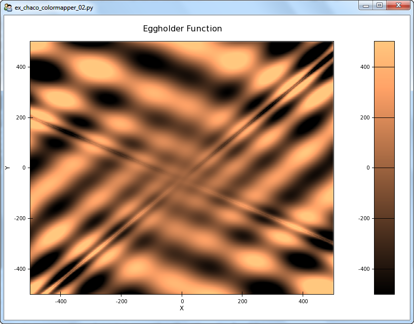
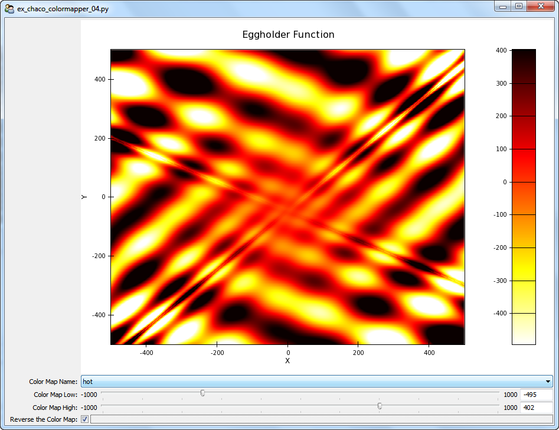

Color Mappers and Image Plots
=============================

.. highlight:: python
  :linenothreshold: 5

.. index::
  pair: Plot; ColorMapper
  single: Function; Eggholder

A colormap allows us to display a matrix of numbers as an image. Optionally, we
can place a colorbar object beside the image to indicate which colors map to
which values.

Chaco Image Plot with ColorMapper
---------------------------------

Let's build a simple Chaco image plot and add a colorbar to it. This
plot uses defaults for the colormap, etc. A lot of things happen automatically::

  ## ex_chaco_colormapper_01.py

  # standard imports
  import os, inspect

  # numpy imports
  from numpy import sin, sqrt,abs, exp, linspace, meshgrid, pi

  # Enthought imports
  from enable.api import Component, ComponentEditor
  from traits.api import HasTraits
  from traitsui.api import Item, Group, View
  from chaco.api import ArrayPlotData, Plot, ColorBar
  from chaco.api import LinearMapper, HPlotContainer

  # defines
  windowSize = (800,600)

  # window title is file name
  windowTitle = os.path.split(__file__)[1]

  class TraitedPlot( HasTraits ):

    # create an interesting scalar field for the image plot
    # Eggholder function
    limitF = 500.0
    xA = linspace(-limitF, limitF, 600)
    yA = linspace(-limitF, limitF, 600)
    ( xMG,yMG ) = meshgrid( xA,yA )
    zMG = -(yMG + 47) * sin( sqrt(abs(yMG + xMG/2 + 47 )))
    zMG = zMG - xMG * sin( sqrt(abs(xMG - (yMG + 47))))

    # Create an ArrayPlotData object and give it this data
    myAPD = ArrayPlotData()
    myAPD.set_data( "Z", zMG )
    myAPD.set_data( "X",xA )
    myAPD.set_data( "Y",yA )

    # Create the plot.
    myTP = Plot( myAPD )

    # add the image plot to this plot object. If we don't specify the colormapper,
    # it defaults to default_colormaps.Spectral
    myTP.img_plot(
        "Z",
        xbounds = (xA[0],xA[-1]),
        ybounds = (yA[0],yA[-1]),
    )

    # add the title and padding around the plot
    myTP.title = "Eggholder Function"
    myTP.padding = 50

    # grids, fonts, etc
    myTP.x_axis.title = "X"
    myTP.y_axis.title = "Y"

    # generate a ColorBar. pulls its colormapper from the myTP Plot object
    myTCB = ColorBar(
      plot = myTP,
      index_mapper = LinearMapper( range = myTP.color_mapper.range ),
      orientation = 'v',
      resizable = 'v',
      width = 40,
      padding = 30,
    )

    # set the padding of the ColorBar to match the padding of the plot
    myTCB.padding_top = myTP.padding_top
    myTCB.padding_bottom = myTP.padding_bottom

    # build up a single container for the colorbar and the image
    myHPC = HPlotContainer( use_backbuffer = True )
    myHPC.add( myTP )
    myHPC.add( myTCB )

    # set up the view for both the graphics and control
    traits_view = View(
        Item(
            'myHPC',
            editor = ComponentEditor(size = windowSize),
            show_label = False,
        ),
        resizable = True,
        title = windowTitle,
    )

  if __name__ == "__main__":

    tp = TraitedPlot()
    tp.configure_traits()

    tp.myTP.color_mapper.print_traits()
    tp.myTP.color_mapper.range.print_traits()

The graphical output is:

   A simple Chaco image plot

.. index
  pair Colormap; Construction

Colormap Construction
---------------------

Let's take more control over this plot. When using a colormap, we want to
map a 2D matrix of numbers (intensities) to various colors. We first construct
an ImageData object which describes the 2D matrix of number that we'll use for
the image source. We next build a DataRange1D instance from the ImageData
instance to describe the range of the values of the ImageData intensities. This
DataRange1D instance will be used to scale the color map. The code is::

  # generate an ImageData instance and add our 2D image data to it.
  myID = ImageData( )
  myID.set_data( zMG )

  # build a DataRange1D instance to describe the ranges of the data in the
  # image data
  myDR1D = DataRange1D( myID )

Finally, we select a colormap function from the default_colormaps.py file. The
colormap names and functions are descibed in the
``default_colormaps.color_map_functions``,
``default_colormaps.color_map_dict``, and the
``default_colormaps.color_map_name_dict`` attributes.
::

  myColorMapperFn = default_colormaps.color_map_name_dict['jet']

The ``default_colormaps`` module provides several functions to modify the
color map. The ``default_colormaps.reverse`` method takes a colormap function
and reverses it.
::

  myColorMapperFn = default_colormaps.reverse( myColorMapperFn )

The ``default_colormaps.center`` method takes in a colormap and centers it
about a particular value. From the documentation,
::

  For example, when passed a DataRange1D(low=-0.5, high=1.0), a colormap would
  usually have its lowest color at -0.5 and its highest at 1.0. Some colormaps
  are designed such that the middle color is special. Using this modifier, the
  example range would be modified to -1.0 and 1.0 to make 0.0 correspond with
  the middle color.

  myColorMapperFn = default_colormaps.center( myColorMapperFn,500 )

The ``default_colormaps.fix()`` method sets the minimum and maximum saturation
values for the colormap.

  myColorMapperFn = default_colormaps.fix( myColorMapperFn,(-500,500) )

We can also use the ``myTP.color_mapper.range.low_setting`` and
``myTP.color_mapper.range.high_setting`` to modify the colormapper range
at any time.
::

  myTP.color_mapper.range.low_setting = 0
  myTP.color_mapper.range.high_setting = 1000

We finally build the scaled color mapping function and apply it to the image
plot with::

  myColorMapper = myColorMapperFn( myDR1D )

  myTP.img_plot(
      "Z",
      xbounds = (xA[0],xA[-1]),
      ybounds = (yA[0],yA[-1]),
      colormap = myColorMapper,
  )

The complete code, containing hooks to modify a colormap, is::

  ## ex_chaco_colormapper_02.py

  # standard imports
  import os, inspect

  # numpy imports
  from numpy import sin, sqrt,abs, exp, linspace, meshgrid, pi

  # Enthought imports
  from enable.api import Component, ComponentEditor
  from traits.api import HasTraits
  from traitsui.api import Item, Group, View
  from chaco.api import ArrayPlotData, Plot, ColorBar
  from chaco.api import LinearMapper, HPlotContainer
  from chaco.api import ImageData, DataRange1D

  from chaco import default_colormaps

  # defines
  windowSize = (800,600)

  # window title is file name
  windowTitle = os.path.split(__file__)[1]

  class TraitedPlot( HasTraits ):

    # create an interesting scalar field for the image plot
    # Eggholder function
    limitF = 500.0
    xA = linspace(-limitF, limitF, 600)
    yA = linspace(-limitF, limitF, 600)
    ( xMG,yMG ) = meshgrid( xA,yA )
    zMG = -(yMG + 47) * sin( sqrt(abs(yMG + xMG/2 + 47 )))
    zMG = zMG - xMG * sin( sqrt(abs(xMG - (yMG + 47))))

    # Create an ArrayPlotData object and give it this data
    myAPD = ArrayPlotData()
    myAPD.set_data( "Z", zMG )
    myAPD.set_data( "X",xA )
    myAPD.set_data( "Y",yA )

    # Create the plot
    myTP = Plot( myAPD )

    # contains a dict of default colormaps and their functions. We have to
    # pass the colormapper the data range of interest to set up the private
    # attributes
    default_colormaps.color_map_name_dict

    # the colormap method needs the range of the image data that we want to
    # plot. We first put the image data (zMG) into an ImageData object. We
    # then use DataRange1D on the ImageData instance to produce a DataRange1D
    # instance describing the ImageData data. Finally, we feed the DataRange1D
    # instance into the colormapper to produce a working colormapper.
    myID = ImageData( )
    myID.set_data( zMG )
    myDR1D = DataRange1D( myID )

    # pick a colormap
    myColorMapperFn = default_colormaps.color_map_name_dict['copper']

    # choose one or more modifications to the colormap function
    #myColorMapperFn = default_colormaps.reverse( myColorMapperFn )
    #myColorMapperFn = default_colormaps.center( myColorMapperFn,500 )
    #myColorMapperFn = default_colormaps.fix( myColorMapperFn,(-500,500) )

    # finally, build the colormapper function
    myColorMapper = myColorMapperFn( myDR1D )

    # add the image plot to this plot object
    # specify the colormap explicitly
    myTP.img_plot(
        "Z",
        xbounds = (xA[0],xA[-1]),
        ybounds = (yA[0],yA[-1]),
        colormap = myColorMapper,
    )

    # add the title and padding around the plot
    myTP.title = "Eggholder Function"
    myTP.padding = 50

    # grids, fonts, etc
    myTP.x_axis.title = "X"
    myTP.y_axis.title = "Y"

    # generate a ColorBar. pulls its colormapper from the myTP Plot object
    myTCB = ColorBar(
      plot = myTP,
      index_mapper = LinearMapper( range = myTP.color_mapper.range ),
      orientation = 'v',
      resizable = 'v',
      width = 40,
      padding = 30,
    )

    # set the padding of the ColorBar to match the padding of the plot
    myTCB.padding_top = myTP.padding_top
    myTCB.padding_bottom = myTP.padding_bottom

    # range of the colormapper. Changes the min/max values that are mapped
    # to the ends of the color range. Try +/-2000 for poor contrast and +/-200 for
    # saturated. Asymmetrical values work as well.
    #myTP.color_mapper.range.low_setting = 0
    #myTP.color_mapper.range.high_setting = 1000

    # build up a single container for the colorbar and the image
    myHPC = HPlotContainer( use_backbuffer = True )
    myHPC.add( myTP )
    myHPC.add( myTCB )

    # set up the view for both the graphics and control
    traits_view = View(
        Item(
            'myHPC',
            editor = ComponentEditor(size = windowSize),
            show_label = False,
        ),
        resizable = True,
        title = windowTitle,
    )

  if __name__ == "__main__":

    tp = TraitedPlot()
    tp.configure_traits()

    myMethods = inspect.getmembers(tp.myTP.color_mapper)
    myPublics = [thisItem for thisItem in myMethods if thisItem[0][0] != '_']
    print( myPublics )

    tp.myTP.color_mapper.print_traits()
    tp.myTP.color_mapper.range.print_traits()

    print( default_colormaps.__all__ )
    print( default_colormaps.color_map_dict )
    print( default_colormaps.color_map_name_dict )

The graphical output is:

   A Chaco image plot, with color map modifications

.. index::
  pair: Colormapped Plot; Traits

Colormapped Plot with Traits
----------------------------

Finally, we present a colormapped plot whose parameters are wired up as Traited
variables. We can reverse, set limits and select the colormap via the TraitsUI
widgets at the bottom of the plot. The source is::

  ## ex_chaco_colormapper_04.py

  # standard imports
  import os, inspect

  # numpy imports
  from numpy import sin, sqrt,abs, exp, linspace, meshgrid, pi

  # Enthought imports
  from enable.api import Component, ComponentEditor
  from traits.api import HasTraits, Instance, Enum, Range, Bool
  from traitsui.api import Item, Group, VGroup, View, RangeEditor
  from chaco.api import ArrayPlotData, Plot, ColorBar
  from chaco.api import LinearMapper, HPlotContainer
  from chaco.api import ImageData, DataRange1D

  from chaco import default_colormaps

  # defines
  windowSize = (800,600)

  # window title is file name
  windowTitle = os.path.split(__file__)[1]

  class TraitedPlot( HasTraits ):

    # the Traits Plot Container
    myTP = Instance( Plot )
    myTCB = Instance( ColorBar )
    myTIC = Instance( HPlotContainer )

    # contains a list of default colormap names
    colormapNameTE = Enum(
        default_colormaps.color_map_name_dict.keys(),
        label = 'Color Map Name',
        desc = 'the color map name',
    )

    # the low saturation value for the colormap
    colormapLowTR = Range(
        value = -1000,
        low = -1000,
        high = 1000,
        label = 'Color Map Low',
        desc = 'the color map low saturation value',
    )

    colormapHighTR = Range(
        value = 1000,
        low = -1000,
        high = 1000,
        label = 'Color Map High',
        desc = 'the color map high saturation value',
    )

    reversedColormapTB = Bool(
        value = False,
        label = 'Reverse the Color Map',
        desc = 'the color map reversal state',
    )

    # set up the view for both the graphics and control
    traits_view = View(
      Item(
          name = 'myTIC',
          editor = ComponentEditor(size = windowSize),
          show_label = False,
      ),
      Item( name = "colormapNameTE" ),
      Item(
          name = "colormapLowTR",
          editor = RangeEditor(
              auto_set = False,
              enter_set = True,
              mode = 'slider',
              low = -1000,
              high = 1000,
          ),
      ),
      Item(
          name = "colormapHighTR",
          editor = RangeEditor(
              auto_set = False,
              enter_set = True,
              mode = 'slider',
              low = -1000,
              high = 1000,
          ),
      ),
      Item( name = "reversedColormapTB" ),
      resizable = True,
      title = windowTitle,
    )

    def _myTIC_default( self ):

      # create an interesting scalar field for the image plot
      # Eggholder function
      limitF = 500.0
      xA = linspace(-limitF, limitF, 600)
      yA = linspace(-limitF, limitF, 600)
      ( xMG,yMG ) = meshgrid( xA,yA )
      zMG = -(yMG + 47) * sin( sqrt(abs(yMG + xMG/2 + 47 )))
      zMG = zMG - xMG * sin( sqrt(abs(xMG - (yMG + 47))))

      # Create an ArrayPlotData object and give it this data
      myAPD = ArrayPlotData()
      myAPD.set_data( "Z", zMG )
      myAPD.set_data( "X",xA )
      myAPD.set_data( "Y",yA )

      # Create the plot
      self.myTP = Plot( myAPD )

      # contains a dict of default colormaps and their functions. We have to
      # pass the colormapper the data range of interest to set up the private
      # attributes
      default_colormaps.color_map_name_dict

      # the colormap method needs the range of the image data that we want to
      # plot. We first put the image data (zMG) into an ImageData object. We
      # then use DataRange1D on the ImageData instance to produce a DataRange1D
      # instance describing the ImageData data. Finally, we feed the DataRange1D
      # instance into the colormapper to produce a working colormapper.
      myID = ImageData( )
      myID.set_data( zMG )
      self.myDR1D = DataRange1D( myID )

      # pick an unmodified (i.e. unreversed, no ranges) colormap and build
      # the colormap functions
      myColorMapperFn = default_colormaps.color_map_name_dict[self.colormapNameTE]
      myColorMapper = myColorMapperFn( self.myDR1D )

      # add the image plot to this plot object
      # specify the colormap explicitly
      self.myTP.img_plot(
          "Z",
          xbounds = (xA[0],xA[-1]),
          ybounds = (yA[0],yA[-1]),
          colormap = myColorMapper,
      )

      # add the title and padding around the plot
      self.myTP.title = "Eggholder Function"
      self.myTP.padding = 50

      # grids, fonts, etc
      self.myTP.x_axis.title = "X"
      self.myTP.y_axis.title = "Y"

      # generate a ColorBar. pulls its colormapper from the myTP Plot object
      self.myTCB = ColorBar(
        plot = self.myTP,
        index_mapper = LinearMapper( range = self.myTP.color_mapper.range ),
        orientation = 'v',
        resizable = 'v',
        width = 40,
        padding = 30,
      )

      # set the padding of the ColorBar to match the padding of the plot
      self.myTCB.padding_top = self.myTP.padding_top
      self.myTCB.padding_bottom = self.myTP.padding_bottom

      # build up a single container for the colorbar and the image
      myHPC = HPlotContainer( use_backbuffer = True )
      myHPC.add( self.myTP )
      myHPC.add( self.myTCB )

      return( myHPC )

    def _modify_colormap(self):

      #myTP.color_mapper.range.low_setting = 0
      #myTP.color_mapper.range.high_setting = 1000

      # pick out the color map function
      myColorMapperFn = default_colormaps.color_map_name_dict[self.colormapNameTE]

      # reverse the colormap, if req'd
      if self.reversedColormapTB:
        myColorMapperFn = default_colormaps.reverse( myColorMapperFn )

      ## TODO adjust for too low, too high, end cases

      myColorMapperFn = default_colormaps.fix(
          myColorMapperFn,
          (self.colormapLowTR, self.colormapHighTR)
      )
      myColorMapper = myColorMapperFn( self.myDR1D )
      self.myTP.color_mapper = myColorMapper
      self.myTP.request_redraw()

    def _reversedColormapTB_changed( self,old,new ):
      S = '_reversedColormapTB_changed() - old: %s, new: %s' % (old,new)
      print( S )
      self._modify_colormap()

    def _colormapNameTE_changed( self,old,new ):
      S = '_colormapNameTE_changed() - old: %s, new: %s' % (old,new)
      print( S )
      self._modify_colormap()

    def _colormapLowTR_changed( self,old,new ):
      S = '_colormapLowTR_changed() - old: %s, new: %s' % (old,new)
      print( S )

      # check for boundary conditions
      if self.colormapLowTR >= self.colormapHighTR:
        self.colormapLowTR = old
        print( 'colormapLowTR restored to old value: %s' % old )
      self._modify_colormap()

    def _colormapHighTR_changed( self,old,new ):
      S = '_colormapHighTR_changed() - old: %s, new: %s' % (old,new)
      print( S )
      if self.colormapHighTR <= self.colormapLowTR:
        self.colormapHighTR = old
        print( 'colormapHighTR restored to old value: %s' % old )
      self._modify_colormap()

  if __name__ == "__main__":

    tp = TraitedPlot()
    tp.configure_traits( )

The graphical output is:

   A Chaco image plot, with Traited characteristics

Found Code
----------

from plot.py::

  if colormap is None:
      if self.color_mapper is None:
          colormap = Spectral(DataRange1D(value))
      else:
          colormap = self.color_mapper
  elif isinstance(colormap, AbstractColormap):
      if colormap.range is None:
          colormap.range = DataRange1D(value)
  else:
      colormap = colormap(DataRange1D(value))
  self.color_mapper = colormap
  cls = self.renderer_map["cmap_img_plot"]
  kwargs = dict(value_mapper=colormap, **styles)

