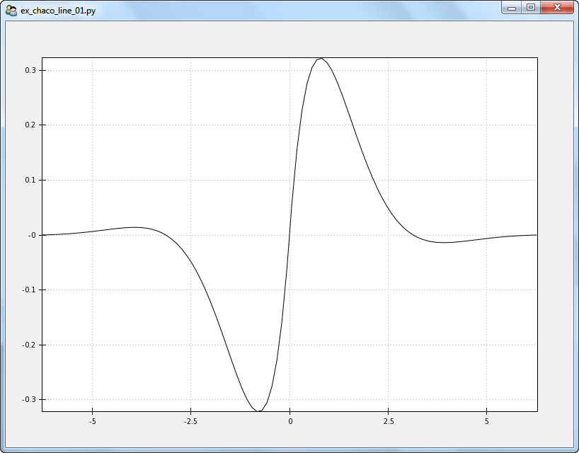

Elements of a Chaco Line Plot
=============================

.. highlight:: python
  :linenothreshold: 5

Let's build a minimalist Chaco line plot and introspect into the elements
underneath it. We're looking for the elements that control the behavior of the
plot (e.g. axis labels, line width, background color, etc). In further chapters,
we'll modify these attributes to control the look of the plot.

.. index::
  pair: Plot; Minimalist
  single: Line Plot; Minimalist

Minimal Chaco Line Plot
------------------------

The source for a very minimal Chaco line plot is::

  ## ex_chaco_line_01.py

  # standard imports
  import os, inspect
  import numpy as np

  # Enthought imports
  from enable.api import Component, ComponentEditor
  from traits.api import HasTraits
  from traitsui.api import Item, Group, View
  from chaco.api import Plot, ArrayPlotData

  # defines
  windowSize = (800,600)

  # window title is file name
  windowTitle = os.path.split(__file__)[1]

  class TraitedPlot( HasTraits ):

    # generate interesting data
    numPoints = 100
    extent = 2.0 * np.pi
    phaseA = np.linspace( -extent,extent,numPoints )
    amplitudeA = np.sin( phaseA ) * np.exp(-abs( phaseA ))

    # map arrays to plot names. TADP suffix => Traits ArrayPlotData
    myTADP = ArrayPlotData()
    myTADP.set_data( 'X',phaseA )
    myTADP.set_data( 'Y',amplitudeA )

    # generate the plot. TP suffix => Traits Plot
    myTP = Plot( myTADP )
    myTP.plot(
        ("X", "Y"),
        type = 'line',
    )

    # generate the view
    traits_view = View(
        Group(
            Item(
                'myTP',
                editor = ComponentEditor(size = windowSize),
                show_label = False,
            ),
            orientation = "vertical",
        ),
        resizable = True,
        title = windowTitle,
    )

  if __name__ == "__main__":

    # generate and display the plot
    tp = TraitedPlot()
    tp.configure_traits()

    # after we close the plot, all the attributes of the plot will be set (see
    # Lazy Initialization). Introspect into the tp object

    # generate a list of the public attributes in the Traits Plot objext
    myPublics = [thisItem for thisItem in inspect.getmembers(tp.myTP) if thisItem[0][0] != '_']
    print( myPublics )

    # use the print_traits() method to show a subset of the plot attributes
    tp.myTP.print_traits()

The resulting graphic is

   A simple Chaco line plot

.. index::
  single: Plot; getmembers
  single: Line Plot; getmembers
  single: Plot; print_traits()
  single: Line Plot; print_traits()
  single: print_traits(); Line Plot
  single: print_traits(); Plot

The reader is encouraged to examine the ``myPublics`` list and the output of
the ``tp.myTP.print_traits()`` command. This data describes how the
attributes of a Chaco plot come together. The various outputs are also available
under the 'Excruciating Detail' heading below

.. index::
  pair: Line Plot; Data

Plot Data
---------

Let's first look at the sources of data for the plot. Two likely candidates
are the ``data`` and ``datasources`` attributes from the ``myPublics`` list::

  ('data', <chaco.array_plot_data.ArrayPlotData object at 0x05F5D6F0>),
  ('datasources',
    { 'Y': <chaco.array_data_source.ArrayDataSource object at 0x05F99A50>,
      'X': <chaco.array_data_source.ArrayDataSource object at 0x05FE7090>}),

.. index::
  pair: Line Plot; ArrayPlotData
  pair: ArrayPlotData; print_traits()

ArrayPlotData
-------------

We first note that the 'data' attribute of the ``myTP`` object is the same as the
``myTAPD`` object in which we first placed the data::

  tp.myTP.data
  <chaco.array_plot_data.ArrayPlotData object at 0x05F616F0>
  tp.myTADP
  <chaco.array_plot_data.ArrayPlotData object at 0x05F616F0>

The ArrayPlotData object maps plot names to data arrays. It's defined in the
chaco/array_plot_data.py module. Introspecting into ``tp.myTP.data``
produces::

  tp.myTP.data
  <chaco.array_plot_data.ArrayPlotData object at 0x05FDAC00>

  tp.myTP.data.print_traits()
  arrays:     {'Y': array([  4.57391553e-19,  ...923,  6.15625227,  6.28318531])}
  selectable: True
  writable:   True

  tp.myTP.data.__dict__
  {'arrays':
    { 'Y': array([
         4.57391553e-19,   2.68399330e-04,   6.04546385e-04,
         1.01572218e-03,   1.50856699e-03,   2.08865225e-03,
         ......
        -1.01572218e-03,  -6.04546385e-04,  -2.68399330e-04,
        -4.57391553e-19]),
      'X': array([
        -6.28318531, -6.15625227, -6.02931923, -5.9023862 , -5.77545316,
        -5.64852012, -5.52158709, -5.39465405, -5.26772102, -5.14078798,
         ......
         5.14078798,  5.26772102,  5.39465405,  5.52158709,  5.64852012,
         5.77545316,  5.9023862 ,  6.02931923,  6.15625227,  6.28318531])},
    'writable': True}

The ``writable`` flag indicates that we're allowed to write to this data. The
``arrays`` attribute contains the data arrays assocated with this object.
These are the arrays and names we passed to the original ``myTADP.set_data``
calls.

.. index::
  pair: ArrayDataSource; print_traits()

ArrayDataSource
---------------

The ``datasources`` dictionary contains an entry for both the X and Y
arrays::

  ('datasources',
    { 'Y': <chaco.array_data_source.ArrayDataSource object at 0x05F99A50>,
      'X': <chaco.array_data_source.ArrayDataSource object at 0x05FE7090>}),

The ArrayDataSource objects describes a single, continuous array of
numerical data. The object contains the raw data (without a useful label)
along with some descriptors about the array::

  tp.myTP.datasources['X']
  <chaco.array_data_source.ArrayDataSource object at 0x05FDA360>

  tp.myTP.datasources['X'].print_traits()
  _cached_bounds:  (-6.2831853071795862, 6.2831853071795862)
  _cached_mask:    None
  _data:           array([-6.28318531, -6.1562522...3,  6.15625227,  6.28318531])
  _max_index:      99
  _min_index:      0
  index_dimension: 'scalar'
  metadata:        {'annotations': [], 'selections': []}
  persist_data:    True
  sort_order:      'none'
  value_dimension: 'scalar'

  tp.myTP.datasources['X'].__dict__
  {
  '_max_index': 99,
  '_cached_bounds': (-6.2831853071795862, 6.2831853071795862),
  '_data':
  array([-6.28318531, -6.15625227, -6.02931923, -5.9023862 , -5.77545316,
         -5.64852012, -5.52158709, -5.39465405, -5.26772102, -5.14078798,
         ......
          5.14078798,  5.26772102,  5.39465405,  5.52158709,  5.64852012,
          5.77545316,  5.9023862 ,  6.02931923,  6.15625227,  6.28318531]),
  'sort_order': 'none',
  '_min_index': 0
  }

Typically, the user passes the Array and the ``sort_order`` flag to the
ArrayDataSource construct and the method builds the private characteristics
that describe the array. Such descriptors include ``_min_index``, ``_max_index``,
``_cached_bounds``, etc.

The ``sort_order`` flag does not tell the method to sort the user's array. The
flag is meant to inform follow-on processors that the data in the array is sorted.
Options for ``sort_order`` are 'none','ascending' and 'descending.'

.. index::
  single: padding
  single: padding_bottom
  single: padding_top
  single: padding_left
  single: padding_right

Padding
-------

The padding attributes represent the number of pixels between the plot and the
window edge. This is the space for axes labels, tick marks, etc. The fundamental
attributes are::

  [padding_left, padding_right, padding_top, padding_bottom]

Retrive the padding using::

  tp.myTP.padding
  [50, 50, 50, 50]
  # returns [padding_left, padding_right, padding_top, padding_bottom]

You can also set equal padding by::

  tp.myTP.padding = 25
  # results in padding of [25,25,25,25]

.. index::
  pair: Grids; Plot

Grids
-----

You can access the characteristics of the plot grid using the following
commands::

  tp.myTP.x_grid
  tp.myTP.x_grid.print_traits()

.. index::
  single: Axis
  single: Axes

Axes
----

View the axes characteristics of the plot with::

  tp.myTP.x_axis
  tp.myTP.x_axis.print_traits()

.. index::
  pair: Range; Plot

Plotting Ranges
---------------

The x- and y-ranges of the plot are revealed using::

  tp.myTP.range2d.print_traits()

The ``range2d`` attribute contains both an ``x_range`` and a ``y_range`` object.
Let's look at the ``x_range`` object::

  tp.myTP.range2d.x_range
  tp.myTP.range2d.x_range.print_traits()

Excruciating Detail
-------------------

.. index
  pair: Plot; print_traits()

The ``myPublics`` list contains the public attributes of the ``tp.myTP``
object::

  [
  ('accepts_focus', True),
  ('add', <bound method Plot.add of <chaco.plot.Plot object at 0x05E2CAE0>>),
  ('add_class_trait', <bound method MetaHasTraits.add_class_trait of <class 'chaco.plot.Plot'>>),
  ('add_trait', <bound method Plot.add_trait of <chaco.plot.Plot object at 0x05E2CAE0>>),
  ('add_trait_category', <bound method MetaHasTraits.add_trait_category of <class 'chaco.plot.Plot'>>),
  ('add_trait_listener', <bound method Plot.add_trait_listener of <chaco.plot.Plot object at 0x05E2CAE0>>),
  ('add_xy_plot', <bound method Plot.add_xy_plot of <chaco.plot.Plot object at 0x05E2CAE0>>),
  ('all_trait_names', <bound method Plot.all_trait_names of <chaco.plot.Plot object at 0x05E2CAE0>>),
  ('as_coordinates', <bound method Plot.as_coordinates of <chaco.plot.Plot object at 0x05E2CAE0>>),
  ('aspect_ratio', None),
  ('auto_handle_event', False),
  ('auto_size', False),
  ('base_trait', <bound method Plot.base_trait of <chaco.plot.Plot object at 0x05E2CAE0>>),
  ('bgcolor', 'white'),
  ('bgcolor_', (1.0, 1.0, 1.0, 1.0)),
  ('border_color_', (0.0, 0.0, 0.0, 1.0)),
  ('border_dash_', None),
  ('border_visible', True),
  ('border_width', 1),
  ('bounds', [700, 500]),
  ('candle_plot', <bound method Plot.candle_plot of <chaco.plot.Plot object at 0x05E2CAE0>>),
  ('class_default_traits_view', <bound method MetaHasTraits.class_default_traits_view of <class 'chaco.plot.Plot'>>),
  ('class_editable_traits', <bound method MetaHasTraits.class_editable_traits of <class 'chaco.plot.Plot'>>),
  ('class_trait_names', <bound method MetaHasTraits.class_trait_names of <class 'chaco.plot.Plot'>>),
  ('class_trait_view', <bound method MetaHasTraits.class_trait_view of <class 'chaco.plot.Plot'>>),
  ('class_trait_view_elements', <bound method MetaHasTraits.class_trait_view_elements of <class 'chaco.plot.Plot'>>),
  ('class_traits', <bound method MetaHasTraits.class_traits of <class 'chaco.plot.Plot'>>),
  ('cleanup', <bound method Plot.cleanup of <chaco.plot.Plot object at 0x05E2CAE0>>),
  ('clone_traits', <bound method Plot.clone_traits of <chaco.plot.Plot object at 0x05E2CAE0>>),
  ('compact', <bound method Plot.compact of <chaco.plot.Plot object at 0x05E2CAE0>>),
  ('components_at', <bound method Plot.components_at of <chaco.plot.Plot object at 0x05E2CAE0>>),
  ('configure_traits', <bound method Plot.configure_traits of <chaco.plot.Plot object at 0x05E2CAE0>>),
  ('container', None),
  ('container_under_layers',
    ( 'background',
      'image',
      'underlay',
      'plot')),
  ('contour_plot', <bound method Plot.contour_plot of <chaco.plot.Plot object at 0x05E2CAE0>>),
  ('controller', None),
  ('copy_traits', <bound method Plot.copy_traits of <chaco.plot.Plot object at 0x05E2CAE0>>),
  ('copyable_trait_names', <bound method Plot.copyable_trait_names of <chaco.plot.Plot object at 0x05E2CAE0>>),
  ('data', <chaco.array_plot_data.ArrayPlotData object at 0x05E5A960>),
  ('datasources',
    { 'Y': <chaco.array_data_source.ArrayDataSource object at 0x05DE5900>,
      'X': <chaco.array_data_source.ArrayDataSource object at 0x05E45180>}),
  ('default_index', <chaco.array_data_source.ArrayDataSource object at 0x05E45180>),
  ('default_origin', 'bottom left'),
  ('default_traits_view', <bound method Plot.default_traits_view of <chaco.plot.Plot object at 0x05E2CAE0>>),
  ('delplot', <bound method Plot.delplot of <chaco.plot.Plot object at 0x05E2CAE0>>),
  ('dispatch', <bound method Plot.dispatch of <chaco.plot.Plot object at 0x05E2CAE0>>),
  ('do_layout', <bound method Plot.do_layout of <chaco.plot.Plot object at 0x05E2CAE0>>),
  ('draw', <bound method Plot.draw of <chaco.plot.Plot object at 0x05E2CAE0>>),
  ('draw_order',
    [ 'background',
      'image',
      'underlay',
      'plot',
      'selection',
      'border',
      'annotation',
      'overlay']),
  ('draw_select_box', <bound method Plot.draw_select_box of <chaco.plot.Plot object at 0x05E2CAE0>>),
  ('draw_valid', False),
  ('drawn_outer_bounds', [800, 600]),
  ('drawn_outer_position', [0, 0]),
  ('edit_traits', <bound method Plot.edit_traits of <chaco.plot.Plot object at 0x05E2CAE0>>),
  ('editable_traits', <bound method Plot.editable_traits of <chaco.plot.Plot object at 0x05E2CAE0>>),
  ('event_state', 'normal'),
  ('fill_padding', False),
  ('fit_window', True),
  ('get', <bound method Plot.get of <chaco.plot.Plot object at 0x05E2CAE0>>),
  ('get_absolute_coords', <bound method Plot.get_absolute_coords of <chaco.plot.Plot object at 0x05E2CAE0>>),
  ('get_event_transform', <bound method Plot.get_event_transform of <chaco.plot.Plot object at 0x05E2CAE0>>),
  ('get_preferred_size', <bound method Plot.get_preferred_size of <chaco.plot.Plot object at 0x05E2CAE0>>),
  ('has_traits_interface', <bound method Plot.has_traits_interface of <chaco.plot.Plot object at 0x05E2CAE0>>),
  ('hideplot', <bound method Plot.hideplot of <chaco.plot.Plot object at 0x05E2CAE0>>),
  ('img_plot', <bound method Plot.img_plot of <chaco.plot.Plot object at 0x05E2CAE0>>),
  ('index_mapper', <chaco.linear_mapper.LinearMapper object at 0x05E734B0>),
  ('index_scale', 'linear'),
  ('insert', <bound method Plot.insert of <chaco.plot.Plot object at 0x05E2CAE0>>),
  ('inset_border', True),
  ('invalidate_and_redraw', <bound method Plot.invalidate_and_redraw of <chaco.plot.Plot object at 0x05E2CAE0>>),
  ('invalidate_draw', <bound method Plot.invalidate_draw of <chaco.plot.Plot object at 0x05E2CAE0>>),
  ('is_in', <bound method Plot.is_in of <chaco.plot.Plot object at 0x05E2CAE0>>),
  ('legend', <chaco.legend.Legend object at 0x05E84C30>),
  ('lower_component', <bound method Plot.lower_component of <chaco.plot.Plot object at 0x05E2CAE0>>),
  ('map_data', <bound method Plot.map_data of <chaco.plot.Plot object at 0x05E2CAE0>>),
  ('map_screen', <bound method Plot.map_screen of <chaco.plot.Plot object at 0x05E2CAE0>>),
  ('new_window', <bound method Plot.new_window of <chaco.plot.Plot object at 0x05E2CAE0>>),
  ('normal_mouse_leave', <bound method Plot.normal_mouse_leave of <chaco.plot.Plot object at 0x05E2CAE0>>),
  ('on_trait_change', <bound method Plot.on_trait_change of <chaco.plot.Plot object at 0x05E2CAE0>>),
  ('on_trait_event', <bound method Plot.on_trait_change of <chaco.plot.Plot object at 0x05E2CAE0>>),
  ('orientation', 'h'),
  ('overlay_border', True),
  ('overlays',
    [ <chaco.plot_label.PlotLabel object at 0x05E7E2D0>,
      <chaco.legend.Legend object at 0x05E84C30>]),
  ('padding_accepts_focus', True),
  ('padding_bottom', 50),
  ('padding_left', 50),
  ('padding_right', 50),
  ('padding_top', 50),
  ('parent', None),
  ('plot', <bound method Plot.plot of <chaco.plot.Plot object at 0x05E2CAE0>>),
  ('plots',
    { 'plot0': [<chaco.lineplot.LinePlot object at 0x05E84DE0>]}),
  ('position', [50, 50]),
  ('print_traits', <bound method Plot.print_traits of <chaco.plot.Plot object at 0x05E2CAE0>>),
  ('raise_component', <bound method Plot.raise_component of <chaco.plot.Plot object at 0x05E2CAE0>>),
  ('range2d', <chaco.data_range_2d.DataRange2D object at 0x05E73030>),
  ('remove', <bound method Plot.remove of <chaco.plot.Plot object at 0x05E2CAE0>>),
  ('remove_trait', <bound method Plot.remove_trait of <chaco.plot.Plot object at 0x05E2CAE0>>),
  ('remove_trait_listener', <bound method Plot.remove_trait_listener of <chaco.plot.Plot object at 0x05E2CAE0>>),
  ('renderer_map', {'bar': <class 'chaco.barplot.BarPlot'>, 'filled_line': <class 'chaco.filled_line_plot.FilledLinePlot'>, 'cmap_img_plot': <class 'chaco.cmap_image_plot.CMapImagePlot'>, 'cmap_scatter': <class 'chaco.colormapped_scatterplot.ColormappedScatterPlot'>, 'contour_poly_plot': <class 'chaco.contour_poly_plot.ContourPolyPlot'>, 'img_plot': <class 'chaco.image_plot.ImagePlot'>, 'contour_line_plot': <class 'chaco.contour_line_plot.ContourLinePlot'>, 'candle': <class 'chaco.candle_plot.CandlePlot'>, 'line': <class 'chaco.lineplot.LinePlot'>, 'scatter': <class 'chaco.scatterplot.ScatterPlot'>, 'polygon': <class 'chaco.polygon_plot.PolygonPlot'>}),
  ('request_redraw', <bound method Plot.request_redraw of <chaco.plot.Plot object at 0x05E2CAE0>>),
  ('reset_traits', <bound method Plot.reset_traits of <chaco.plot.Plot object at 0x05E2CAE0>>),
  ('resizable', 'hv'),
  ('set', <bound method Plot.trait_set of <chaco.plot.Plot object at 0x05E2CAE0>>),
  ('set_outer_bounds', <bound method Plot.set_outer_bounds of <chaco.plot.Plot object at 0x05E2CAE0>>),
  ('set_outer_position', <bound method Plot.set_outer_position of <chaco.plot.Plot object at 0x05E2CAE0>>),
  ('set_trait_dispatch_handler', <bound method MetaHasTraits.set_trait_dispatch_handler of <class 'chaco.plot.Plot'>>),
  ('showplot', <bound method Plot.showplot of <chaco.plot.Plot object at 0x05E2CAE0>>),
  ('sync_trait', <bound method Plot.sync_trait of <chaco.plot.Plot object at 0x05E2CAE0>>),
  ('tools', []),
  ('trait', <bound method Plot.trait of <chaco.plot.Plot object at 0x05E2CAE0>>),
  ('trait_context', <bound method Plot.trait_context of <chaco.plot.Plot object at 0x05E2CAE0>>),
  ('trait_get', <bound method Plot.trait_get of <chaco.plot.Plot object at 0x05E2CAE0>>),
  ('trait_items_event', <built-in method trait_items_event of Plot object at 0x05E2CAE0>),
  ('trait_monitor', <bound method MetaHasTraits.trait_monitor of <class 'chaco.plot.Plot'>>),
  ('trait_names', <bound method Plot.trait_names of <chaco.plot.Plot object at 0x05E2CAE0>>),
  ('trait_property_changed', <built-in method trait_property_changed of Plot object at 0x05E2CAE0>),
  ('trait_set', <bound method Plot.trait_set of <chaco.plot.Plot object at 0x05E2CAE0>>),
  ('trait_setq', <bound method Plot.trait_setq of <chaco.plot.Plot object at 0x05E2CAE0>>),
  ('trait_subclasses', <bound method MetaHasTraits.trait_subclasses of <class 'chaco.plot.Plot'>>),
  ('trait_view', <bound method Plot.trait_view of <chaco.plot.Plot object at 0x05E2CAE0>>),
  ('trait_view_elements', <bound method Plot.trait_view_elements of <chaco.plot.Plot object at 0x05E2CAE0>>),
  ('trait_views', <bound method Plot.trait_views of <chaco.plot.Plot object at 0x05E2CAE0>>),
  ('traits', <bound method Plot.traits of <chaco.plot.Plot object at 0x05E2CAE0>>),
  ('traits_init', <built-in method traits_init of Plot object at 0x05E2CAE0>),
  ('traits_inited', <built-in method traits_inited of Plot object at 0x05E2CAE0>),
  ('underlays',
  [ <chaco.grid.PlotGrid object at 0x05E736F0>,
    <chaco.grid.PlotGrid object at 0x05E7A270>,
    <chaco.axis.PlotAxis object at 0x05E7AC60>,
    <chaco.axis.PlotAxis object at 0x05E7AF60>]),
  ('use_backbuffer', False),
  ('use_draw_order', True),
  ('validate_trait', <bound method Plot.validate_trait of <chaco.plot.Plot object at 0x05E2CAE0>>),
  ('value_mapper', <chaco.linear_mapper.LinearMapper object at 0x05E73630>),
  ('value_scale', 'linear'),
  ('viewports', []),
  ('visible', True),
  ('wrappers',
    { 'new': <class traits.trait_notifiers.NewTraitChangeNotifyWrapper at 0x03E79F48>,
      'ui': <class traits.trait_notifiers.FastUITraitChangeNotifyWrapper at 0x03E79ED8>,
      'extended': <class traits.trait_notifiers.ExtendedTraitChangeNotifyWrapper at 0x03E79EA0>,
      'fast_ui': <class traits.trait_notifiers.FastUITraitChangeNotifyWrapper at 0x03E79ED8>,
      'same': <class traits.trait_notifiers.TraitChangeNotifyWrapper at 0x03E79E68>}),
  ('x_axis', <chaco.axis.PlotAxis object at 0x05E7AC60>),
  ('x_grid', <chaco.grid.PlotGrid object at 0x05E736F0>),
  ('y_axis', <chaco.axis.PlotAxis object at 0x05E7AF60>),
  ('y_grid', <chaco.grid.PlotGrid object at 0x05E7A270>)
  ]

The ``tp.myTP.print_traits()`` method produces::

  _active_tool:           None
  _auto_color_idx:        -1
  _auto_edge_color_idx:   -1
  _auto_face_color_idx:   -1
  _backbuffer:            None
  _cached_preferred_size: ()
  _children_draw_mode:    'default'
  _components:            [<chaco.lineplot.LinePlot object at 0x05E84DE0>]
  _layout_needed:         False
  _lookup_cache:          None
  _plot_ui_info:          None
  _prev_event_handlers:   set([<chaco.lineplot.LinePlot object at 0x05E84DE0>])
  _title:                 <chaco.plot_label.PlotLabel object at 0x05E7E2D0>
  _window:                None
  accepts_focus:          True
  active_tool:            None
  aspect_ratio:           None
  auto_center:            True
  auto_colors:            ['green', 'lightgreen', 'b...nk', 'darkgray', 'silver']
  auto_handle_event:      False
  auto_size:              False
  backbuffer_padding:     True
  bgcolor:                'white'
  bgcolor_:               (1.0, 1.0, 1.0, 1.0)
  border_color:           'black'
  border_color_:          (0.0, 0.0, 0.0, 1.0)
  border_dash:            'solid'
  border_dash_:           None
  border_visible:         True
  border_width:           1
  bounds:                 [700, 500]
  classes:                []
  color_mapper:           None
  components:             [<chaco.lineplot.LinePlot object at 0x05E84DE0>]
  container:              None
  container_under_layers: ('background', 'image', 'underlay', 'plot')
  controller:             None
  cursor_color:           'black'
  cursor_style:           'default'
  data:                   <chaco.array_plot_data.Arr...Data object at 0x05E5A960>
  datasources:            {'Y': <chaco.array_data_so...rce object at 0x05E45180>}
  default_index:          <chaco.array_data_source.A...urce object at 0x05E45180>
  default_origin:         'bottom left'
  default_size:           (0, 0)
  draw_layer:             'plot'
  draw_order:             ['background', 'image', 'u..., 'annotation', 'overlay']
  draw_valid:             False
  drawn_outer_bounds:     [800, 600]
  drawn_outer_position:   [0, 0]
  event_state:            'normal'
  fill_padding:           False
  fit_components:         ''
  fit_window:             True
  fixed_preferred_size:   None
  height:                 500
  hpadding:               100
  id:                     ''
  index_axis:             <chaco.axis.PlotAxis object at 0x05E7AC60>
  index_grid:             <chaco.grid.PlotGrid object at 0x05E736F0>
  index_mapper:           <chaco.linear_mapper.LinearMapper object at 0x05E734B0>
  index_range:            <chaco.data_range_1d.DataRange1D object at 0x05E733F0>
  index_scale:            'linear'
  inset_border:           True
  intercept_events:       True
  invisible_layout:       False
  layout_controller:      None
  layout_needed:          False
  legend:                 <chaco.legend.Legend object at 0x05E84C30>
  legend_alignment:       'ur'
  orientation:            'h'
  origin:                 'bottom left'
  outer_bounds:           (800, 600)
  outer_height:           600
  outer_position:         (0, 0)
  outer_width:            800
  outer_x:                0
  outer_x2:               799
  outer_y:                0
  outer_y2:               599
  overlay_border:         True
  overlays:               [<chaco.plot_label.PlotLab...end object at 0x05E84C30>]
  padding:                [50, 50, 50, 50]
  padding_accepts_focus:  True
  padding_bottom:         50
  padding_left:           50
  padding_right:          50
  padding_top:            50
  parent:                 None
  plot_components:        [<chaco.lineplot.LinePlot object at 0x05E84DE0>]
  plots:                  {'plot0': [<chaco.lineplot...ot object at 0x05E84DE0>]}
  pointer:                'arrow'
  position:               [50, 50]
  range2d:                <chaco.data_range_2d.DataRange2D object at 0x05E73030>
  renderer_map:           {'bar': <class 'chaco.barp...olygon_plot.PolygonPlot'>}
  resizable:              'hv'
  resolver:               None
  title:                  ''
  title_angle:            0
  title_color:            'black'
  title_font:             Font(size=16,family=1,weig... face_name='',encoding=0 )
  title_position:         'top'
  title_text:             ''
  tools:                  []
  tooltip:                None
  underlays:              [<chaco.grid.PlotGrid obje...xis object at 0x05E7AF60>]
  unified_draw:           False
  use_backbuffer:         False
  use_draw_order:         True
  use_selection:          False
  value_axis:             <chaco.axis.PlotAxis object at 0x05E7AF60>
  value_grid:             <chaco.grid.PlotGrid object at 0x05E7A270>
  value_mapper:           <chaco.linear_mapper.LinearMapper object at 0x05E73630>
  value_range:            <chaco.data_range_1d.DataRange1D object at 0x05E73570>
  value_scale:            'linear'
  viewports:              []
  visible:                True
  vpadding:               100
  width:                  700
  window:                 None
  x:                      50
  x2:                     749
  x_axis:                 <chaco.axis.PlotAxis object at 0x05E7AC60>
  x_grid:                 <chaco.grid.PlotGrid object at 0x05E736F0>
  x_mapper:               <chaco.linear_mapper.LinearMapper object at 0x05E734B0>
  y:                      50
  y2:                     549
  y_axis:                 <chaco.axis.PlotAxis object at 0x05E7AF60>
  y_grid:                 <chaco.grid.PlotGrid object at 0x05E7A270>
  y_mapper:               <chaco.linear_mapper.LinearMapper object at 0x05E73630>

.. index:
  pair: ArrayPlotData; print_traits()

Introspecting into ``tp.myTP.data`` produces::

  tp.myTP.data
  <chaco.array_plot_data.ArrayPlotData object at 0x05FDAC00>

  tp.myTP.data.print_traits()
  arrays:     {'Y': array([  4.57391553e-19,  ...923,  6.15625227,  6.28318531])}
  selectable: True
  writable:   True

  tp.myTP.data.__dict__
  {'arrays':
    { 'Y': array([
         4.57391553e-19,   2.68399330e-04,   6.04546385e-04,
         1.01572218e-03,   1.50856699e-03,   2.08865225e-03,
         2.75996780e-03,   3.52431888e-03,   4.38062872e-03,
         5.32414502e-03,   6.34555158e-03,   7.42999022e-03,
         8.55600270e-03,   9.69440840e-03,   1.08071401e-02,
         1.18460684e-02,   1.27518549e-02,   1.34528831e-02,
         1.38643309e-02,   1.38874568e-02,   1.34091901e-02,
         1.23021262e-02,   1.04250455e-02,   7.62408714e-03,
         3.73472511e-03,  -1.41529513e-03,  -8.00188797e-03,
        -1.61992496e-02,  -2.61729883e-02,  -3.80715840e-02,
        -5.20160056e-02,  -6.80873351e-02,  -8.63122735e-02,
        -1.06646448e-01,  -1.28955496e-01,  -1.52993971e-01,
        -1.78382224e-01,  -2.04581503e-01,  -2.30867687e-01,
        -2.56304206e-01,  -2.79714905e-01,  -2.99657838e-01,
        -3.14401207e-01,  -3.21902952e-01,  -3.19795797e-01,
        -3.05379868e-01,  -2.75625351e-01,  -2.27187982e-01,
        -1.56440526e-01,  -5.95237001e-02,   5.95237001e-02,
         1.56440526e-01,   2.27187982e-01,   2.75625351e-01,
         3.05379868e-01,   3.19795797e-01,   3.21902952e-01,
         3.14401207e-01,   2.99657838e-01,   2.79714905e-01,
         2.56304206e-01,   2.30867687e-01,   2.04581503e-01,
         1.78382224e-01,   1.52993971e-01,   1.28955496e-01,
         1.06646448e-01,   8.63122735e-02,   6.80873351e-02,
         5.20160056e-02,   3.80715840e-02,   2.61729883e-02,
         1.61992496e-02,   8.00188797e-03,   1.41529513e-03,
        -3.73472511e-03,  -7.62408714e-03,  -1.04250455e-02,
        -1.23021262e-02,  -1.34091901e-02,  -1.38874568e-02,
        -1.38643309e-02,  -1.34528831e-02,  -1.27518549e-02,
        -1.18460684e-02,  -1.08071401e-02,  -9.69440840e-03,
        -8.55600270e-03,  -7.42999022e-03,  -6.34555158e-03,
        -5.32414502e-03,  -4.38062872e-03,  -3.52431888e-03,
        -2.75996780e-03,  -2.08865225e-03,  -1.50856699e-03,
        -1.01572218e-03,  -6.04546385e-04,  -2.68399330e-04,
        -4.57391553e-19]),
      'X': array([
        -6.28318531, -6.15625227, -6.02931923, -5.9023862 , -5.77545316,
        -5.64852012, -5.52158709, -5.39465405, -5.26772102, -5.14078798,
        -5.01385494, -4.88692191, -4.75998887, -4.63305583, -4.5061228 ,
        -4.37918976, -4.25225672, -4.12532369, -3.99839065, -3.87145761,
        -3.74452458, -3.61759154, -3.4906585 , -3.36372547, -3.23679243,
        -3.10985939, -2.98292636, -2.85599332, -2.72906028, -2.60212725,
        -2.47519421, -2.34826118, -2.22132814, -2.0943951 , -1.96746207,
        -1.84052903, -1.71359599, -1.58666296, -1.45972992, -1.33279688,
        -1.20586385, -1.07893081, -0.95199777, -0.82506474, -0.6981317 ,
        -0.57119866, -0.44426563, -0.31733259, -0.19039955, -0.06346652,
         0.06346652,  0.19039955,  0.31733259,  0.44426563,  0.57119866,
         0.6981317 ,  0.82506474,  0.95199777,  1.07893081,  1.20586385,
         1.33279688,  1.45972992,  1.58666296,  1.71359599,  1.84052903,
         1.96746207,  2.0943951 ,  2.22132814,  2.34826118,  2.47519421,
         2.60212725,  2.72906028,  2.85599332,  2.98292636,  3.10985939,
         3.23679243,  3.36372547,  3.4906585 ,  3.61759154,  3.74452458,
         3.87145761,  3.99839065,  4.12532369,  4.25225672,  4.37918976,
         4.5061228 ,  4.63305583,  4.75998887,  4.88692191,  5.01385494,
         5.14078798,  5.26772102,  5.39465405,  5.52158709,  5.64852012,
         5.77545316,  5.9023862 ,  6.02931923,  6.15625227,  6.28318531])},
    'writable': True}

.. index:
  pair: ArrayDataSource; print_traits()

The ArrayDataSource objects describes a single, continuous array of
numerical data. The object contains the raw data (without a useful label)
along with some descriptors about the array::

  tp.myTP.datasources['X']
  <chaco.array_data_source.ArrayDataSource object at 0x05FDA360>

  tp.myTP.datasources['X'].print_traits()
  _cached_bounds:  (-6.2831853071795862, 6.2831853071795862)
  _cached_mask:    None
  _data:           array([-6.28318531, -6.1562522...3,  6.15625227,  6.28318531])
  _max_index:      99
  _min_index:      0
  index_dimension: 'scalar'
  metadata:        {'annotations': [], 'selections': []}
  persist_data:    True
  sort_order:      'none'
  value_dimension: 'scalar'

  tp.myTP.datasources['X'].__dict__
  {
  '_max_index': 99,
  '_cached_bounds': (-6.2831853071795862, 6.2831853071795862),
  '_data':
  array([-6.28318531, -6.15625227, -6.02931923, -5.9023862 , -5.77545316,
         -5.64852012, -5.52158709, -5.39465405, -5.26772102, -5.14078798,
         -5.01385494, -4.88692191, -4.75998887, -4.63305583, -4.5061228 ,
         -4.37918976, -4.25225672, -4.12532369, -3.99839065, -3.87145761,
         -3.74452458, -3.61759154, -3.4906585 , -3.36372547, -3.23679243,
         -3.10985939, -2.98292636, -2.85599332, -2.72906028, -2.60212725,
         -2.47519421, -2.34826118, -2.22132814, -2.0943951 , -1.96746207,
         -1.84052903, -1.71359599, -1.58666296, -1.45972992, -1.33279688,
         -1.20586385, -1.07893081, -0.95199777, -0.82506474, -0.6981317 ,
         -0.57119866, -0.44426563, -0.31733259, -0.19039955, -0.06346652,
          0.06346652,  0.19039955,  0.31733259,  0.44426563,  0.57119866,
          0.6981317 ,  0.82506474,  0.95199777,  1.07893081,  1.20586385,
          1.33279688,  1.45972992,  1.58666296,  1.71359599,  1.84052903,
          1.96746207,  2.0943951 ,  2.22132814,  2.34826118,  2.47519421,
          2.60212725,  2.72906028,  2.85599332,  2.98292636,  3.10985939,
          3.23679243,  3.36372547,  3.4906585 ,  3.61759154,  3.74452458,
          3.87145761,  3.99839065,  4.12532369,  4.25225672,  4.37918976,
          4.5061228 ,  4.63305583,  4.75998887,  4.88692191,  5.01385494,
          5.14078798,  5.26772102,  5.39465405,  5.52158709,  5.64852012,
          5.77545316,  5.9023862 ,  6.02931923,  6.15625227,  6.28318531]),
  'sort_order': 'none',
  '_min_index': 0
  }

.. index:
  pair: PlotGrid; print_traits()

Let's examine the plot grids.
::

  tp.myTP.x_grid
  <chaco.grid.PlotGrid object at 0x05FF4990>

  tp.myTP.x_grid.print_traits()
  _active_tool:          None
  _backbuffer:           None
  _cache_valid:          False
  _layout_needed:        True
  _tick_extents:         array([[  50.,  510.],\n   ...,\n       [  50.,  510.]])
  _tick_list:            None
  _tick_positions:       array([[ 120.,   50.],\n   ...,\n       [ 661.,   50.]])
  _window:               None
  accepts_focus:         True
  active_tool:           None
  aspect_ratio:          None
  auto_center:           True
  auto_handle_event:     False
  backbuffer_padding:    True
  bgcolor:               'none'
  bgcolor_:              (0.0, 0.0, 0.0, 0.0)
  border_color:          'black'
  border_dash:           'solid'
  border_visible:        False
  border_width:          1
  bounds:                [682, 460]
  classes:               []
  component:             <chaco.plot.Plot object at 0x05F9ED80>
  container:             None
  controller:            None
  cursor_color:          'black'
  cursor_style:          'default'
  data_max:              None
  data_min:              None
  draw_layer:            'overlay'
  draw_order:            ['background', 'image', 'un..., 'annotation', 'overlay']
  draw_valid:            False
  drawn_outer_bounds:    [0.0, 0.0]
  drawn_outer_position:  [0.0, 0.0]
  event_state:           'normal'
  fill_padding:          False
  fixed_preferred_size:  None
  flip_axis:             False
  grid_interval:         'auto'
  height:                460
  hpadding:              0
  id:                    ''
  inset_border:          True
  invisible_layout:      False
  layout_needed:         True
  line_color:            'lightgray'
  line_color_:           (0.827, 0.827, 0.827, 1.0)
  line_style:            'dot'
  line_style_:           array([ 2.,  2.])
  line_weight:           1
  line_width:            1
  mapper:                <chaco.linear_mapper.LinearMapper object at 0x05FF4750>
  orientation:           'vertical'
  outer_bounds:          (682, 460)
  outer_height:          460
  outer_position:        (50, 50)
  outer_width:           682
  outer_x:               50
  outer_x2:              731
  outer_y:               50
  outer_y2:              509
  overlay_border:        True
  overlays:              []
  padding:               [0, 0, 0, 0]
  padding_accepts_focus: True
  padding_bottom:        0
  padding_left:          0
  padding_right:         0
  padding_top:           0
  pointer:               'arrow'
  position:              [50, 50]
  resizable:             'hv'
  tick_generator:        <chaco.ticks.DefaultTickGenerator object at 0x05FF49C0>
  tools:                 []
  tooltip:               None
  transverse_bounds:     None
  transverse_mapper:     None
  underlays:             []
  unified_draw:          False
  use_backbuffer:        False
  use_draw_order:        True
  use_selection:         False
  viewports:             []
  visible:               True
  vpadding:              0
  width:                 682
  window:                None
  x:                     50
  x2:                    731
  y:                     50
  y2:                    509

.. index:
  pair: PlotAxis; print_traits()

Axes
::

  tp.myTP.x_axis
  <chaco.axis.PlotAxis object at 0x05FFAF00>

  tp.myTP.x_axis.print_traits()
  _active_tool:               None
  _axis_pixel_vector:         array([ 1.,  0.])
  _axis_vector:               array([ 681.,    0.])
  _backbuffer:                None
  _cache_valid:               True
  _end_axis_point:            array([ 731.,   50.])
  _inside_vector:             array([ 0.,  1.])
  _layout_needed:             False
  _major_axis:                array([ 1.,  0.])
  _major_axis_size:           682.0
  _minor_axis_size:           460.0
  _origin_point:              array([50, 50])
  _tick_label_bounding_boxes: [array([ 14.,  12.]), ar...]), array([ 10.,  12.])]
  _tick_label_list:           array([-5. , -2.5,  0. ,  2.5,  5. ])
  _tick_label_positions:      array([[ 120.,   50.],\n...n       [ 661.,   50.]])
  _tick_list:                 []
  _tick_positions:            array([[ 120.,   50.],\n...n       [ 661.,   50.]])
  _title_angle:               0.0
  _title_orientation:         array([ 0.,  1.])
  _window:                    None
  accepts_focus:              True
  active_tool:                None
  aspect_ratio:               None
  auto_center:                True
  auto_handle_event:          False
  axis_line_color:            'black'
  axis_line_color_:           (0.0, 0.0, 0.0, 1.0)
  axis_line_style:            'solid'
  axis_line_style_:           None
  axis_line_visible:          True
  axis_line_weight:           1.0
  backbuffer_padding:         True
  bgcolor:                    'transparent'
  border_color:               'black'
  border_dash:                'solid'
  border_visible:             False
  border_width:               1
  bounds:                     [682, 50]
  classes:                    []
  component:                  <chaco.plot.Plot object at 0x05F9ED80>
  container:                  None
  controller:                 None
  cursor_color:               'black'
  cursor_style:               'default'
  draw_layer:                 'overlay'
  draw_order:                 ['background', 'image', ...'annotation', 'overlay']
  draw_valid:                 False
  drawn_outer_bounds:         [0.0, 0.0]
  drawn_outer_position:       [0.0, 0.0]
  ensure_labels_bounded:      False
  ensure_ticks_bounded:       False
  event_state:                'normal'
  fill_padding:               False
  fixed_preferred_size:       None
  height:                     50
  hpadding:                   0
  id:                         ''
  inset_border:               True
  invisible_layout:           False
  layout_needed:              False
  mapper:                     <chaco.linear_mapper.Lin...er object at 0x05FF4750>
  orientation:                'bottom'
  outer_bounds:               (682, 50)
  outer_height:               50
  outer_position:             (50, 0)
  outer_width:                682
  outer_x:                    50
  outer_x2:                   731
  outer_y:                    0
  outer_y2:                   49
  overlay_border:             True
  overlays:                   []
  padding:                    [0, 0, 0, 0]
  padding_accepts_focus:      True
  padding_bottom:             0
  padding_left:               0
  padding_right:              0
  padding_top:                0
  pointer:                    'arrow'
  position:                   [50, 0]
  resizable:                  'hv'
  small_haxis_style:          False
  tick_color:                 'black'
  tick_color_:                (0.0, 0.0, 0.0, 1.0)
  tick_generator:             <chaco.ticks.DefaultTick...or object at 0x05FFAF30>
  tick_in:                    5
  tick_interval:              'auto'
  tick_label_alignment:       'edge'
  tick_label_color:           'black'
  tick_label_font:            Font(size=10,family=3,we...ace_name='',encoding=0 )
  tick_label_formatter:       <function DEFAULT_TICK_FORMATTER at 0x059C0A70>
  tick_label_margin:          2
  tick_label_offset:          8.0
  tick_label_position:        'outside'
  tick_label_rotate_angle:    0
  tick_out:                   5
  tick_visible:               True
  tick_weight:                1.0
  ticklabel_cache:            [<chaco.label.Label obje...l object at 0x0706FF30>]
  title:                      ''
  title_angle:                0.0
  title_color:                'black'
  title_font:                 Font(size=12,family=3,we...ace_name='',encoding=0 )
  title_spacing:              'auto'
  tools:                      []
  tooltip:                    None
  underlays:                  []
  unified_draw:               False
  use_backbuffer:             False
  use_draw_order:             True
  use_selection:              False
  viewports:                  []
  visible:                    True
  vpadding:                   0
  width:                      682
  window:                     None
  x:                          50
  x2:                         731
  y:                          0
  y2:                         49

.. index:
  pair: DataRange2D; print_traits()
  pair: DataRange1D; print_traits()

Plotting Ranges
::

  tp.myTP.range2d.print_traits()
  _high_setting: ('auto', 'auto')
  _high_value:   (inf, inf)
  _low_setting:  ('auto', 'auto')
  _low_value:    (-inf, -inf)
  _xrange:       <chaco.data_range_1d.DataRange1D object at 0x05FF4690>
  _yrange:       <chaco.data_range_1d.DataRange1D object at 0x05FF4810>
  epsilon:       (0.0001, 0.0001)
  high:          (6.283185307179586, 0.32190295210375436)
  high_setting:  ('auto', 'auto')
  low:           (-6.283185307179586, -0.3219029521037544)
  low_setting:   ('auto', 'auto')
  sources:       []
  tight_bounds:  (True, True)
  x_range:       <chaco.data_range_1d.DataRange1D object at 0x05FF4690>
  y_range:       <chaco.data_range_1d.DataRange1D object at 0x05FF4810>

The ``range2d`` attribute contains both an ``x_range`` and a ``y_range`` object.
Let's look at the ``x_range`` object::

  tp.myTP.range2d.x_range
  <chaco.data_range_1d.DataRange1D object at 0x05FF4690>

  tp.myTP.range2d.x_range.print_traits()
  _high_setting:           'auto'
  _high_value:             6.2831853071795862
  _low_setting:            'auto'
  _low_value:              -6.2831853071795862
  bounds_func:             None
  default_state:           'auto'
  default_tracking_amount: 20.0
  epsilon:                 1e-10
  fit_to_subset:           False
  high:                    6.283185307179586
  high_setting:            'auto'
  low:                     -6.283185307179586
  low_setting:             'auto'
  margin:                  0.05
  sources:                 [<chaco.array_data_source....ce object at 0x05FDA360>]
  tight_bounds:            True
  tracking_amount:         20.0
