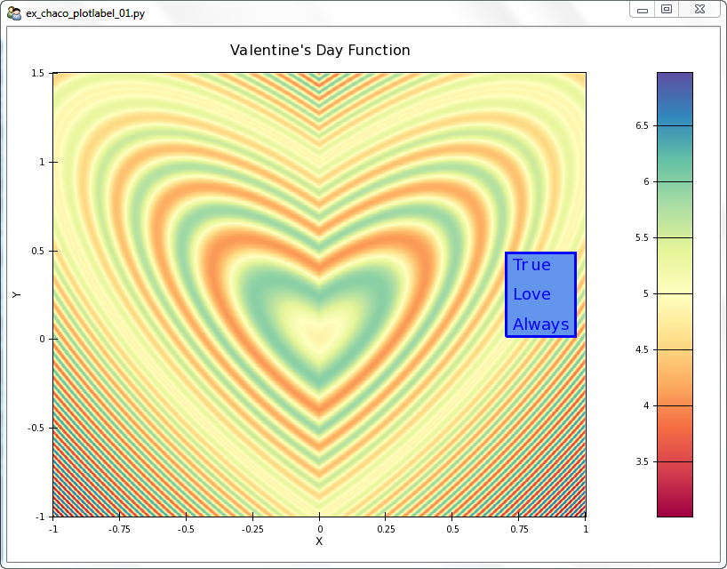

Chaco Plot - Plot Label Options
===============================

.. highlight:: python
  :linenothreshold: 5

.. index::
  pair: Title; Plot Label
  single: Plot Label
  single: Function; Valentine's Day

Let's generate a plot with a plot label. The code is::

  ## ex_chaco_plotlabel_01.py

  # standard imports
  import os, inspect

  # numpy imports
  from numpy import sin, cos, sqrt, abs, linspace, meshgrid

  # Enthought imports
  from enable.api import Component, ComponentEditor
  from traits.api import HasTraits
  from traitsui.api import Item, Group, View
  from chaco.api import ArrayPlotData, Plot, ColorBar, PlotLabel
  from chaco.api import LinearMapper, HPlotContainer, DataLabel

  # defines
  windowSize = (800,600)

  # window title is file name
  windowTitle = os.path.split(__file__)[1]

  class TraitedPlot( HasTraits ):

    # create an interesting scalar field for the image plot
    # the valentine's plot
    # 5 + (-sqrt(1-x^2-(y-abs(x))^2))*cos(30*((1-x^2-(y-abs(x))^2))),
    # x is from -1 to 1, y is from -1 to 1.5, z is from 1 to 6
    xA = linspace(-1.0, 1.0, 600)
    yA = linspace(-1.0, 1.5, 600)
    ( xMG,yMG ) = meshgrid( xA,yA )
    zMG = (-sqrt( abs( 1 - xMG**2 - (yMG - abs(xMG))**2 )))
    zMG = zMG * cos( 30.0 * ( (1.0 - xMG**2 - (yMG - abs(xMG))**2)))
    zMG = zMG + 5.0

    # Create an ArrayPlotData object and give it this data
    myAPD = ArrayPlotData()
    myAPD.set_data( "Z", zMG )
    myAPD.set_data( "X",xA )
    myAPD.set_data( "Y",yA )

    # Create the plot.
    myTP = Plot( myAPD )

    # add the image plot to this plot object. If we don't specify the colormapper,
    # it defaults to default_colormaps.Spectral
    myTP.img_plot(
        "Z",
        xbounds = (xA[0],xA[-1]),
        ybounds = (yA[0],yA[-1]),
    )

    # add the title and padding around the plot
    myTP.title = "Valentine's Day Function"
    myTP.padding = 50

    # grids, fonts, etc
    myTP.x_axis.title = "X"
    myTP.y_axis.title = "Y"

    # PlotLabel stuff
    myTPL = PlotLabel( text = "Howdy" )

    # Can set the text this way as well. Also, can use newlines
    myTPL.text = "True\nLove\nAlways"

    # The color of the label text.
    myTPL.color = 'blue'

    # The font for the label text.
    myTPL.font = 'swiss 18 bold'

    # The angle of rotation of the label.
    myTPL.angle = 0       # try 45

    # misc
    myTPL.bgcolor = 'cornflowerblue'    # see ``cclor_table`` in enable/colors.py
    myTPL.border_width = 3              # defaults to 0 pixels
    myTPL.border_color = 'blue'         # defaults to black
    myTPL.border_visible = True         # defaults to True
    myTPL.margin = 5                    # number of pixels of margin between the
                                        # text and the plotlabel border, in both
                                        # X and Y dims
    myTPL.line_spacing = 20             # number of pixels of spacing between lines of text

    # layout related
    # Horizontal/vertical justification used if the label has more space
    # than it needs.
    myTPL.hjustify = 'center'     # Enum("center", "left", "right")
    myTPL.vjustify = 'center'     # Enum("center", "bottom", "top")

    # The position of this label relative to the object it is overlaying.
    # Can be "top", "left", "right", "bottom", and optionally can be preceeded
    # by the words "inside" or "outside", separated by a space.  If "inside"
    # and "outside" are not provided, then defaults to "outside".
    # Examples: 'inside top', 'outside right'
    myTPL.overlay_position = 'inside right'  # Trait("outside top", Str, None)

    myTPL.padding_left = 10     # extra padding added to the PlotLabel layout, in pixels
    myTPL.padding_right
    myTPL.padding_top
    myTPL.padding_bottom

    # By default, this acts like a component and will render on the main plot
    # layer unless its component attribute gets set.
    #myTPL.draw_layer

    # The label has a fixed height and can be resized horizontally. (Overrides
    # PlotComponent.)
    myTPL.resizable = 'h'       # defaults to 'h'

    # methods
    #myTPL.do_layout()                # Tells this component to do layout.
    myTPL.get_preferred_size()        # Returns the label?s preferred size, in pixels.

    # generate a ColorBar. pulls its colormapper from the myTP Plot object
    myTCB = ColorBar(
      plot = myTP,
      index_mapper = LinearMapper( range = myTP.color_mapper.range ),
      orientation = 'v',
      resizable = 'v',
      width = 40,
      padding = 30,
    )

    # set the padding of the ColorBar to match the padding of the plot
    myTCB.padding_top = myTP.padding_top
    myTCB.padding_bottom = myTP.padding_bottom

    # build up a single container for the colorbar and the image
    myHPC = HPlotContainer( use_backbuffer = True )
    myHPC.add( myTP )
    myHPC.add( myTCB )

    # inform the Traits plot that it has a Traits PlotLabel overlay, and inform
    # the Traits PlotLabel instance that it is being overlayed onto the Traits
    # Plot
    myTP.overlays.append( myTPL )
    myTPL.component = myTP

    # Note that we could also have overlayed the PlotLabel on the Traits
    # Horizontal Plot container, myHPC. Then the positions would refer to
    # the plot container and not just to the plot
    #myHPC.overlays.append( myTPL )
    #myTPL.component = myHPC

    # set up the view for both the graphics and control
    traits_view = View(
        Item(
            'myHPC',
            editor = ComponentEditor(size = windowSize),
            show_label = False,
        ),
        resizable = True,
        title = windowTitle,
    )

  if __name__ == "__main__":

    tp = TraitedPlot()
    tp.configure_traits()

    # traits of the Traits Plot
    tp.myTP.print_traits()

    # traits of the Traits Horizontal Plot Container
    tp.myHPC.print_traits()

    # traits of the Traits Plot Label
    tp.myTPL.print_traits()

The resulting graphic is

   Chaco PlotLabel Demo

Found Code
----------

from plot.py,
::

  # The PlotLabel object that contains the title.
  _title = Instance(PlotLabel)

  if not self._title:
  self._title = PlotLabel(font="swiss 16", visible=False,
                                   overlay_position="top", component=self)

  def _set_title_position(self, pos):
      if self._title is not None:
          self._title.overlay_position = pos

Excrutiating Detail
-------------------

The output of the ``tp.myTP.print_traits()`` line is::

  _active_tool:           None
  _auto_color_idx:        -1
  _auto_edge_color_idx:   -1
  _auto_face_color_idx:   -1
  _backbuffer:            None
  _cached_preferred_size: (100, 100)
  _children_draw_mode:    'default'
  _components:            [<chaco.cmap_image_plot.CM...lot object at 0x06282D80>]
  _layout_needed:         False
  _lookup_cache:          None
  _plot_ui_info:          None
  _prev_event_handlers:   set([])
  _title:                 <chaco.plot_label.PlotLabel object at 0x06272BD0>
  _window:                None
  accepts_focus:          True
  active_tool:            None
  aspect_ratio:           None
  auto_center:            True
  auto_colors:            ['green', 'lightgreen', 'b...nk', 'darkgray', 'silver']
  auto_handle_event:      False
  auto_size:              False
  backbuffer_padding:     True
  bgcolor:                'white'
  bgcolor_:               (1.0, 1.0, 1.0, 1.0)
  border_color:           'black'
  border_color_:          (0.0, 0.0, 0.0, 1.0)
  border_dash:            'solid'
  border_dash_:           None
  border_visible:         True
  border_width:           1
  bounds:                 [600, 500]
  classes:                []
  color_mapper:           <chaco.color_mapper.ColorMapper object at 0x06241B10>
  components:             [<chaco.cmap_image_plot.CM...lot object at 0x06282D80>]
  container:              <chaco.plot_containers.HPl...iner object at 0x06298F60>
  container_under_layers: ('background', 'image', 'underlay', 'plot')
  controller:             None
  cursor_color:           'black'
  cursor_style:           'default'
  data:                   <chaco.array_plot_data.Arr...Data object at 0x06241EA0>
  datasources:            {'Z': <chaco.image_data.Im...ata object at 0x06241A50>}
  default_index:          None
  default_origin:         'bottom left'
  default_size:           (0, 0)
  draw_layer:             'plot'
  draw_order:             ['background', 'image', 'u..., 'annotation', 'overlay']
  draw_valid:             False
  drawn_outer_bounds:     [0.0, 0.0]
  drawn_outer_position:   [0.0, 0.0]
  event_state:            'normal'
  fill_padding:           False
  fit_components:         ''
  fit_window:             True
  fixed_preferred_size:   None
  height:                 500
  hpadding:               100
  id:                     ''
  index_axis:             <chaco.axis.PlotAxis object at 0x062725A0>
  index_grid:             <chaco.grid.PlotGrid object at 0x0626C030>
  index_mapper:           <chaco.linear_mapper.LinearMapper object at 0x06257DB0>
  index_range:            <chaco.data_range_1d.DataRange1D object at 0x06257CF0>
  index_scale:            'linear'
  inset_border:           True
  intercept_events:       True
  invisible_layout:       False
  layout_controller:      None
  layout_needed:          False
  legend:                 <chaco.legend.Legend object at 0x06282570>
  legend_alignment:       'ur'
  orientation:            'h'
  origin:                 'bottom left'
  outer_bounds:           (700, 600)
  outer_height:           600
  outer_position:         (0, 0)
  outer_width:            700
  outer_x:                0
  outer_x2:               699
  outer_y:                0
  outer_y2:               599
  overlay_border:         True
  overlays:               [<chaco.plot_label.PlotLab...bel object at 0x062891E0>]
  padding:                [50, 50, 50, 50]
  padding_accepts_focus:  True
  padding_bottom:         50
  padding_left:           50
  padding_right:          50
  padding_top:            50
  plot_components:        [<chaco.cmap_image_plot.CM...lot object at 0x06282D80>]
  plots:                  {'plot0': [<chaco.cmap_ima...ot object at 0x06282D80>]}
  pointer:                'arrow'
  position:               [50, 50]
  range2d:                <chaco.data_range_2d.DataRange2D object at 0x06257930>
  renderer_map:           {'bar': <class 'chaco.barp...olygon_plot.PolygonPlot'>}
  resizable:              'hv'
  resolver:               None
  title:                  "Valentine's Day Function"
  title_angle:            0
  title_color:            'black'
  title_font:             Font(size=16,family=1,weig... face_name='',encoding=0 )
  title_position:         'top'
  title_text:             "Valentine's Day Function"
  tools:                  []
  tooltip:                None
  underlays:              [<chaco.grid.PlotGrid obje...xis object at 0x062728A0>]
  unified_draw:           False
  use_backbuffer:         False
  use_draw_order:         True
  use_selection:          False
  value_axis:             <chaco.axis.PlotAxis object at 0x062728A0>
  value_grid:             <chaco.grid.PlotGrid object at 0x0626CB70>
  value_mapper:           <chaco.linear_mapper.LinearMapper object at 0x06257F30>
  value_range:            <chaco.data_range_1d.DataRange1D object at 0x06257E70>
  value_scale:            'linear'
  viewports:              []
  visible:                True
  vpadding:               100
  width:                  600
  window:                 None
  x:                      50
  x2:                     649
  x_axis:                 <chaco.axis.PlotAxis object at 0x062725A0>
  x_grid:                 <chaco.grid.PlotGrid object at 0x0626C030>
  x_mapper:               <chaco.linear_mapper.LinearMapper object at 0x06257DB0>
  y:                      50
  y2:                     549
  y_axis:                 <chaco.axis.PlotAxis object at 0x062728A0>
  y_grid:                 <chaco.grid.PlotGrid object at 0x0626CB70>
  y_mapper:               <chaco.linear_mapper.LinearMapper object at 0x06257F30>

..index:
  pair: HPlotContainer; print_traits()

The output of the ``tp.myHPC.print_traits()`` line is::

  _active_tool:           None
  _backbuffer:            <kiva.agg.GraphicsContextS...base *' at 0x0635D7B8> > >
  _cached_preferred_size: ()
  _children_draw_mode:    'default'
  _components:            [<chaco.plot.Plot object a...Bar object at 0x06289840>]
  _layout_needed:         False
  _lookup_cache:          None
  _prev_event_handlers:   set([])
  _window:                None
  accepts_focus:          True
  active_tool:            None
  aspect_ratio:           None
  auto_center:            True
  auto_handle_event:      False
  auto_size:              False
  backbuffer_padding:     True
  bgcolor:                'white'
  bgcolor_:               (1.0, 1.0, 1.0, 1.0)
  border_color:           'black'
  border_dash:            'solid'
  border_visible:         False
  border_width:           1
  bounds:                 [800, 600]
  classes:                []
  components:             [<chaco.plot.Plot object a...Bar object at 0x06289840>]
  container:              None
  container_under_layers: ('background', 'image', 'underlay', 'plot')
  controller:             None
  cursor_color:           'black'
  cursor_style:           'default'
  default_size:           (0, 0)
  draw_layer:             'plot'
  draw_order:             ['background', 'image', 'u..., 'annotation', 'overlay']
  draw_valid:             True
  drawn_outer_bounds:     [800, 600]
  drawn_outer_position:   [0, 0]
  event_state:            'normal'
  fill_padding:           False
  fit_components:         ''
  fit_window:             True
  fixed_preferred_size:   None
  height:                 600
  hpadding:               0
  id:                     ''
  inset_border:           True
  intercept_events:       True
  invisible_layout:       False
  layout_controller:      None
  layout_needed:          False
  other_dimension:        'v'
  outer_bounds:           (800, 600)
  outer_height:           600
  outer_position:         (0, 0)
  outer_width:            800
  outer_x:                0
  outer_x2:               799
  outer_y:                0
  outer_y2:               599
  overlay_border:         True
  overlays:               []
  padding:                [0, 0, 0, 0]
  padding_accepts_focus:  True
  padding_bottom:         0
  padding_left:           0
  padding_right:          0
  padding_top:            0
  parent:                 None
  plot_components:        [<chaco.plot.Plot object a...Bar object at 0x06289840>]
  pointer:                'arrow'
  position:               [0, 0]
  resizable:              'hv'
  resolver:               None
  spacing:                0.0
  stack_dimension:        'h'
  stack_order:            'left_to_right'
  tools:                  []
  tooltip:                None
  underlays:              []
  unified_draw:           False
  use_backbuffer:         True
  use_draw_order:         True
  use_selection:          False
  valign:                 'bottom'
  viewports:              []
  visible:                True
  vpadding:               0
  width:                  800
  window:                 None
  x:                      0
  x2:                     799
  y:                      0
  y2:                     599

.. index::
  pair: PlotLabel; print_traits()

The output of the ``tp.myTPL.print_traits()`` line is::

  _active_tool:          None
  _backbuffer:           None
  _label:                <chaco.label.Label object at 0x062893C0>
  _layout_needed:        True
  _window:               None
  accepts_focus:         True
  active_tool:           None
  angle:                 0.0
  aspect_ratio:          None
  auto_center:           True
  auto_handle_event:     False
  backbuffer_padding:    True
  bgcolor:               'cornflowerblue'
  border_color:          'blue'
  border_dash:           'solid'
  border_visible:        True
  border_width:          3
  bounds:                [80.0, 500]
  classes:               []
  color:                 'blue'
  component:             <chaco.plot.Plot object at 0x06222420>
  container:             None
  controller:            None
  cursor_color:          'black'
  cursor_style:          'default'
  draw_layer:            'overlay'
  draw_order:            ['background', 'image', 'un..., 'annotation', 'overlay']
  draw_valid:            False
  drawn_outer_bounds:    [0.0, 0.0]
  drawn_outer_position:  [0.0, 0.0]
  event_state:           'normal'
  fill_padding:          False
  fixed_preferred_size:  None
  font:                  Font(size=18,family=1,weigh... face_name='',encoding=0 )
  height:                500
  hjustify:              'center'
  hpadding:              10
  id:                    ''
  inset_border:          True
  invisible_layout:      False
  layout_needed:         True
  line_spacing:          20
  margin:                5
  outer_bounds:          (90.0, 500)
  outer_height:          500
  outer_position:        (549.0, 50)
  outer_width:           90.0
  outer_x:               549.0
  outer_x2:              638.0
  outer_y:               50
  outer_y2:              549
  overlay_border:        True
  overlay_position:      'inside right'
  overlays:              []
  padding:               [10, 0, 0, 0]
  padding_accepts_focus: True
  padding_bottom:        0
  padding_left:          10
  padding_right:         0
  padding_top:           0
  pointer:               'arrow'
  position:              [559.0, 50]
  resizable:             'h'
  text:                  'True\nLove\nAlways'
  tools:                 []
  tooltip:               None
  underlays:             []
  unified_draw:          False
  use_backbuffer:        False
  use_draw_order:        True
  use_selection:         False
  viewports:             []
  visible:               True
  vjustify:              'center'
  vpadding:              0
  width:                 80.0
  window:                None
  x:                     559.0
  x2:                    638.0
  y:                     50
  y2:                    549
