.. _examples:

##################
Annotated Examples
##################

This section describes each of the examples provided with Chaco.  Each example
is designed to be a stand-alone demonstration of some of Chaco's features.
Though they are simple, many of the examples have capabilities that are
difficult to find in other plotting packages.

Extensibility is a core design goal of Chaco, and many people have used the
examples as starting points for their own applications.

``bar_plot_stacked.py``
-----------------------
An example showing Chaco's BarPlot class.

source: `bar_plot_stacked.py <https://github.com/enthought/chaco/tree/main/examples/demo/basic/bar_plot_stacked.py>`_

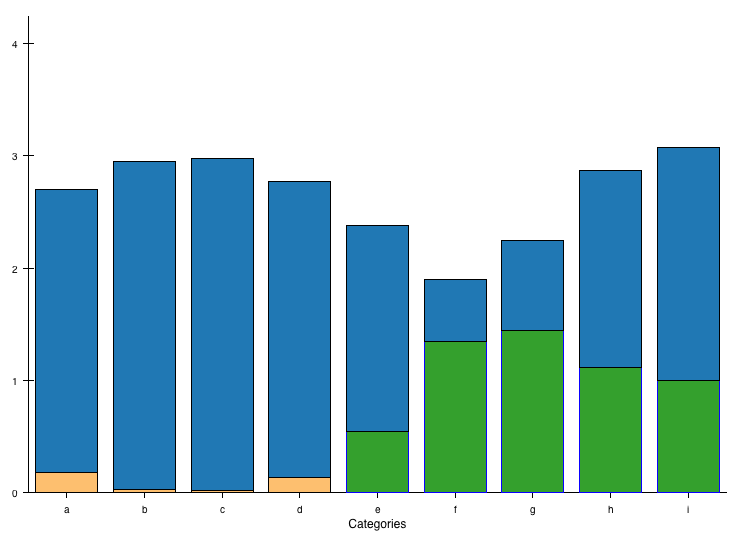

``bigdata.py``
--------------
Demonstrates chaco performance with large datasets.

There are 10 plots with 100,000 points each.  Right-click and drag to
create a range selection region.  The region can be moved around and
resized (drag the edges).  These interactions are very fast because
of the backbuffering built into chaco.

Zooming with the mousewheel and the zoombox (as described in simple_line.py)
is also available, but panning is not.

source: `bigdata.py <https://github.com/enthought/chaco/tree/main/examples/demo/bigdata.py>`_

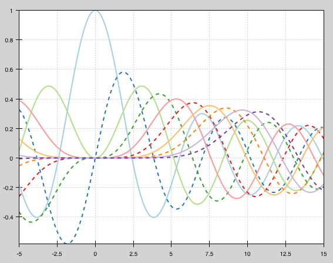

``cmap_image_plot.py``
----------------------
Draws a colormapped image plot.

source: `cmap_image_plot.py <https://github.com/enthought/chaco/tree/main/examples/demo/basic/cmap_image_plot.py>`_

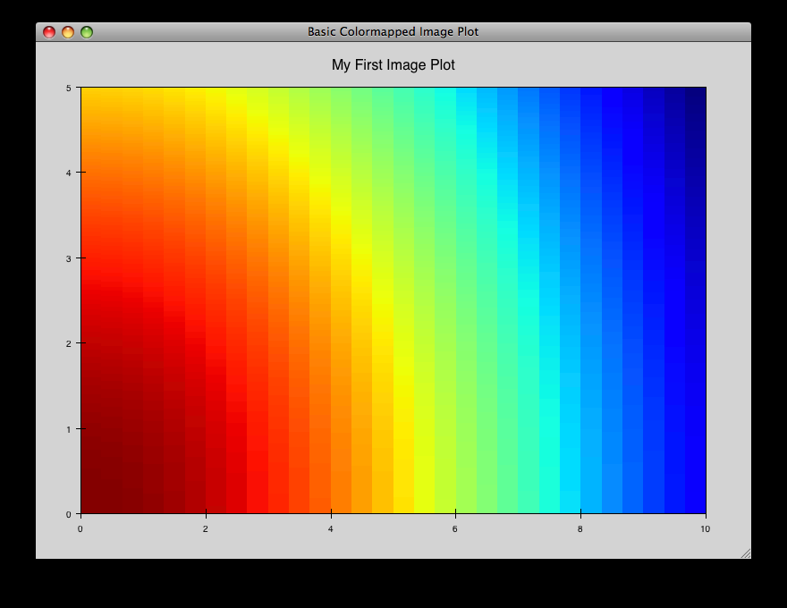

``cmap_image_select.py``
-------------------------
Draws a colormapped image plot. Selecting colors in the spectrum on the right
highlights the corresponding colors in the color map.

source: `cmap_image_select.py <https://github.com/enthought/chaco/tree/main/examples/demo/basic/cmap_image_select.py>`_

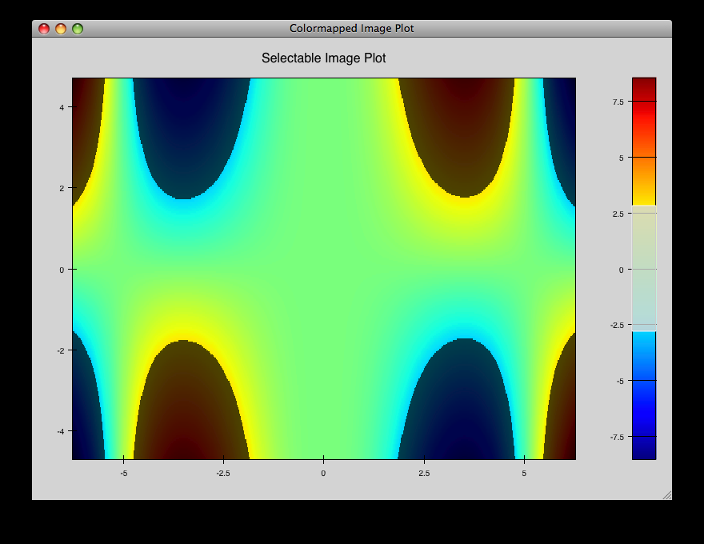

``cmap_scatter.py``
-------------------
Draws a colormapped scatterplot of some random data. Selection works the same as in cmap_image_select.py.

source: `cmap_scatter.py <https://github.com/enthought/chaco/tree/main/examples/demo/basic/cmap_scatter.py>`_

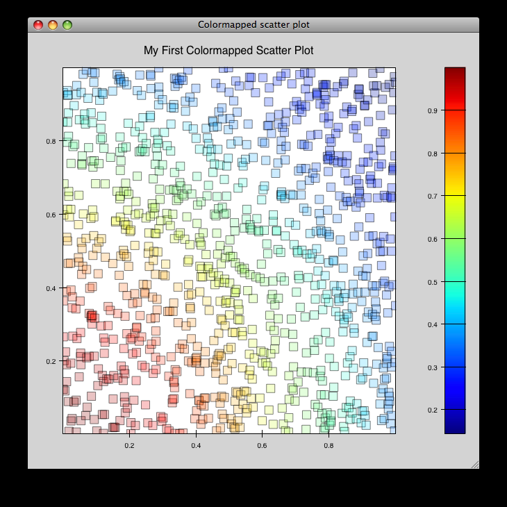

``contour_cmap_plot.py``
--------------------------
Renders some contoured and colormapped images of a scalar value field.

source: `countour_cmap_plot.py <https://github.com/enthought/chaco/tree/main/examples/demo/basic/contour_cmap_plot.py>`_

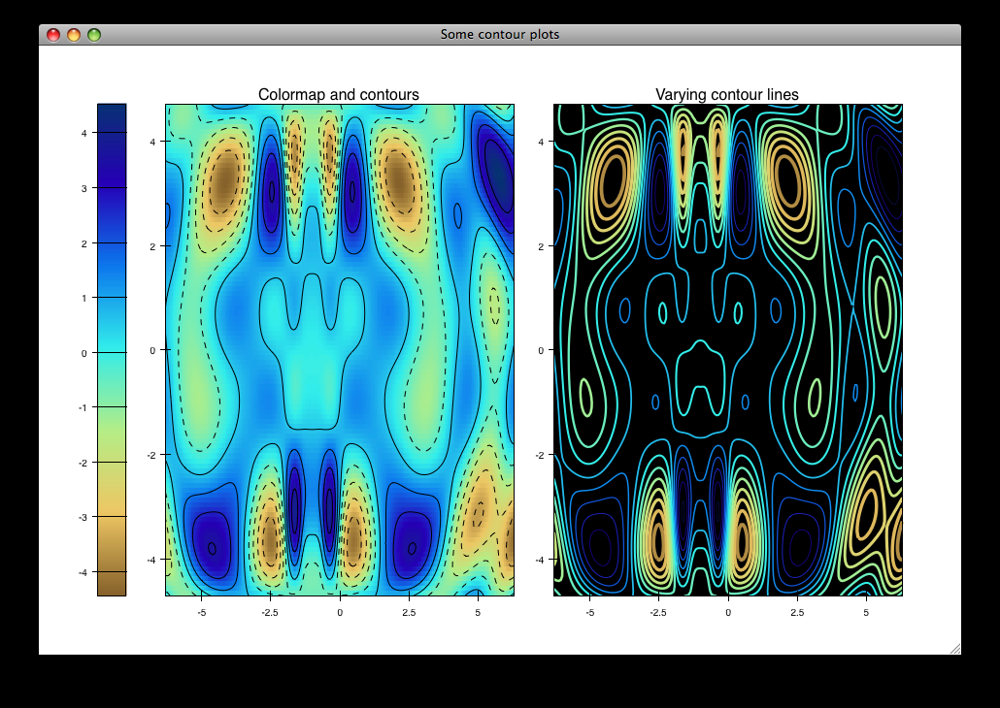

``contour_plot.py``
-------------------
Draws an contour polygon plot with a contour line plot on top.

source: `countour_plot.py <https://github.com/enthought/chaco/tree/main/examples/demo/basic/contour_plot.py>`_

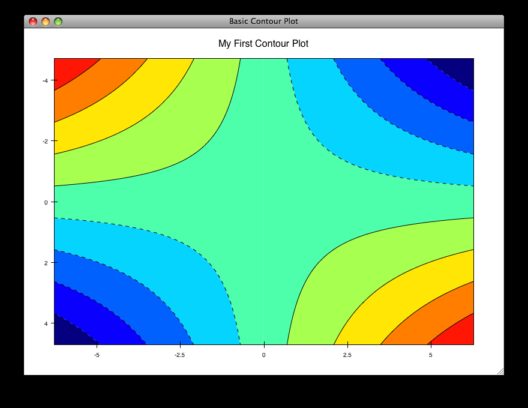

``cursor_tool_demo.py``
-----------------------
A Demonstration of the CursorTool functionality

Left-button drag to move the cursors round.
Right-drag to pan the plots. 'z'-key to Zoom

source: `cursor_tool_demo.py <https://github.com/enthought/chaco/tree/main/examples/demo/cursor_tool_demo.py>`_

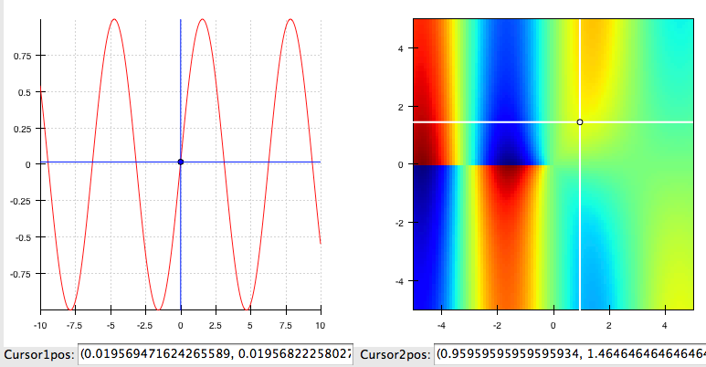

``data_cube.py``
----------------
Allows isometric viewing of a 3-D data cube (downloads the necessary data, about 7.8 MB)

source: `data_cube.py <https://github.com/enthought/chaco/tree/main/examples/demo/advanced/data_cube.py>`_

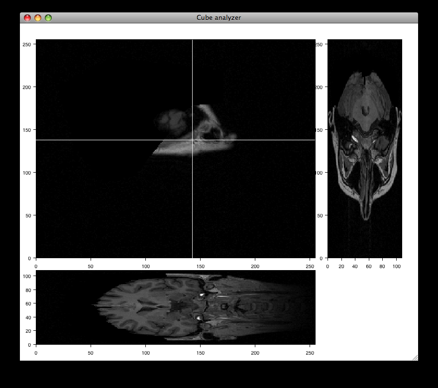

``data_labels.py``
------------------
Draws a line plot with several points labelled.  Demonstrates how to annotate
plots.

source: `data_labels.py <https://github.com/enthought/chaco/tree/main/examples/demo/data_labels.py>`_

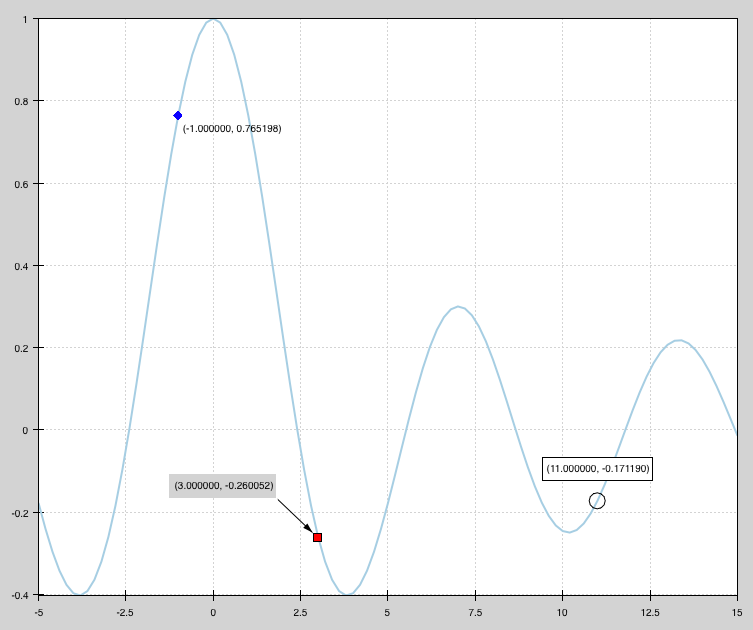

``data_stream.py``
------------------
This demo shows how Chaco and Traits can be used to easily build a data
acquisition and visualization system.

Two frames are opened: one has the plot and allows configuration of
various plot properties, and one which simulates controls for the hardware
device from which the data is being acquired; in this case, it is a mockup
random number generator whose mean and standard deviation can be controlled
by the user.

source: `data_stream.py <https://github.com/enthought/chaco/tree/main/examples/demo/advanced/data_stream.py>`_

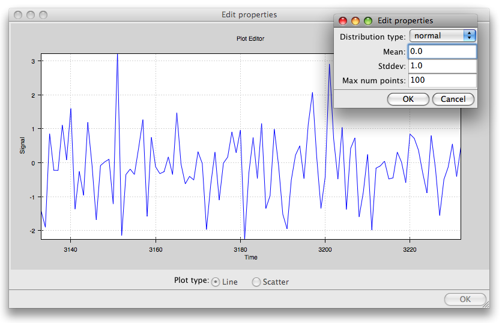

``data_view.py``
----------------
Example of how to use a DataView and bare renderers to create plots.

source: `data_view.py <https://github.com/enthought/chaco/tree/main/examples/demo/data_view.py>`_

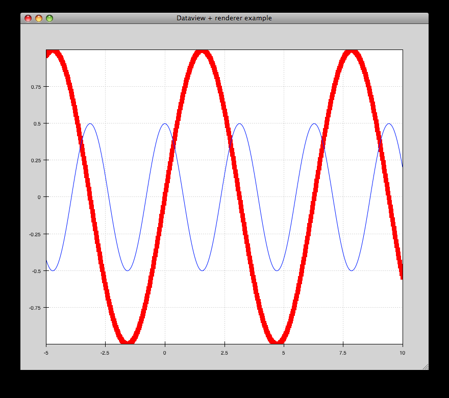

``edit_line.py``
----------------
Allows editing of a line plot.

source: `edit_line.py <https://github.com/enthought/chaco/tree/main/examples/demo/edit_line.py>`_

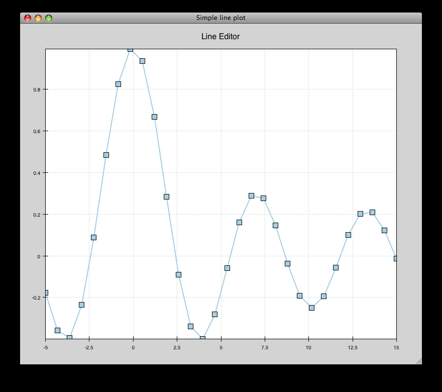

``financial_plot.py``
---------------------
Implementation of a standard financial plot visualization using Chaco renderers
and scales. Right-clicking and selecting an area in the top window zooms in
the corresponding area in the lower window.

source: `financial_plot.py <https://github.com/enthought/chaco/tree/main/examples/demo/financial_plot.py>`_

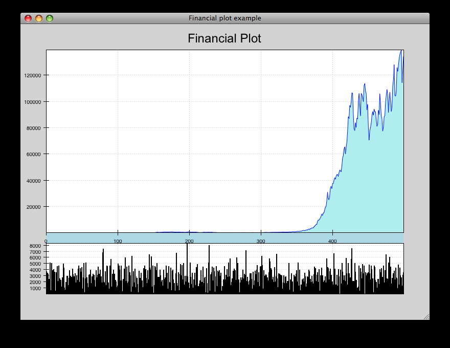

``financial_plot_dates.py``
---------------------------
Implementation of a standard financial plot visualization using Chaco renderers
and scales. Right-clicking and selecting an area in the top window zooms in
the corresopnding area in the lower window.
This differs from the financial_plot.py example in that it uses a date-oriented
axis.

source: `financial_plot_dates.py <https://github.com/enthought/chaco/tree/main/examples/demo/financial_plot_dates.py>`_

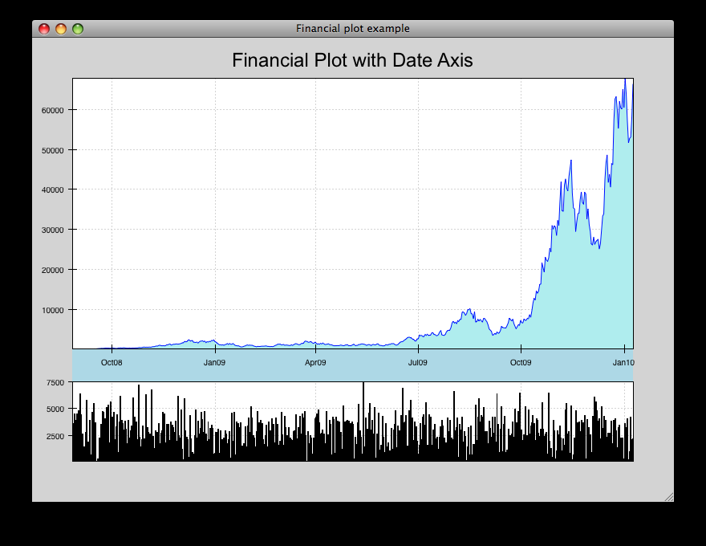

``grid_container.py``
---------------------
Draws several overlapping line plots.

source: `grid_container.py <https://github.com/enthought/chaco/tree/main/examples/demo/basic/grid_container.py>`_

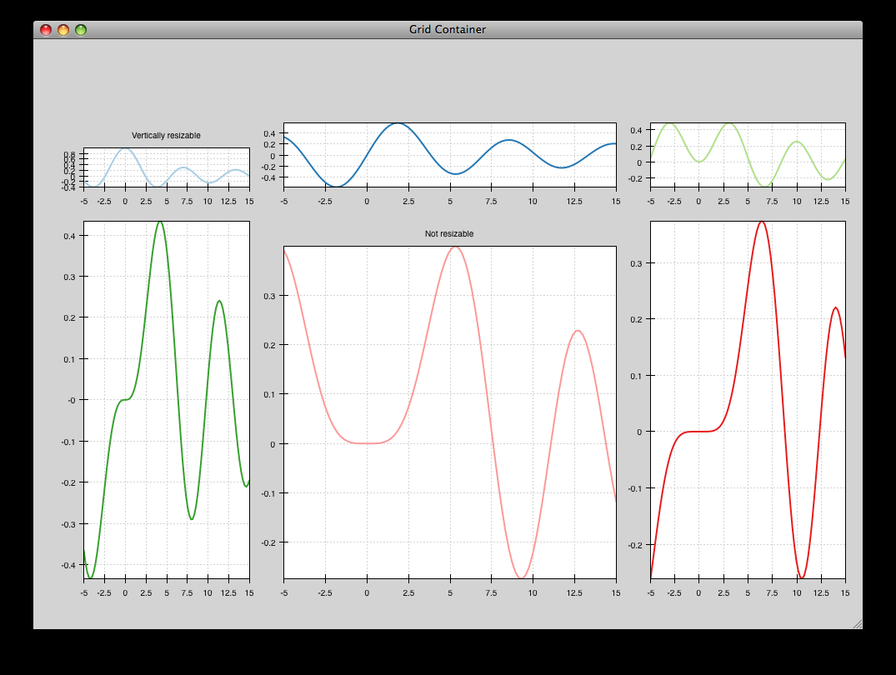

``grid_container_aspect_ratio``
-------------------------------
Similar to grid_container.py, but demonstrates Chaco's capability to used a
fixed screen space aspect ratio for plot components.

source: `grid_container_aspect_ratio.py <https://github.com/enthought/chaco/tree/main/examples/demo/basic/grid_container_aspect_ratio.py>`_

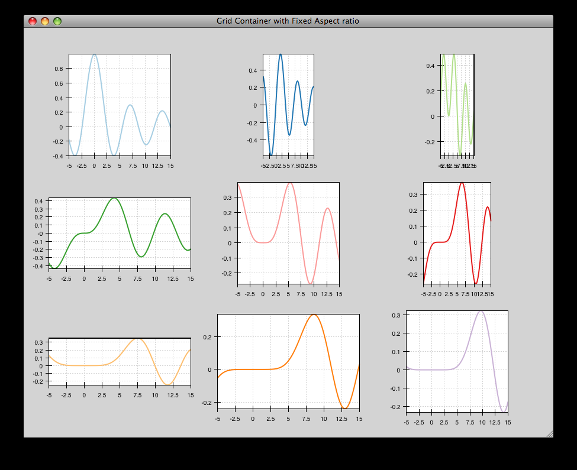

``image_from_file.py``
----------------------
Loads and saves RGB images from disk.

source: `image_from_file.py <https://github.com/enthought/chaco/tree/main/examples/demo/basic/image_from_file.py>`_

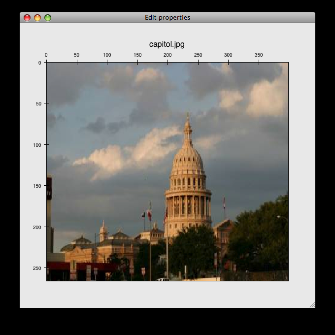

``image_inspector.py``
----------------------
Demonstrates the ImageInspectorTool and overlay on a colormapped image plot.
The underlying plot is similar to the one in cmap_image_plot.py.

source: `image_inspector.py <https://github.com/enthought/chaco/tree/main/examples/demo/basic/image_inspector.py>`_

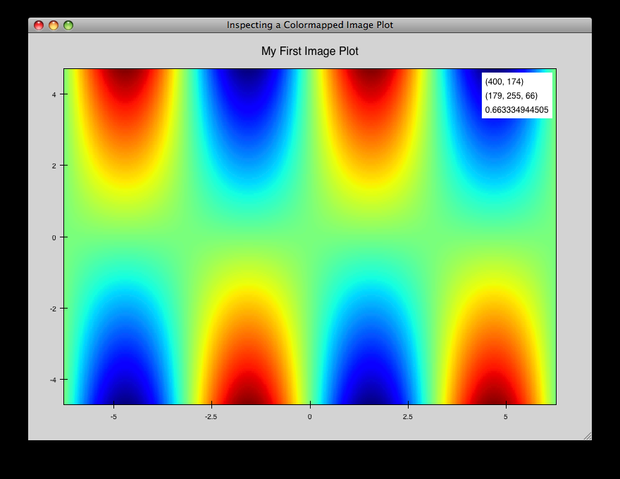

``image_plot.py``
-----------------
Draws a simple RGB image

source: `image_plot.py <https://github.com/enthought/chaco/tree/main/examples/demo/basic/image_plot.py>`_

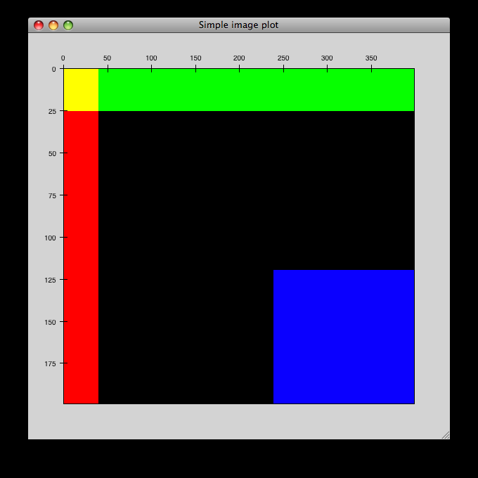

``inset_plot.py``
-----------------
A modification of line_plot1.py that shows the second plot as a subwindow of
the first.  You can pan and zoom the second plot just like the first, and you
can move it around my right-click and dragging in the smaller plot.

source: `inset_plot.py <https://github.com/enthought/chaco/tree/main/examples/demo/basic/inset_plot.py>`_

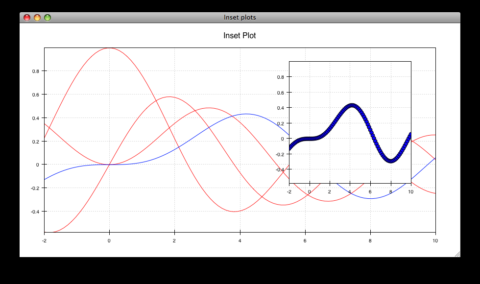

``line_drawing.py``
--------------------
Demonstrates using a line segment drawing tool on top of the scatter plot from
simple_scatter.py.

source: `line_drawing.py <https://github.com/enthought/chaco/tree/main/examples/demo/basic/line_drawing.py>`_

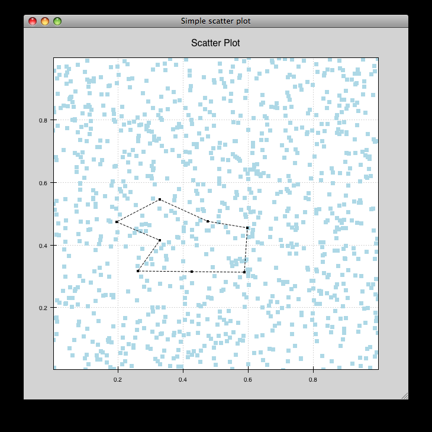

``line_plot1.py``
-----------------
Draws some x-y line and scatter plots.

source: `line_plot1.py <https://github.com/enthought/chaco/tree/main/examples/demo/basic/line_plot1.py>`_

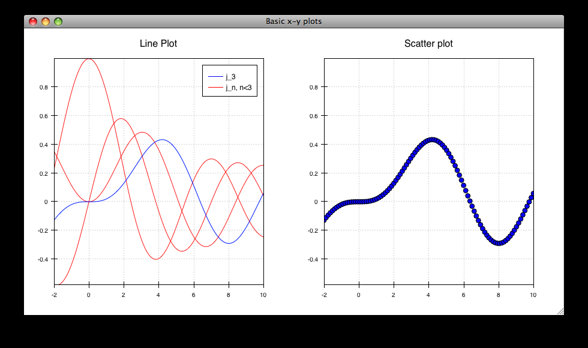

``line_plot_hold.py``
---------------------
Demonstrates the different 'hold' styles of LinePlot.

source: `line_plot_hold.py <https://github.com/enthought/chaco/tree/main/examples/demo/basic/line_plot_hold.py>`_

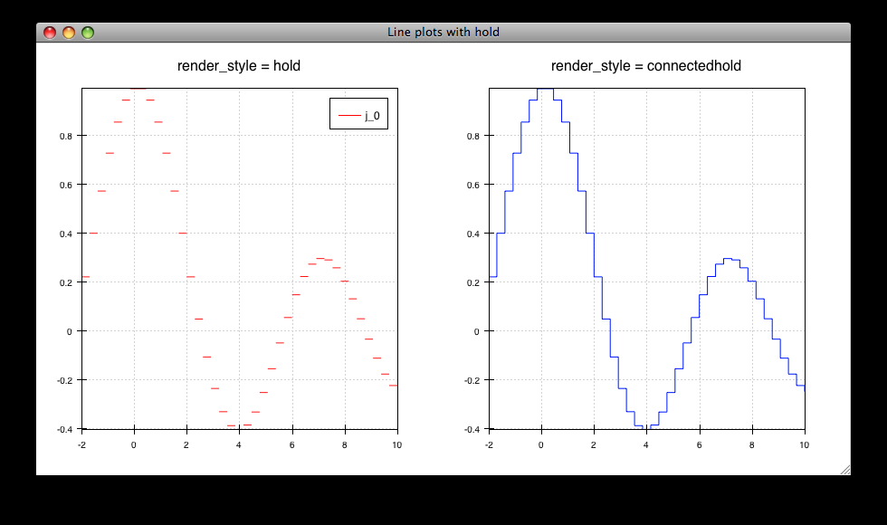

``log_plot.py``
-----------------
Draws some x-y log plots. (No Tools).

source: `log_plot.py <https://github.com/enthought/chaco/tree/main/examples/demo/basic/log_plot.py>`_

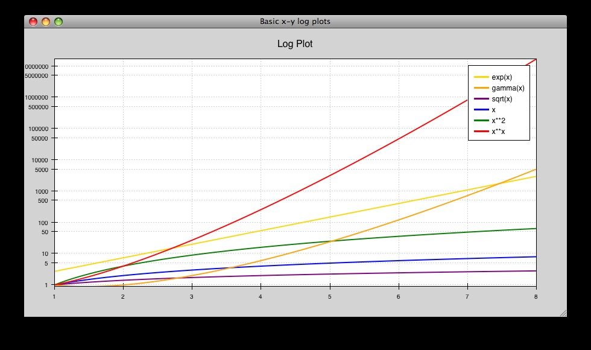

``multiaxis.py``
----------------
Draws several overlapping line plots like simple_line.py, but uses a separate
Y range for each plot.  Also has a second Y-axis on the right hand side.
Demonstrates use of the BroadcasterTool.

source: `multiaxis.py <https://github.com/enthought/chaco/tree/main/examples/demo/multiaxis.py>`_

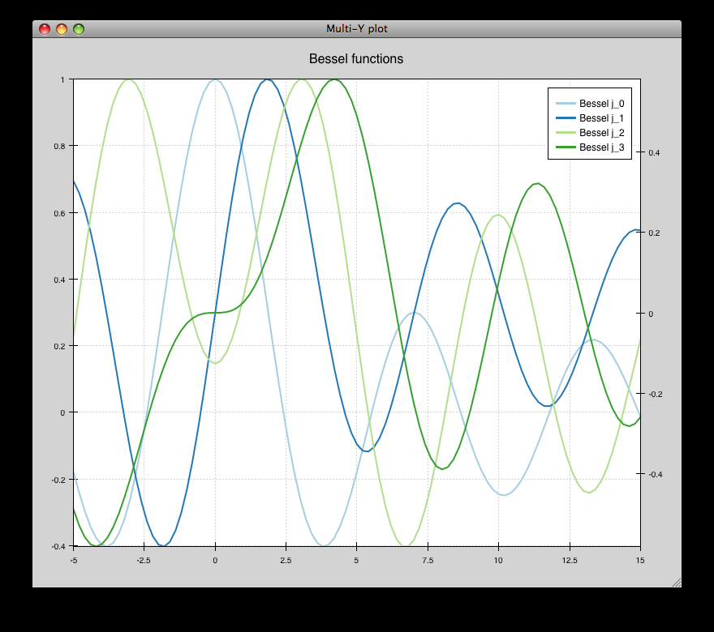

``multiaxis_using_Plot.py``
---------------------------
Draws some x-y line and scatter plots. On the left hand plot:
 - Left-drag pans the plot.
 - Mousewheel up and down zooms the plot in and out.
 - Pressing "z" opens the Zoom Box, and you can click-drag a rectangular
   region to zoom. If you use a sequence of zoom boxes, pressing alt-left-arrow
   and alt-right-arrow moves you forwards and backwards through the "zoom
   history".

source: `multiaxis_using_Plot.py <https://github.com/enthought/chaco/tree/main/examples/demo/multiaxis_using_Plot.py>`_

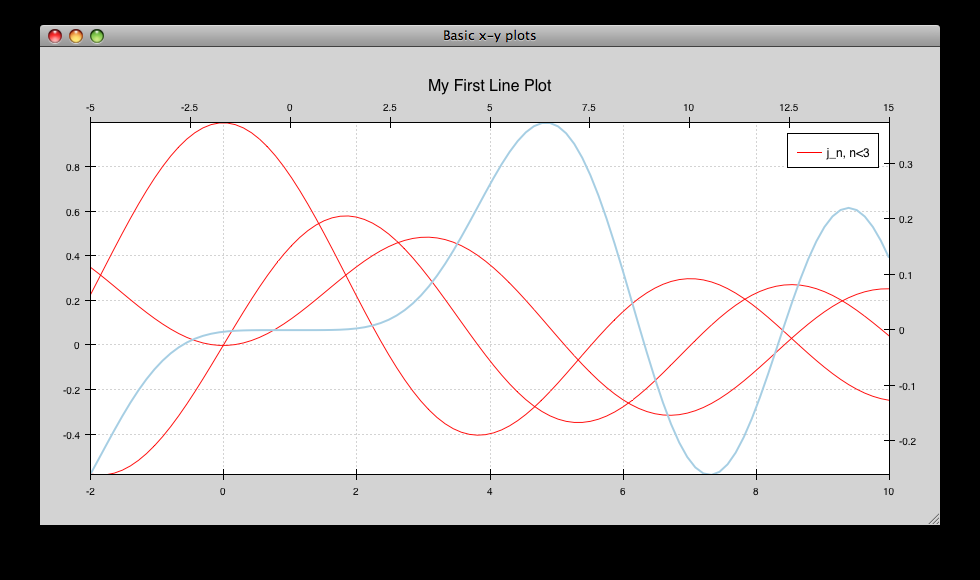

``nans_plot.py``
----------------
This plot displays chaco's ability to handle data interlaced with NaNs.

source: `nans_plot.py <https://github.com/enthought/chaco/tree/main/examples/demo/basic/nans_plot.py>`_

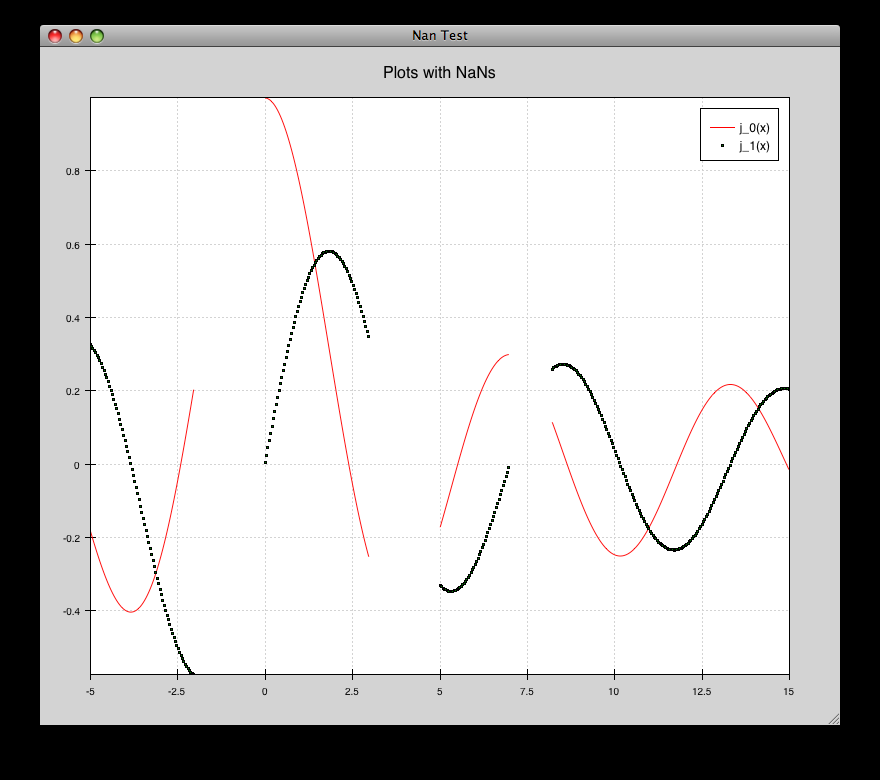

``noninteractive.py``
---------------------
This demonstrates how to create a plot offscreen and save it to an image file
on disk. The image is what is saved.

source: `noninteractive.py <https://github.com/enthought/chaco/tree/main/examples/demo/noninteractive.py>`_

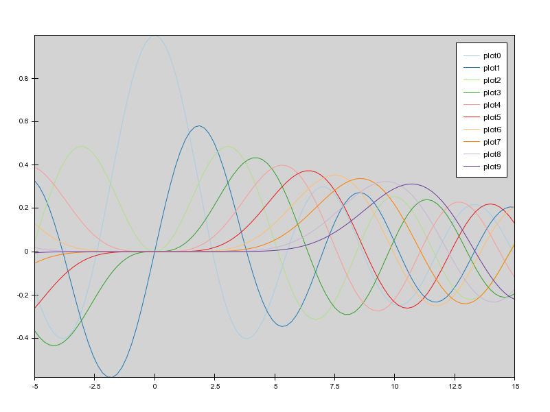

``polygon_move.py``
-------------------
Shares same basic interactions as polygon_plot.py, but adds a new one:
right-click and drag to move a polygon around.

source: `polygon_move.py <https://github.com/enthought/chaco/tree/main/examples/demo/basic/polygon_move.py>`_

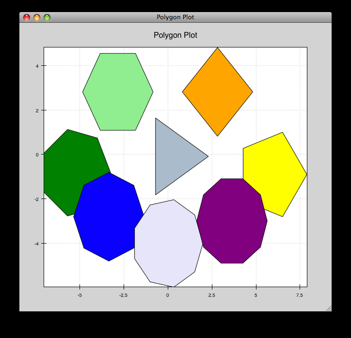

``polygon_plot_demo.py``
------------------------
Draws some different polygons.

source: `polygon_plot_demo.py <https://github.com/enthought/chaco/tree/main/examples/demo/basic/polygon_plot_demo.py>`_

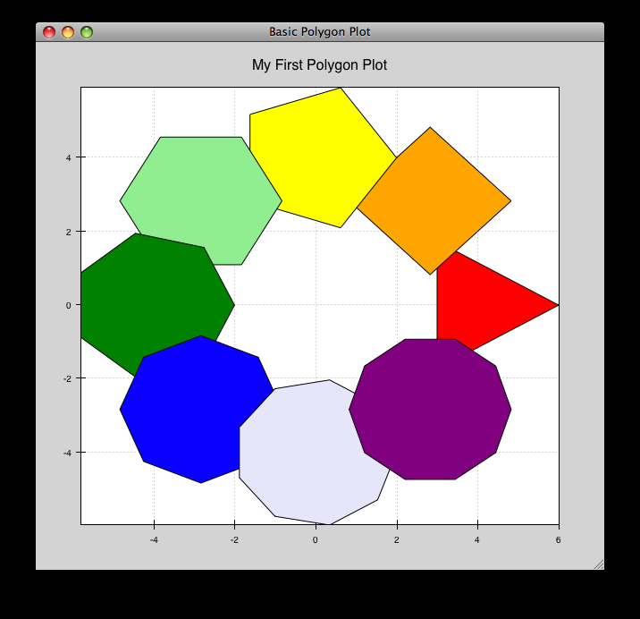

``range_selection_demo.py``
---------------------------
Demo of the RangeSelection on a line plot.  Left-click and drag creates a
horizontal range selection; this selection can then be dragged around, or
resized by dragging its edges.

source: `range_selection_demo.py <https://github.com/enthought/chaco/tree/main/examples/demo/range_selection_demo.py>`_

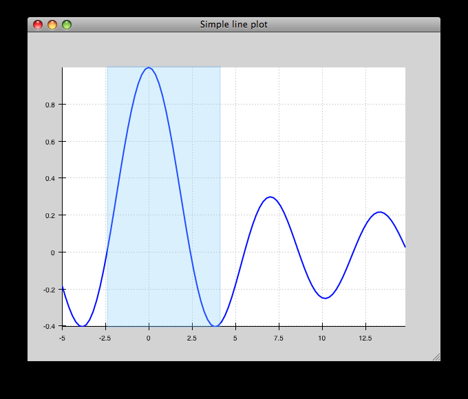

``regression.py``
-------------------
Demonstrates the Regression Selection tool.

Hold down the left mouse button to use the mouse to draw a selection region
around some points, and a line fit is drawn through the center of the points.
The parameters of the line are displayed at the bottom of the plot region.  You
can do this repeatedly to draw different regions.

source: `regression.py <https://github.com/enthought/chaco/tree/main/examples/demo/basic/regression.py>`_

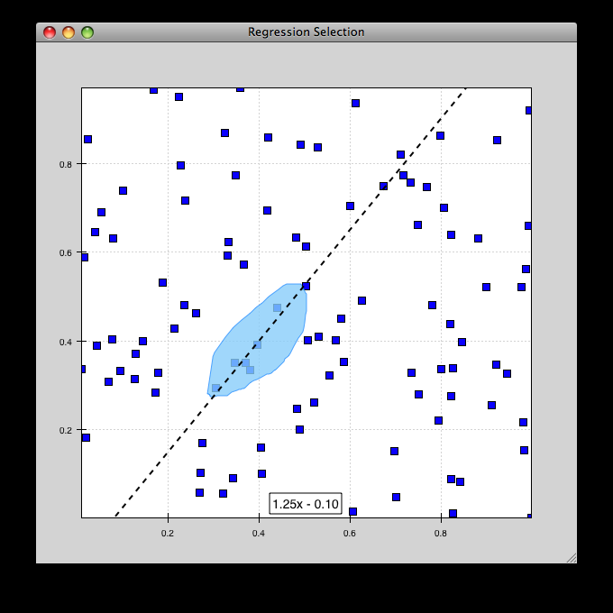

``scalar_image_function_inspector.py``
--------------------------------------
Renders a colormapped image of a scalar value field, and a cross section
chosen by a line interactor.

source: `scalar_image_function_inspector.py <https://github.com/enthought/chaco/tree/main/examples/demo/advanced/scalar_image_function_inspector.py>`_

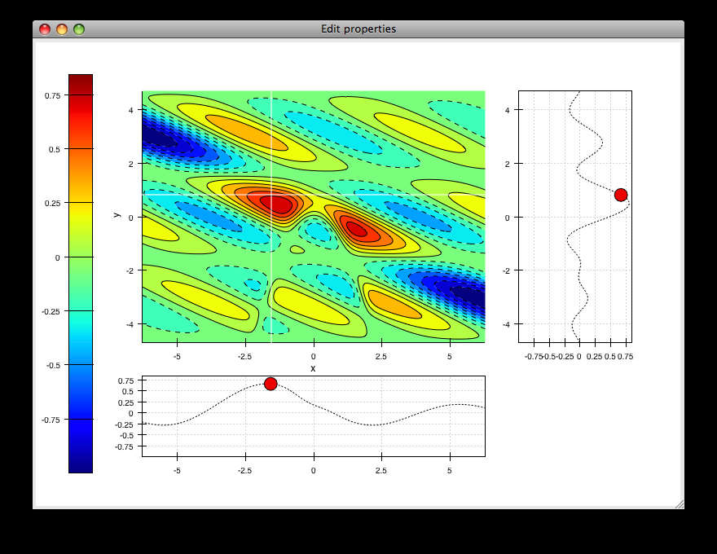

``scales_test.py``
------------------
Draws several overlapping line plots.

Double-clicking on line or scatter plots opens a Traits editor for the plot.

source: `scales_test.py <https://github.com/enthought/chaco/tree/main/examples/demo/scales_test.py>`_

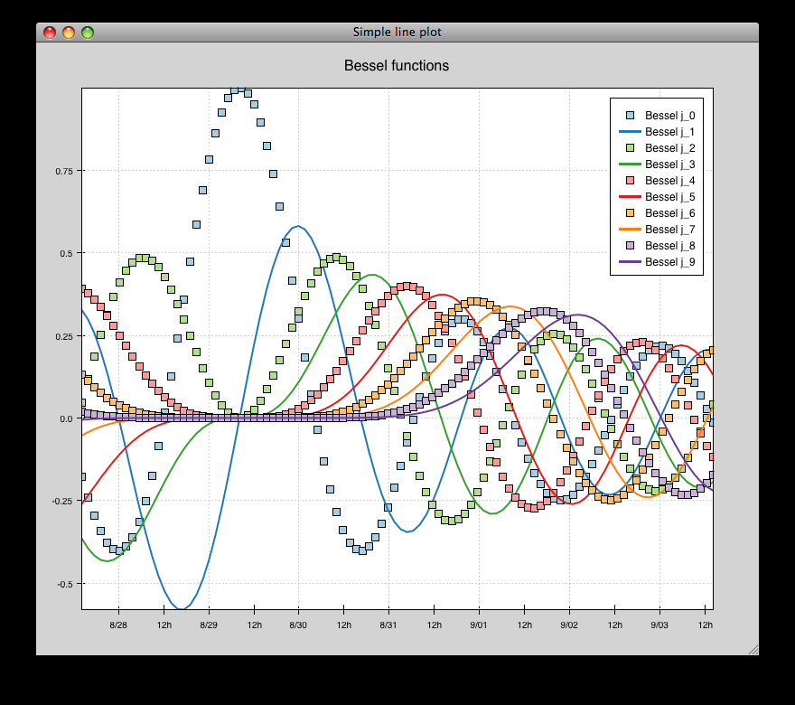

``scatter.py``
-------------------
Draws a simple scatterplot of a set of random points.

source: `scatter.py <https://github.com/enthought/chaco/tree/main/examples/demo/basic/scatter.py>`_

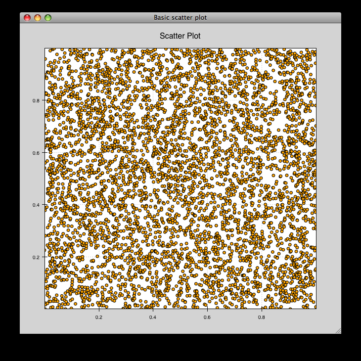

``scatter_inspector.py``
------------------------
Example of using tooltips on Chaco plots.

source: `scatter_inspector.py <https://github.com/enthought/chaco/tree/main/examples/demo/basic/scatter_inspector.py>`_

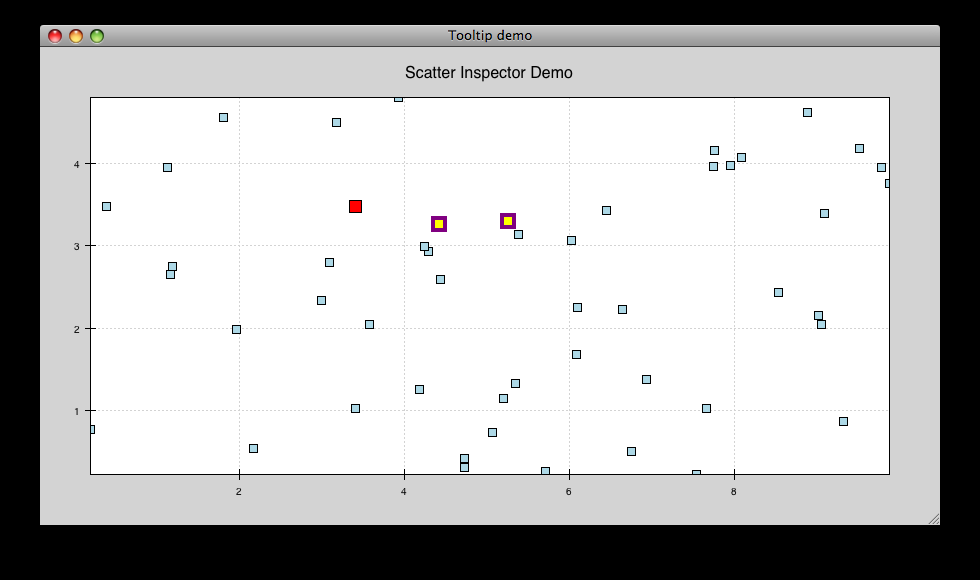

``scatter_select.py``
------------------------
Draws a simple scatterplot of random data.  The only interaction available is
the lasso selector, which allows you to circle a set of points.  Upon
completion of the lasso operation, the indices of the selected points are
printed to the console.

source: `scatter_select.py <https://github.com/enthought/chaco/tree/main/examples/demo/basic/scatter_select.py>`_

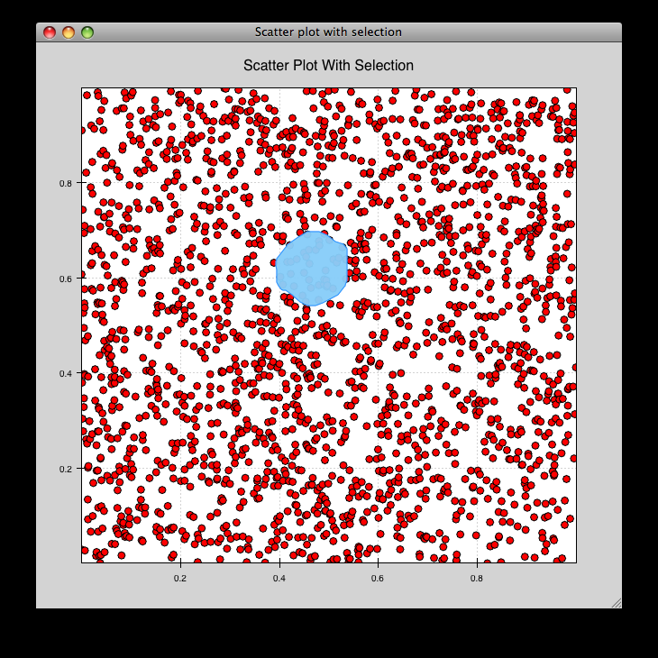

console output::

    New selection:
        [789  799  819  830  835  836  851  867  892  901  902  909  913  924  929
         931  933  938  956  971  972  975  976  996  999 1011 1014 1016 1021 1030
         1045 1049 1058 1061 1073 1086 1087 1088]

``scrollbar.py``
-------------------
Draws some x-y line and scatter plots.

source: `scrollbar.py <https://github.com/enthought/chaco/tree/main/examples/demo/basic/scrollbar.py>`_

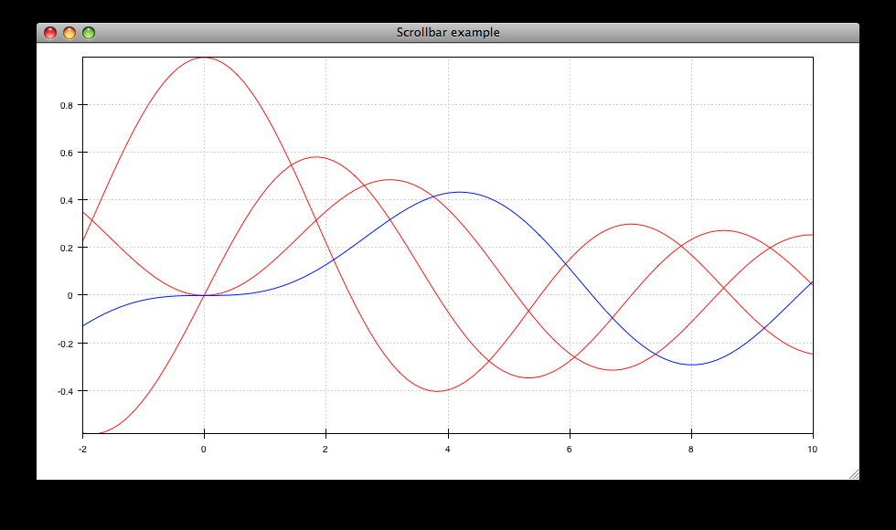

``simple_line.py``
------------------
Draws several overlapping line plots.

Double-clicking on line or scatter plots opens a Traits editor for the plot.

source: `simple_line.py <https://github.com/enthought/chaco/tree/main/examples/demo/simple_line.py>`_

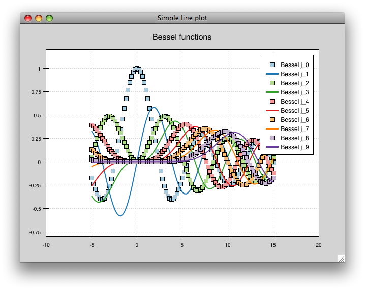

.. [COMMENT]::

    ``simple_polar.py``
    -------------------
    Draws a static polar plot.

    source: `simple_polar.py <https://github.com/enthought/chaco/tree/main/examples/demo/simple_polar.py>`_

    .. image:: example_images/simple_polar.png

``spectrum.py``
--------------------------------------
This plot displays the audio spectrum from the microphone.

source: `spectrum.py <https://github.com/enthought/chaco/tree/main/examples/demo/advanced/spectrum.py>`_

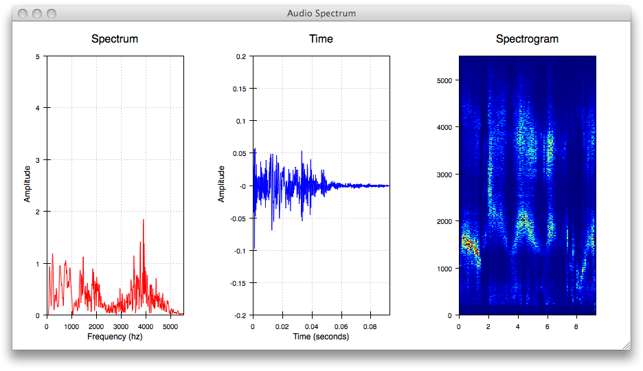

``tabbed_plots.py``
-------------------
Draws some x-y line and scatter plots.

source: `tabbed_plots.py <https://github.com/enthought/chaco/tree/main/examples/demo/basic/tabbed_plots.py>`_

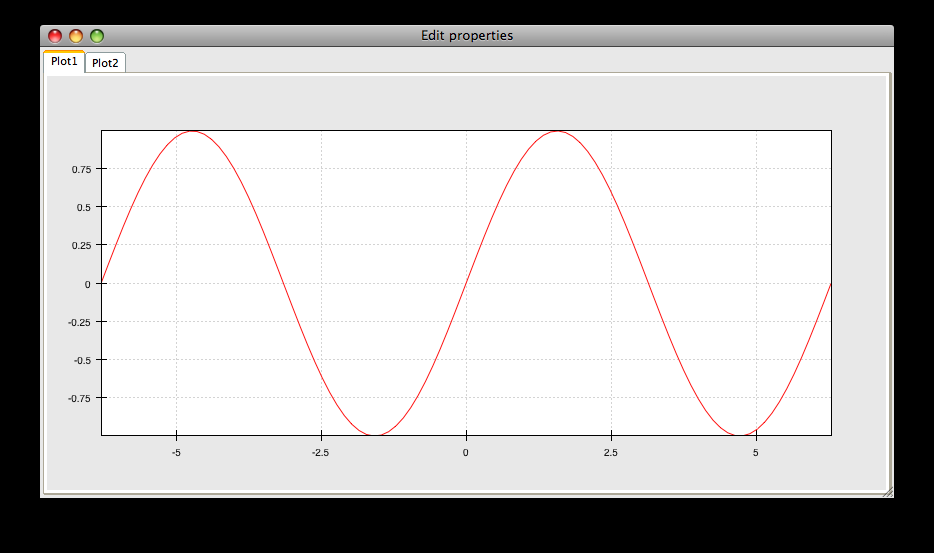
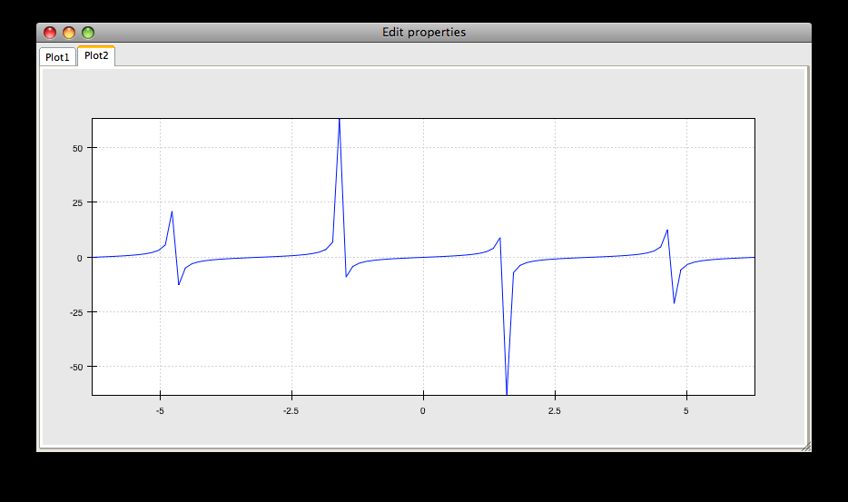

``tornado.py``
--------------
Tornado plot example from Brennan Williams.

source: `tornado.py <https://github.com/enthought/chaco/tree/main/examples/demo/tornado.py>`_

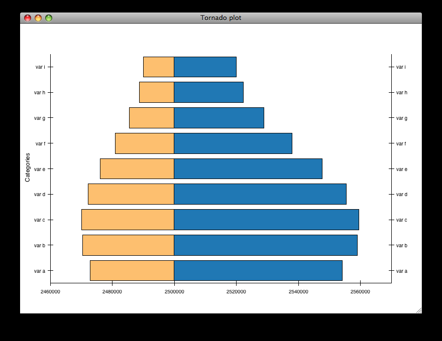

``two_plots.py``
----------------
Demonstrates plots sharing datasources, ranges, etc...

source: `two_plots.py <https://github.com/enthought/chaco/tree/main/examples/demo/two_plots.py>`_

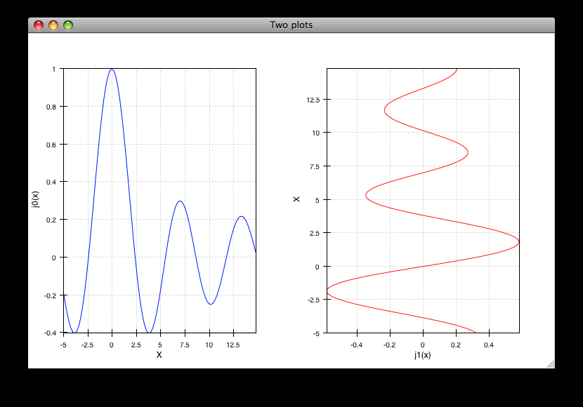

``vertical_plot.py``
--------------------
Draws a static plot of bessel functions, oriented vertically, side-by-side.

You can experiment with using different containers (uncomment lines 32-33)
or different orientations on the plots (comment out line 43 and uncomment 44).

source: `vertical_plot.py <https://github.com/enthought/chaco/tree/main/examples/demo/vertical_plot.py>`_

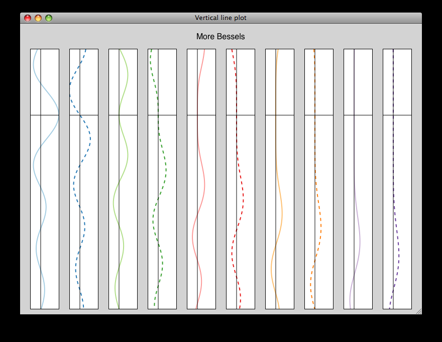

``zoomable_colorbar.py``
------------------------
Draws a colormapped scatterplot of some random data.

Interactions on the plot are the same as for simple_line.py, and additionally,
pan and zoom are available on the colorbar.

Left-click pans the colorbar's data region.  Right-click-drag
selects a zoom range.  Mousewheel up and down zoom in and out on
the data bounds of the color bar.

source: `zoomable_colorbar.py <https://github.com/enthought/chaco/tree/main/examples/demo/basic/zoomable_colorbar.py>`_

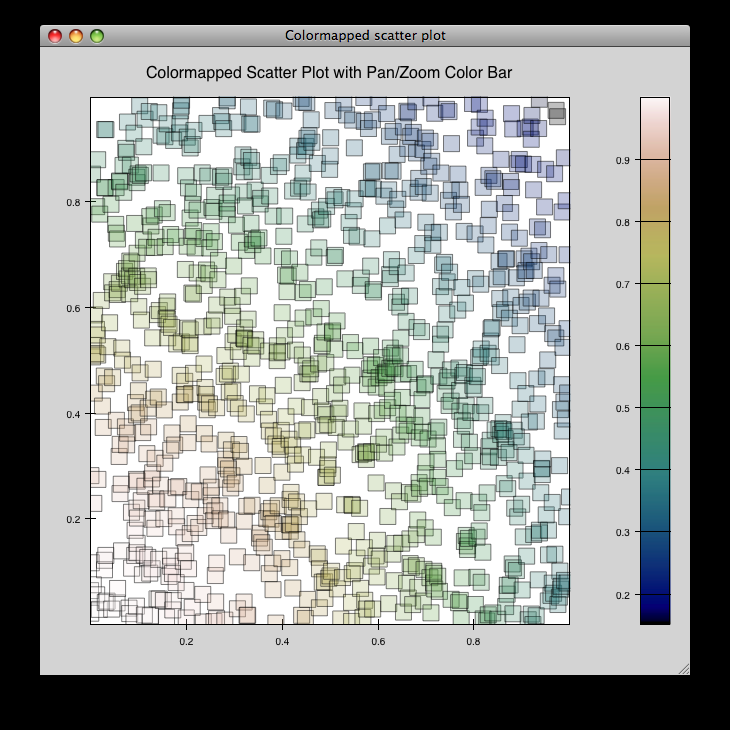

``zoomed_plot``
------------------------
The main executable file for the zoom_plot demo.

Right-click and drag on the upper plot to select a region to view in detail
in the lower plot.  The selected region can be moved around by dragging,
or resized by clicking on one of its edges and dragging.

source: `zoomed_plot <https://github.com/enthought/chaco/tree/main/examples/demo/zoomed_plot/>`_

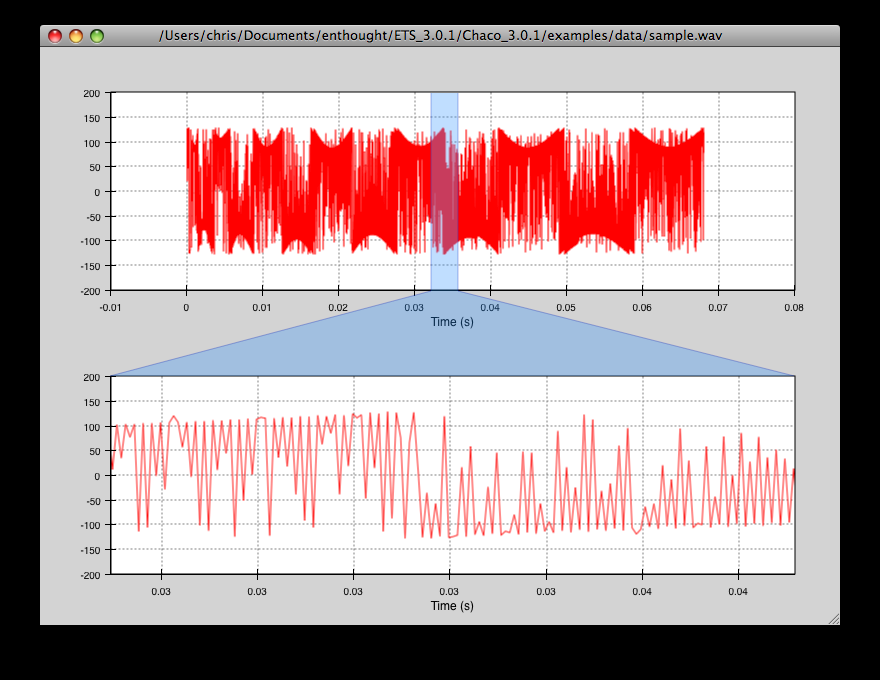
