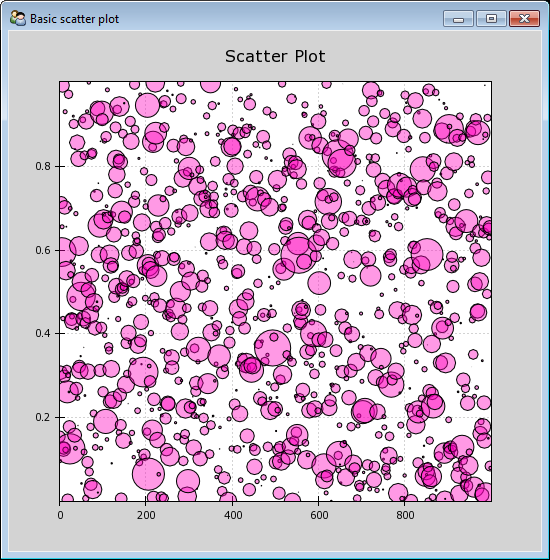

Chaco Advanced Examples
=======================

.. _demo_function_inspector:

Function Inspector Demo
-----------------------

Colormap of a scalar value field with cross sections that can be animated

A complex example showing interaction between a Traits-based interactive model,
interactive plot parameters, and multiple Chaco components.

Renders a colormapped image of a scalar value field, and a cross section
chosen by a line interactor.

Animation must be disabled (unchecked) before the model can be edited.

Complete source code:

.. literalinclude:: ../../../examples/demo/advanced/scalar_image_function_inspector.py

.. _demo_variable_sized_scatter:

Variable-sized Scatterplot Demo
-------------------------------

Draws a scatterplot of a set of random points of variable size.

 - This uses the non-standard renderer, VariableSizeScatterPlot
 
 - Left-drag pans the plot.
 
 - Mousewheel up and down zooms the plot in and out.
 
 - Pressing "z" brings up the Zoom Box, and you can click-drag a rectangular
   region to zoom.  If you use a sequence of zoom boxes, pressing alt-left-arrow
   and alt-right-arrow moves you forwards and backwards through the "zoom
   history".

Complete source code:

.. literalinclude:: ../../../examples/demo/advanced/variable_sized_scatter.py

