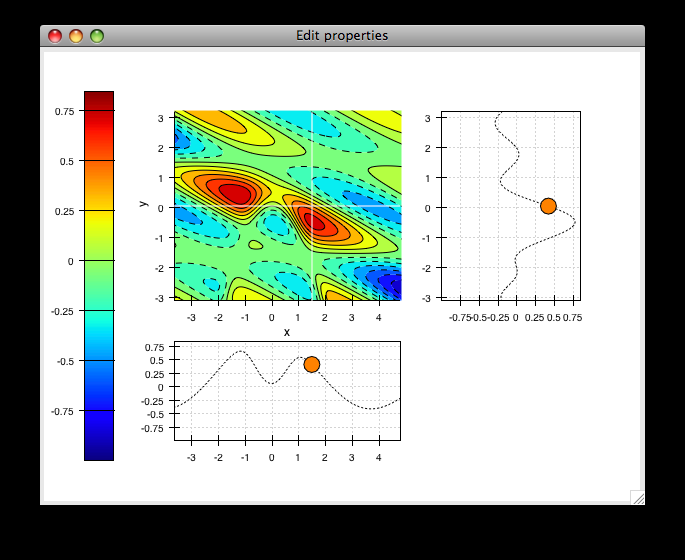
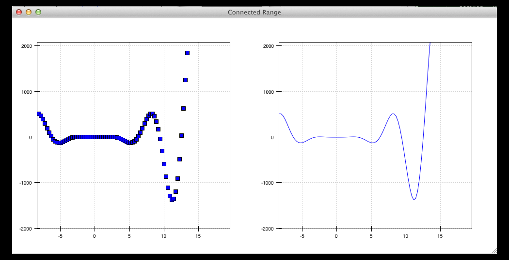
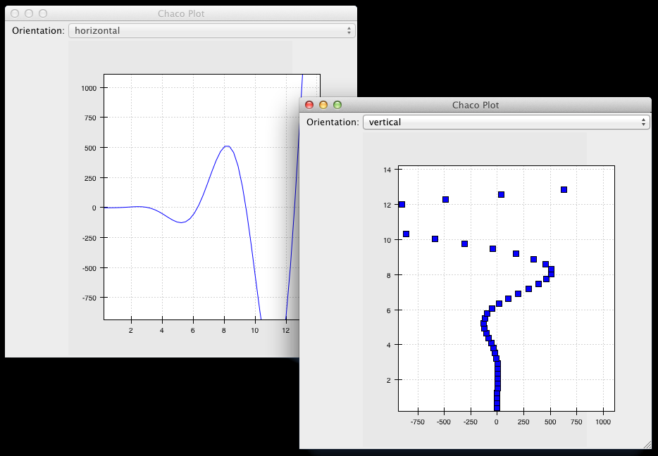
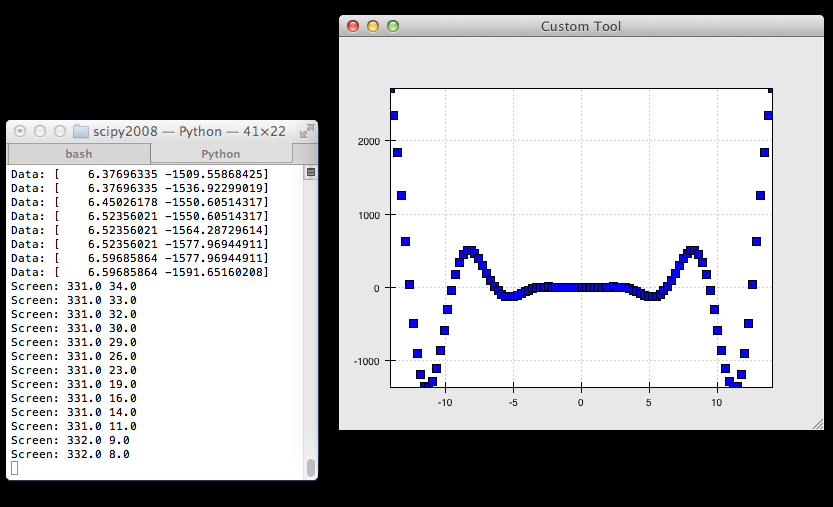

.. highlight:: python
   :linenothreshold: 10
   
.. _tutorial:

###############################
Interactive plotting with Chaco
###############################

Overview
========

This tutorial is an introduction to Chaco. We're going to build several
mini-applications of increasing capability and complexity. Chaco was designed to
be used primarily by scientific programmers, and this tutorial requires only
basic familiarity with Python.

Knowledge of NumPy can be helpful for certain parts of the tutorial. Knowledge
of GUI programming concepts such as widgets, windows, and events are helpful
for the last portion of the tutorial, but it is not required.

This tutorial demonstrates using Chaco with Traits UI, so knowledge of the
Traits framework is also helpful. We don't use very many sophisticated aspects
of Traits or Traits UI, and it is entirely possible to pick it up as you go
through the tutorial. This tutorial applies to Enthought Tool Suite
version 3.x.

It's also worth pointing out that you don't *have* to use Traits UI in order to
use Chaco --- you can integrate Chaco directly with Qt or wxPython --- but for
this tutorial, we use Traits UI to make things easier.

Goals
=====

By the end of this tutorial, you will have learned how to:

- create plots of various types

- arrange plots in various layouts

- configure and dynamically modify your plots using Traits UI

- interact with plots using tools

- create custom, stateful tools that interact with mouse and keyboard

Introduction
============

Chaco is a *plotting application toolkit*. This means that it can build
both static plots and dynamic data visualizations that let you
interactively explore your data. Here are four basic examples of Chaco plots:

.. image:: images/tornado.png
    :height: 300pt

This plot shows a static "tornado plot" with a categorical Y axis and continuous
X axis.  The plot is resizable, but the user cannot interact or explore the data
in any way.

.. image:: images/simple_line.png
    :height: 300pt

This is an overlaid composition of line and scatter plots with a legend. Unlike
the previous plot, the user can pan and zoom this plot, exploring the
relationship between data curves in areas that appear densely overlapping.
Furthermore, the user can move the legend to an arbitrary position on the plot,
and as they resize the plot, the legend maintains the same screen-space
separation relative to its closest corner.

.. image:: images/regression.png
    :height: 300pt

This example starts to demonstrate interacting with the data set in an
exploratory way. Whereas interactivity in the previous example was limited to
basic pan and zoom (which are fairly common in most plotting libraries), this is
an example of a more advanced interaction that allows a level of data
exploration beyond the standard view manipulations.

With this example, the user can select a region of data space, and a simple
line fit is applied to the selected points. The equation of the line is
then displayed in a text label.

The lasso selection tool and regression overlay are both built in to Chaco,
but they serve an additional purpose of demonstrating how one can build complex
data-centric interactions and displays on top of the Chaco framework.

This is a much more complex demonstration of Chaco's capabilities.  The user
can view the cross sections of a 2-D scalar-valued function.  The cross sections
update in real time as the user moves the mouse, and the "bubble" on each line
plot represents the location of the cursor along that dimension.  By using
drop-down menus (not show here), the user can change plot attributes like the
colormap and the number of contour levels used in the center plot, as well as
the actual function being plotted.

Script-oriented plotting
========================

We distinguish between "static" plots and "interactive visualizations"
because these different applications of a library affect the structure
of how the library is written, as well as the code you write to use the
library.

Here is a simple example of the "script-oriented" approach for creating
a static plot.  This is probably familiar to anyone who has used Gnuplot,
MATLAB, or Matplotlib::

    import numpy as np
    from chaco.shell import *

    x = np.linspace(-2*pi, 2*pi, 100)
    y = np.sin(x)

    plot(x, y, "r-")
    title("First plot")
    ytitle("sin(x)")
    show()

This creates this plot:

.. image:: images/script_oriented.png
    :height: 300pt

The basic structure of this example is that we generate some data, then we call
functions to plot the data and configure the plot. There is a global concept of
"the active plot", and the functions do high-level manipulations on it. The
generated plot is then usually saved to disk for inclusion in a journal article
or presentation slides.

Now, as it so happens, this particular example uses the `chaco.shell`
script plotting package, so when you run this script, the plot that Chaco opens
does have some basic interactivity. You can pan and zoom, and even move forwards
and backwards through your zoom history. But ultimately it's a pretty static
view into the data.

.. _line_plot_example:

Application-oriented plotting
=============================

The second approach to plotting can be thought of as "application-oriented", for
lack of a better term. There is definitely a bit more code, and the plot
initially doesn't look much different, but it sets us up to do more interesting
things, as you will see later on::

    from traits.api import HasTraits, Instance
    from traitsui.api import View, Item
    from chaco.api import Plot, ArrayPlotData
    from enable.component_editor import ComponentEditor
    from numpy import linspace, sin

    class LinePlot(HasTraits):
        plot = Instance(Plot)

        traits_view = View(
            Item('plot',editor=ComponentEditor(), show_label=False), 
            width=500, height=500, resizable=True, title="Chaco Plot")

        def __init__(self):
            super(LinePlot, self).__init__()

            x = linspace(-14, 14, 100)
            y = sin(x) * x**3
            plotdata = ArrayPlotData(x=x, y=y)

            plot = Plot(plotdata)
            plot.plot(("x", "y"), type="line", color="blue")
            plot.title = "sin(x) * x^3"

            self.plot = plot

    if __name__ == "__main__":
        LinePlot().configure_traits()

This produces a plot similar to the previous script-oriented code snippet:

.. image:: images/first_plot.png
    :height: 300pt

So, this is our first "real" Chaco plot. We will walk through this code and
look at what each bit does.  This example serves as the basis for many of the
later examples.

Application-oriented plotting, step by step
===========================================

Let's start with the basics.  First, we declare a class to represent our
plot, called :class:`LinePlot`::

    class LinePlot(HasTraits):
        plot = Instance(Plot)

This class uses the Enthought Traits package, and all of our objects subclass
from :class:`HasTraits`.

Next, we declare a Traits UI View for this class::

    traits_view = View( 
            Item('plot',editor=ComponentEditor(), show_label=False), 
            width=500, height=500, resizable=True, title="Chaco Plot") 

Inside this view, we are placing a reference to the :attr:`plot` trait and
telling Traits UI to use the :class:`ComponentEditor` (imported from 
:mod:`enable.component_editor`) to display it. If the
trait were an Int or Str or Float, Traits could automatically pick an 
appropriate GUI element to display it. Since Traits UI doesn't natively know 
how to display Chaco components, we explicitly tell it what kind of editor to
use.

The other parameters in the :class:`View` constructor are pretty
self-explanatory, and the 
`Traits UI User's Guide <http://code.enthought.com/projects/traits/docs/html/TUIUG/index.html>`_ 
documents all the various properties
you can set here. For our purposes, this Traits View is sort of boilerplate. It
gets us a nice little window that we can resize. We'll be using something like
this View in most of the examples in the rest of the tutorial.

Now, let's look at the constructor, where the real work gets done::

    def __init__(self): 
        super(LinePlot, self).__init__()
        x = linspace(-14, 14, 100) 
        y = sin(x) * x**3 
        plotdata = ArrayPlotData(x=x, y=y) 

The first thing we do here is call the super-class's :meth:`__init__` method,
which ensures that all the Traits machinery is properly set up, even though the
:meth:`__init__` method is overridden. Then we create some mock data, just like
in the script-oriented approach. But rather than directly calling some sort of
plotting function to throw up a plot, we create this :class:`ArrayPlotData`
object and stick the data in there. The ArrayPlotData object is a simple
structure that associates a name with a NumPy array.

In a script-oriented approach to plotting, whenever you have to update the data
or tweak any part of the plot, you basically re-run the entire script.  Chaco's
model is based on having objects representing each of the little pieces of a
plot, and they all use Traits events to notify one another that some attribute
has changed.  So, the ArrayPlotData is an object that interfaces your
data with the rest of the objects in the plot.  In a later example we'll see
how we can use the ArrayPlotData to quickly swap data items in and
out, without affecting the rest of the plot.

The next line creates an actual :class:`Plot` object, and gives it the
ArrayPlotData instance we created previously::

    plot = Plot(plotdata)

Chaco's Plot object serves two roles: it is both a container of
renderers, which are the objects that do the actual task of transforming data
into lines and markers and colors on the screen, and it is a factory for
instantiating renderers. Once you get more familiar with Chaco, you can choose
to not use the Plot object, and instead directly create renderers and containers
manually. Nonetheless, the Plot object does a lot of nice housekeeping that is
useful in a large majority of use cases.

Next, we call the :meth:`plot` method on the Plot object we just created::

    plot.plot(("x", "y"), type="line", color="blue")

This creates a blue line plot of the data items named "x" and "y".  Note that
we are not passing in an actual array here; we are passing in the names of arrays
in the ArrayPlotData we created previously.

This method call creates a new renderer --- in this case a line renderer --- and
adds it to the Plot.

This may seem kind of redundant or roundabout to folks who are used to passing
in a pile of NumPy arrays to a plot function, but consider this:
ArrayPlotData objects can be shared between multiple Plots.  If you
want several different plots of the same data, you don't have to externally
keep track of which plots are holding on to identical copies of what data, and
then remember to shove in new data into every single one of those plots.  The
ArrayPlotData object acts almost like a symlink between consumers of data and
the actual data itself.

Next, we set a title on the plot::

    plot.title = "sin(x) * x^3"

And then we set our :attr:`plot` trait to the new plot::

    self.plot = plot

The last thing we do in this script is set up some code to run when the script
is executed::

    if __name__ == "__main__": 
        LinePlot().configure_traits() 

This one-liner instantiates a LinePlot object and calls its
:meth:`configure_traits` method.  This brings up a dialog with a traits editor for
the object, built up according to the View we created earlier.  In our
case, the editor just displays our :attr:`plot` attribute using the
ComponentEditor.

Scatter plots
=============

We can use the same pattern to build a scatter plot::

    from traits.api import HasTraits, Instance
    from traitsui.api import View, Item
    from chaco.api import Plot, ArrayPlotData
    from enable.component_editor import ComponentEditor
    from numpy import linspace, sin
    
    class ScatterPlot(HasTraits):
        plot = Instance(Plot)

        traits_view = View(
            Item('plot',editor=ComponentEditor(), show_label=False), 
            width=500, height=500, resizable=True, title="Chaco Plot")

        def __init__(self):
            super(ScatterPlot, self).__init__()

            x = linspace(-14, 14, 100)
            y = sin(x) * x**3
            plotdata = ArrayPlotData(x = x, y = y)

            plot = Plot(plotdata)
            plot.plot(("x", "y"), type="scatter", color="blue")
            plot.title = "sin(x) * x^3"

            self.plot = plot

    if __name__ == "__main__":
        ScatterPlot().configure_traits()

Note that we have only changed the *type* argument to the :meth:`plot.plot` call
and the name of the class from :class:`LinePlot` to :class:`ScatterPlot`. This
produces the following:

.. image:: images/scatter.png
    :height: 300pt

Image plots
===========

Image plots can be created in a similar fashion::

    from traits.api import HasTraits, Instance
    from traitsui.api import View, Item
    from chaco.api import Plot, ArrayPlotData, jet
    from enable.component_editor import ComponentEditor
    from numpy import exp, linspace, meshgrid
    
    class ImagePlot(HasTraits):
        plot = Instance(Plot)

        traits_view = View(
            Item('plot', editor=ComponentEditor(), show_label=False),
            width=500, height=500, resizable=True, title="Chaco Plot")
            
        def __init__(self):
            super(ImagePlot, self).__init__()

            x = linspace(0, 10, 50)
            y = linspace(0, 5, 50)
            xgrid, ygrid = meshgrid(x, y)
            z = exp(-(xgrid*xgrid+ygrid*ygrid)/100)
            plotdata = ArrayPlotData(imagedata = z)

            plot = Plot(plotdata)
            plot.img_plot("imagedata", colormap=jet)

            self.plot = plot
            
    if __name__ == "__main__":
        ImagePlot().configure_traits()

There are a few more steps to create the input Z data, and we also call a
different method on the Plot object --- :meth:`img_plot` instead of
:meth:`plot`.  The details of the method parameters are not that important
right now; this is just to demonstrate how we can apply the same basic pattern
from the "first plot" example above to do other kinds of plots.

.. image:: images/image_plot.png
    :height: 300pt

Multiple plots
==============

Earlier we said that the Plot object is both a container of renderers and a
factory (or generator) of renderers. This modification of the previous example
illustrates this point. We only create a single instance of Plot, but we call
its :meth:`plot()` method twice. Each call creates a new renderer and adds it to
the Plot object's list of renderers. Also notice that we are reusing the *x*
array from the ArrayPlotData::

    from traits.api import HasTraits, Instance
    from traitsui.api import View, Item
    from chaco.api import Plot, ArrayPlotData
    from enable.component_editor import ComponentEditor
    from numpy import cos, linspace, sin

    class OverlappingPlot(HasTraits): 

        plot = Instance(Plot)

        traits_view = View(
            Item('plot',editor=ComponentEditor(), show_label=False), 
            width=500, height=500, resizable=True, title="Chaco Plot") 

        def __init__(self):
            super(OverlappingPlot).__init__()

            x = linspace(-14, 14, 100)
            y = x/2 * sin(x) 
            y2 = cos(x) 
            plotdata = ArrayPlotData(x=x, y=y, y2=y2) 

            plot = Plot(plotdata)
            plot.plot(("x", "y"), type="scatter", color="blue") 
            plot.plot(("x", "y2"), type="line", color="red") 

            self.plot = plot

    if __name__ == "__main__":
        OverlappingPlot().configure_traits()

This code generates the following plot:

.. image:: images/overlapping_plot.png
    :height: 300pt

Containers
==========

So far we've only seen single plots, but frequently we need to plot data side
by side.  Chaco uses various subclasses of :class:`Container` to do layout.
Horizontal containers (:class:`HPlotContainer`) place components horizontally:

.. image:: images/hplotcontainer.png
    :height: 350pt

Vertical containers (:class:`VPlotContainer`) array component vertically:

.. image:: images/vplotcontainer.png
    :height: 350pt

Grid container (:class:`GridPlotContainer`) lays plots out in a grid:

.. image:: images/gridcontainer.png
    :height: 350pt

Overlay containers (:class:`OverlayPlotContainer`) just overlay plots on top of
each other:

.. image:: images/simple_line.png
    :height: 350pt

You've actually already seen OverlayPlotContainer --- the Plot
class is actually a special subclass of OverlayPlotContainer.  All of
the plots inside this container appear to share the same X- and Y-axis, but this
is not a requirement of the container.  For instance, the following plot shows
plots sharing only the X-axis:

.. image:: images/multiyaxis.png
    :height: 350pt

Using a container
=================

Containers can have any Chaco component added to them.  The following code
creates a separate Plot instance for the scatter plot and the line
plot, and adds them both to the HPlotContainer object::

    from traits.api import HasTraits, Instance
    from traitsui.api import View, Item
    from chaco.api import HPlotContainer, ArrayPlotData, Plot
    from enable.component_editor import ComponentEditor
    from numpy import linspace, sin
    
    class ContainerExample(HasTraits): 

        plot = Instance(HPlotContainer)

        traits_view = View(Item('plot', editor=ComponentEditor(), show_label=False),
                           width=1000, height=600, resizable=True, title="Chaco Plot") 

        def __init__(self):
            super(ContainerExample, self).__init__()

            x = linspace(-14, 14, 100)
            y = sin(x) * x**3 
            plotdata = ArrayPlotData(x=x, y=y) 

            scatter = Plot(plotdata)
            scatter.plot(("x", "y"), type="scatter", color="blue") 

            line = Plot(plotdata)
            line.plot(("x", "y"), type="line", color="blue") 

            container = HPlotContainer(scatter, line)
            self.plot = container

    if __name__ == "__main__": 
        ContainerExample().configure_traits()

This produces the following plot:

.. image:: images/container_example.png
    :height: 300pt

There are many parameters you can configure on a container, like background
color, border thickness, spacing, and padding.  We insert some more
lines between lines 20 and 21 of the previous example to make the two plots
touch in the middle:

.. code-block:: python

            container = HPlotContainer(scatter, line)
            container.spacing = 0

            scatter.padding_right = 0

            line.padding_left = 0
            line.y_axis.orientation = "right"

            self.plot = container

Something to note here is that all Chaco components have both bounds and
padding (or margin).  In order to make our plots touch, we need to zero out the
padding on the appropriate side of each plot.  We also move the Y-axis for the
line plot (which is on the right hand side) to the right side.

This produces the following:

.. image:: images/container_nospace.png
    :height: 300pt

Dynamically changing plots
==========================

So far, the stuff you've seen is pretty standard: building up a plot of some
sort and doing some layout on them.  Now we start taking advantage
of the underlying framework.

Chaco is written using Traits.  This means that all the graphical bits you
see --- and many of the bits you don't see --- are all objects with various
traits, generating events, and capable of responding to events.

We're going to modify our previous ScatterPlot example to demonstrate some
of these capabilities.  Here is the full listing of the modified code::

    from traits.api import HasTraits, Instance, Int
    from traitsui.api import View, Group, Item
    from enable.api import ColorTrait
    from enable.component_editor import ComponentEditor
    from chaco.api import marker_trait, Plot, ArrayPlotData
    from numpy import linspace, sin

    class ScatterPlotTraits(HasTraits):
    
        plot = Instance(Plot)
        color = ColorTrait("blue")
        marker = marker_trait
        marker_size = Int(4)
    
        traits_view = View(
            Group(Item('color', label="Color", style="custom"),
                  Item('marker', label="Marker"),
                  Item('marker_size', label="Size"),
                  Item('plot', editor=ComponentEditor(), show_label=False),
                       orientation = "vertical"),
                  width=800, height=600, resizable=True, title="Chaco Plot")
    
        def __init__(self):
            super(ScatterPlotTraits, self).__init__()

            x = linspace(-14, 14, 100)
            y = sin(x) * x**3
            plotdata = ArrayPlotData(x = x, y = y)

            plot = Plot(plotdata)

            self.renderer = plot.plot(("x", "y"), type="scatter", color="blue")[0]
            self.plot = plot
    
        def _color_changed(self):
            self.renderer.color = self.color
    
        def _marker_changed(self):
            self.renderer.marker = self.marker
    
        def _marker_size_changed(self):
            self.renderer.marker_size = self.marker_size
    
    if __name__ == "__main__":
        ScatterPlotTraits().configure_traits()

Let's step through the changes.

First, we add traits for color, marker type, and marker size::

    class ScatterPlotTraits(HasTraits): 
        plot = Instance(Plot) 
        color = ColorTrait("blue") 
        marker = marker_trait 
        marker_size = Int(4) 

We also change our Traits UI View to include references to these
new traits.  We put them in a Traits UI :class:`Group` so that we can control
the layout in the dialog a little better --- here, we're setting the layout
orientation of the elements in the dialog to "vertical". ::

    traits_view = View( 
        Group( 
            Item('color', label="Color", style="custom"), 
            Item('marker', label="Marker"), 
            Item('marker_size', label="Size"), 
            Item('plot', editor=ComponentEditor(), show_label=False), 
                 orientation = "vertical" ), 
            width=500, height=500, resizable=True, 
            title="Chaco Plot")

Now we have to do something with those traits.  We modify the
constructor so that we grab a handle to the renderer that is created by
the call to :meth:`plot`::

    self.renderer = plot.plot(("x", "y"), type="scatter", color="blue")[0]

Recall that a Plot is a container for renderers and a factory for them. When
called, its :meth:`plot` method returns a list of the renderers that the call
created. In previous examples we've been just ignoring or discarding the return
value, since we had no use for it. In this case, however, we grab a
reference to that renderer so that we can modify its attributes in later
methods.

The :meth:`plot` method returns a list of renderers because for some values
of the *type* argument, it will create multiple renderers.  In our case here,
we are just doing a scatter plot, and this creates just a single renderer.

Next, we define some Traits event handlers.  These are specially-named
methods that are called whenever the value of a particular trait changes.  Here
is the handler for :attr:`color` trait::

    def _color_changed(self):
        self.renderer.color = self.color

This event handler is called whenever the value of :attr:`self.color` changes,
whether due to user interaction with a GUI, or due to code elsewhere. (The
Traits framework automatically calls this method because its name follows the
name template of :samp:`\_{traitname}_changed`.) Since this method is called
after the new value has already been updated, we can read out the new value just
by accessing :attr:`self.color`. We just copy the color to the scatter renderer.
You can see why we needed to hold on to the renderer in the constructor.

Now we do the same thing for the marker type and marker size traits::

    def _marker_changed(self):
        self.renderer.marker = self.marker

    def _marker_size_changed(self):
        self.renderer.marker_size = self.marker_size

Running the code produces an app that looks like this:

.. image:: images/traits.png
    :height: 350pt

Depending on your platform, the color editor/swatch at the top may look different.
This is how it looks on Mac OS X.  All of the controls here are "live".  If you
modify them, the plot updates.

.. _data_chooser_example:

Dynamically changing plot content
=================================

Traits are not just useful for tweaking visual features. For instance, you can
use them to select among several data items. This next example is based on
the earlier :ref:`LinePlot example <line_plot_example>`, and we’ll walk through the modifications: ::

    from scipy.special import jn

    class DataChooser(HasTraits):

        plot = Instance(Plot)

        data_name = Enum("jn0", "jn1", "jn2")

        traits_view = View(
            Item('data_name', label="Y data"),
            Item('plot', editor=ComponentEditor(), show_label=False),
            width=800, height=600, resizable=True,
            title="Data Chooser")

        def __init__(self):
            x = linspace(-5, 10, 100)

            # jn is the Bessel function
            self.data = {"jn0": jn(0, x),
                         "jn1": jn(1, x),
                         "jn2": jn(2, x)}

            self.plotdata = ArrayPlotData(x = x, y = self.data["jn0"])

            plot = Plot(self.plotdata)
            plot.plot(("x", "y"), type="line", color="blue")
            self.plot = plot

        def _data_name_changed(self):
            self.plotdata.set_data("y", self.data[self.data_name])

First, we add an Enumeration trait to select a particular data name ::

    data_name = Enum("jn0", "jn1", "jn2")

and a corresponding ``Item`` in the Traits UI View ::

    Item('data_name', label="Y data")

By default, an ``Enum`` trait will be displayed as a drop-down. In the
constructor, we create a dictionary that maps the data names to actual
numpy arrays: ::

    # jn is the Bessel function
    self.data = {“jn0”: jn(0, x),
                 “jn1”: jn(1, x),
                 “jn2”: jn(2, x)}

When we initialize the ArrayPlotData, we’ll set ``y`` to the ``jn0`` array. ::

    self.plotdata = ArrayPlotData(x = x, y = self.data[“jn0”])
    plot = Plot(self.plotdata)

Note that we are storing a reference to the ``plotdata`` object.
In previous examples, there was no need to keep a reference around (except
for the one stored inside the Plot object).

Finally, we create an event handler for the “data_name” Trait. Any time the
``data_name`` trait changes, we’re going to look it up in the ``self.data``
dictionary, and push that value into the ``y`` data item in ``ArrayPlotData``. ::

    def _data_name_changed(self):
        self.plotdata.set_data("y", self.data[self.data_name])

Note that there is no actual copying of data here, we’re just passing around
numpy references.

The final plot looks like this:

.. _connected_plots_example:

Connected plots
===============

One of the features of Chaco’s architecture is that all the underlying
components of a plot are live objects, connected via events.
In the next set of examples, we’ll look at how to hook some of those up.

First, we are going to make two separate plots look at the same data
space region. This is the full code::

    class ConnectedRange(HasTraits):

        container = Instance(HPlotContainer)

        traits_view = View(Item('container', editor=ComponentEditor(),
                                show_label=False),
                           width=1000, height=600, resizable=True,
                           title="Connected Range")

        def __init__(self):
            x = linspace(-14, 14, 100)
            y = sin(x) * x**3
            plotdata = ArrayPlotData(x = x, y = y)

            scatter = Plot(plotdata)
            scatter.plot(("x", "y"), type="scatter", color="blue")

            line = Plot(plotdata)
            line.plot(("x", "y"), type="line", color="blue")

            self.container = HPlotContainer(scatter, line)

            scatter.tools.append(PanTool(scatter))
            scatter.tools.append(ZoomTool(scatter))

            line.tools.append(PanTool(line))
            line.tools.append(ZoomTool(line))

            scatter.range2d = line.range2d

First, we define a "horizontal" container that displays the plots side
to side::

        container = Instance(HPlotContainer)

        traits_view = View(Item('container', editor=ComponentEditor(),
                                show_label=False),
                           width=1000, height=600, resizable=True,
                           title="Connected Range")

In the constructor, we define some data and create two plots of it,
a line plot and a scatter plot, insert them in the container, and add
pan and zoom tools to both.

The most important part of the code is the last line of the constructor::

            scatter.range2d = line.range2d

Chaco has a concept of *data range* to express bounds in data space.
There are a series of objects representing this concept.
The standard 2D plots that we have considered so far all
have a two-dimensional range on them.

In this line, we are replacing the range on the scatter plot
with the range from the line plot. The two plots now share the same
range object, **and will change together in response to
changes to the data space bounds**. For example, panning
or zooming one of the plots
will result in the same transformation in the other:

Plot orientation, index and value
=================================

We can modify the :ref:`connected plots example <connected_plots_example>`
such that the two plots only share one of the axes. The 2D data range
trait is actually composed of two 1D data ranges, and we can access them
independently. So to link up the x-axes we can substitute the line ::

            scatter.range2d = line.range2d

with ::

            scatter.index_range = line.index_range

Now the plot can move independently on the y-axis and are link on the x-axis.

You may have notices that we referred to the x-axis range as *index* range.
The terms *index* and *value* are quite common in Chaco:
As it is possible to easily change the orientation of most Chaco plots,
we want some way to differentiate between the abscissa and the ordinate axes.
If we just stuck with *x* and *y*, things would get pretty confusing after
a change in orientation, as one would now, for instance, change the y-axis
by referring to it as ``x_range``.

Instead, in Chaco we refer to the data domain as *index*, and to the co-domain
(the set of possible values) as *value*.

To illustrate how flexible this concept is, we can switch the orientation
of the line plot by substituting ::

            line = Plot(plotdata)

with ::

            line = Plot(plotdata, orientation="v", default_origin="top left")

The ``default_origin`` parameter sets the index axis to be increasing
downwards. As a result of these changes, now changes to the
scatter plot index axis (the *x* axis) produces equivalent changes in the
line plot index axis (the *y* axis):

Multiple windows
================

Chaco components can also be connected beyond the boundary of a single window.
We will again modify the :ref:`LinePlot example <line_plot_example>`. This
time, we will create a scatter plot and a line plot with connected ranges
in different windows.

First of all, we define a Traits UI view of a customizable plot.
This is the full code that we will analyze step by step below ::

    class PlotEditor(HasTraits):

        plot = Instance(Plot)

        plot_type = Enum("scatter", "line")

        orientation = Enum("horizontal", "vertical")

        traits_view = View(Item('orientation', label="Orientation"),
                           Item('plot', editor=ComponentEditor(),
                                show_label=False),
                           width=500, height=500, resizable=True,
                           title="Chaco Plot")

        def __init__(self, *args, **kw):
            super(PlotEditor, self).__init__(*args, **kw)

            x = linspace(-14, 14, 100)
            y = sin(x) * x**3
            plotdata = ArrayPlotData(x = x, y = y)

            plot = Plot(plotdata)
            plot.plot(("x", "y"), type=self.plot_type, color="blue")

            plot.tools.append(PanTool(plot))
            plot.tools.append(ZoomTool(plot))

            self.plot = plot

        def _orientation_changed(self):
            if self.orientation == "vertical":
                self.plot.orientation = "v"
            else:
                self.plot.orientation = "h"

The plot defines two traits, one for the plot type (scatter of line plot) ::

        plot_type = Enum("scatter", "line")

and one for the orientation of the plot ::

        orientation = Enum("horizontal", "vertical")

The ``plot_type`` trait will not be exposed in the UI, but we add a
Traits UI item for the orientation: ::

        traits_view = View(Item('orientation', label="Orientation"), ...)

Since the ``orientation`` trait is an Enum, this will appear as a drop-down
box in the window.

The constructor is very similar to the one used in the previous examples,
except that we create a new plot of the type specified in the ``plot_type``
trait: ::

            plot.plot(("x", "y"), type=self.plot_type, color="blue")

Finally, we wrote a Trait event handler for the ``orientation`` trait,
which changes the orientation of the plot as required: ::

        def _orientation_changed(self):
            if self.orientation == "vertical":
                self.plot.orientation = "v"
            else:
                self.plot.orientation = "h"

The :class:`PlotEditor` represents one window. When running the application,
we can easily create two separate windows, and connect their axes in
this way: ::

    if __name__ == "__main__":

        # create two plots, one of type "scatter", one of type "line"
        scatter = PlotEditor(plot_type = "scatter")
        line = PlotEditor(plot_type = "line")

        # connect the axes of the two plots
        scatter.plot.range2d = line.plot.range2d

        # open two windows
        line.edit_traits()
        scatter.configure_traits()

In the last two lines, we open Traits UI editors on both objects.
Note that we call :meth:`edit_traits()` on the first object,
and :meth:`configure_traits()` on the second object.
The technical reason for this is that :meth:`configure_traits()`
will start the wxPython main loop (thereby blocking the script until the
window is closed), whereas :meth:`edit_traits()` will not. Thus, when
opening multiple windows, we would call :meth:`edit_traits()`
on all but the last one.

Here is a screenshot of the two windows in action:

Plot tools: adding interactions
===============================

An important feature of Chaco is that it is possible to write re-usable
tools to interact directly with the plots.

Chaco takes a modular approach to interactivity. Instead of begin hard-coded
into specific plot types or plot renderers,
the interaction logic is factored out into classes we call *tools*.
An advantage of this approach is that we can add new plot types
and container types and still use the old interactions, as long as we
adhere to certain basic interfaces.

Thus far, none of the example plots we’ve built are truly interactive,
e.g., you cannot pan or zoom them. In the next example, we will modify
the :ref:`LinePlot example <line_plot_example>` so that we can pan and zoom. ::

    from chaco.tools.api import PanTool, ZoomTool, DragZoom

    class ToolsExample(HasTraits):

        plot = Instance(Plot)

        traits_view = View(
            Item('plot',editor=ComponentEditor(), show_label=False),
            width=500, height=500,
            resizable=True,
            title="Chaco Plot")

        def __init__(self):
            x = linspace(-14, 14, 100)
            y = sin(x) * x**3
            plotdata = ArrayPlotData(x = x, y = y)
            plot = Plot(plotdata)
            plot.plot(("x", "y"), type="line", color="blue")

            # append tools to pan, zoom, and drag
            plot.tools.append(PanTool(plot))
            plot.tools.append(ZoomTool(plot))
            plot.tools.append(DragZoom(plot, drag_button="right"))

            self.plot = plot

The example illustrates the general usage pattern: we create a new instance of
a Tool, giving it a reference
to the Plot, and then we append that tool to a list of tools on the plot.
This looks a little redundant, but there is a reason why the tools
need a reference back to the plot: the tools use methods and attributes
of the plot
to transform and interpret the events that it receives, as well as act
on those events. Most tools will also modify the attributes on the plot.
The pan and zoom tools, for instance, modify the data ranges on the
component handed in to it.

Dynamically controlling interactions
====================================

One of the nice things about having interactivity bundled up into modular
tools is that one can dynamically control when the interaction are allowed
and when they are not.

We will modify the previous example so that we can externally control
what interactions are available on a plot.

First, we add a new trait to hold a list of names of the tools.
This is similar to adding a list of data items
in the :ref:`DataChooser example <data_chooser_example>`.
However, instead of a drop-down (which is the default editor
for an Enumeration trait), we tell Traits that we would like a
check list by creating a :class:`CheckListEditor`, so that we will be able
to select multiple tools. We give the CheckListEditor a list of possible
values, which are just the names of the tools. Notice that these are
strings, and not the tool classes themselves.

.. code-block:: python
    :linenos:

    from enthought.traits.ui.api import CheckListEditor

    class ToolsExample(HasTraits):

        plot = Instance(Plot)

        tools = List(editor=CheckListEditor(values = ["PanTool",
                                     "SimpleZoom", "DragZoom"]))

In the constructor, we do not add the interactive tools:

.. code-block:: python
    :linenos:

        def __init__(self):
            x = linspace(-14, 14, 100)
            y = sin(x) * x**3
            plotdata = ArrayPlotData(x = x, y = y)
            plot = Plot(plotdata)
            plot.plot(("x", "y"), type="line", color="blue")
            self.plot = plot

Instead, we write a trait event handler for the ``tools`` trait:

.. code-block:: python
    :linenos:

        def _tools_changed(self):
            classes = [eval(class_name) for class_name in self.tools]

            # Remove all tools from the plot
            plot_tools = self.plot.tools
            for tool in plot_tools:
                plot_tools.remove(tool)

            # Create new instances for the selected tool classes
            for cls in classes:
                self.plot.tools.append(cls(self.plot))

The first line, ::

            classes = [eval(class_name) for class_name in self.tools]

converts the value of the ``tools`` trait (a string) to a Tool class. In the
of the method, we remove all the existing tools from the plot ::

            # Remove all tools from the plot
            plot_tools = self.plot.tools
            for tool in plot_tools:
                plot_tools.remove(tool)

and create new ones for the selected items: ::

            # Create new instances for the selected tool classes
            for cls in classes:
                self.plot.tools.append(cls(self.plot))

Here is a screenshot of the final result:

.. image:: images/tool_chooser_example.png
    :width: 350pt

Writing a custom tool
=====================

It is easy to extend and customize the Chaco framework:
the main Chaco components define clear interfaces, so one can write a
custom plot or tool, plug it in, and it will play well with the existing
pieces.

Our next step is to write a simple, custom tool that will
print out the position on the plot under the mouse cursor.
This can be done in just a few lines: ::

    from enable.api import BaseTool

    class CustomTool(BaseTool):
        def normal_mouse_move(self, event):
            print "Screen point:", event.x, event.y

:class:`BaseTool` is an abstract class that forms the interface for tools.
It defines a set of methods that are called for the
most common mouse and keyboard events. In this case, we define a callback
for the ``mouse_move`` event. The prefix ``normal`` indicated the
state of the tool, which we will cover next.

All events have an ``x`` and a ``y`` position, and our custom tools is
just going to print it out.

Other event callbacks correspond to mouse gestures (``mouse_enter``,
``mouse_leave``, ``mouse_wheel``), mouse clicks (``left_down``, ``left_up``,
``right_down``, ``right_up``), and key presses (``key_pressed``).

Stateful tools
==============

Chaco tools are stateful. You can think of them as state machines that
toggle states based on the events they receive. All tools have at least
one state, called "normal". That is why the callback in the previous
example began with the prefix ``normal_``.

Our next tool is going to have two states, "normal" and "mousedown".
We are going to enter the "mousedown" state when we detect a "left down"
event, and we will exit that state when we detect a "left up" event: ::

    CustomTool(BaseTool):

        event_state = Enum("normal", "mousedown")

        def normal_mouse_move(self, event):
            print "Screen:", event.x, event.y

        def normal_left_down(self, event):
            self.event_state = "mousedown"
            event.handled = True

        def mousedown_left_up(self, event):
            self.event_state = "normal"
            event.handled = True

Every event has a ``handled`` boolean attribute that can be set to announce
that it has been taken care of. Handled events are not propagated further.

So far, the custom tool would stop printing to screen while the left mouse
button is pressed. This is because while the tools is in the "mousedown" state,
a mouse move event looks for a ``mousedown_mouse_move`` callback method.
We can write an implementation for it that maps the screen coordinates in
data space:

.. code-block:: python

        def mousedown_mouse_move(self, event):
                print "Data:", self.component.map_data((event.x, event.y))

The ``self.component`` attribute contains a reference to the underlying
plot. This is why tools need to be given a reference to a plot when
they are constructed: almost all tools need to use some capabilities
(like ``map_data``) of the components for which they are receiving events.

Final words
===========

This concludes this tutorial. For further information, please refer
to the :ref:`Resources` page, or visit the :ref:`User guide`.

*This tutorial is based on the "Interactive plotting with Chaco" tutorial
that was presented by Peter Wang at Scipy 2008*
