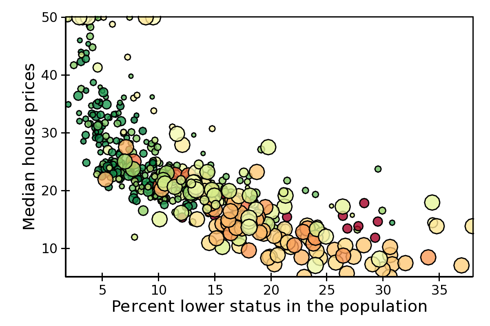
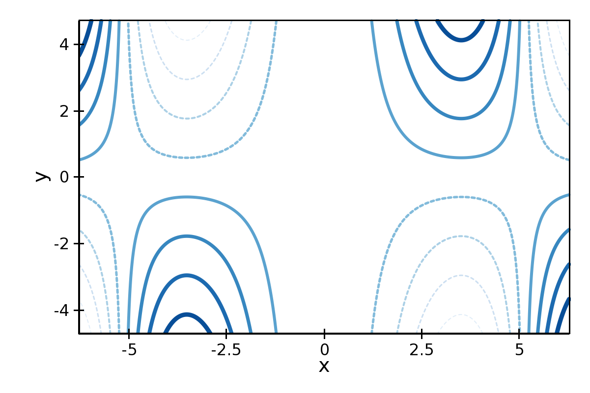

.. _plot_types:

**********
Plot types
**********

This section gives an overview of individual plot classes in Chaco. It
is divided in three parts: the first part lists all plot classes
implementing the :ref:`X-Y plots <xy_plots>` interface, the second
all plot classes implementing the :ref:`2D plots <twod_plots>`
interface, and finally a part collecting all plot types that do not
fall in either category. See the
:ref:`section on plot renderers <plot_renderers>` for a detailed description
of the methods and attributes that are common to all plots.

The code to generate the figures in this section can be found in
the path ``tutorials/user_guide/plot_types/`` in the examples
directory.

For more complete examples, see also the :ref:`annotated examples <examples>`
page.

.. _xy_plot_types:

================================================================
X-Y Plot Types
================================================================

These plots display information in a two-axis coordinate system
and are subclasses of
:class:`~chaco.base_xy_plot.BaseXYPlot`.

The common interface for X-Y plots is described in :ref:`xy_plots`.

.. _line_plot:

Line Plot
=========

Standard line plot implementation. The aspect of the line is controlled by the
parameters

:attr:`~chaco.lineplot.LinePlot.line_width`
  The width of the line (default is 1.0)

:attr:`~chaco.lineplot.LinePlot.line_style`
  The style of the line, one of 'solid' (default), 'dot dash', 'dash', 'dot',
  or 'long dash'.

:attr:`~chaco.lineplot.LinePlot.render_style`
  The rendering style of the line plot, one of
  'connectedpoints' (default), 'hold', or 'connectedhold'

These images illustrate the differences in rendering style:

* ``renderstyle='connectedpoints'``

.. image:: images/user_guide/line_plot.png
  :width: 500px

* ``renderstyle='hold'``

.. image:: images/user_guide/line_hold_plot.png
  :width: 500px

* ``renderstyle='connectedhold'``

.. image:: images/user_guide/line_connectedhold_plot.png
  :width: 500px

.. _scatter_plot:

Scatter Plot
============

Standard scatter plot implementation. The aspect of the markers is controlled
by the parameters

:attr:`~chaco.scatterplot.ScatterPlot.marker`
  The marker type, one of 'square'(default), 'circle', 'triangle',
  'inverted_triangle', 'plus', 'cross', 'diamond', 'dot', or 'pixel'.
  One can also define a new marker shape by setting this parameter to 'custom',
  and set the :attr:`~chaco.scatterplot.custom_symbol` parameter to
  a :class:`CompiledPath` instance (see the file
  ``demo/basic/scatter_custom_marker.py`` in the Chaco examples directory).

:attr:`~chaco.scatterplot.ScatterPlot.marker_size`
  Size of the marker in pixels, not including the outline. This can be
  either a scalar (default is 4.0), or an array with one size per data
  point.

:attr:`~chaco.scatterplot.ScatterPlot.line_width`
  Width of the outline around the markers (default is 1.0). If this is 0.0,
  no outline is drawn.

:attr:`~chaco.scatterplot.ScatterPlot.color`
    The fill color of the marker (default is black).

:attr:`~chaco.scatterplot.ScatterPlot.outline_color`
    The color of the outline to draw around the marker (default is black).

This is an example with fixed point size:

.. image:: images/user_guide/scatter_plot.png
  :width: 500px

The same example, using marker size to map property-tax rate
(larger is higher):

.. image:: images/user_guide/vsize_scatter_plot.png
  :width: 500px

Colormapped Scatter Plot
========================

Colormapped scatter plot. Additional information can be added to each point
by setting a different color.

The color information is controlled by the
:attr:`~chaco.colormapped_scatterplot.ColormappedScatterPlot.color_data`
data source, and the
:attr:`~chaco.colormapped_scatterplot.ColormappedScatterPlot.color_mapper`
mapper. A large number of ready-to-use color maps are defined in the
module :mod:`chaco.default_colormaps`, including discrete color maps.

In addition to the parameters supported by a
:ref:`scatter plot <scatter_plot>`, a colormapped scatter plot defines
these attributes:

:attr:`~chaco.colormapped_scatterplot.ColormappedScatterPlot.fill_alpha`
  Set the alpha value of the points.

:attr:`~chaco.colormapped_scatterplot.ColormappedScatterPlot.render_method`
  Set the sequence in which the points are drawn. It is one of

  'banded'
    draw points by color band; this is more efficient but some colors
    will appear more prominently if there are a lot of overlapping points

  'bruteforce'
    set the stroke color before drawing each marker

  'auto' (default)
    the approach is selected based on the number of points

  In practice, there is not much performance difference between the two
  methods.

In this example plot, color represents nitric oxides concentration (green
is low, red is high):

.. image:: images/user_guide/cmap_scatter_plot.png
  :width: 500px

Using X,Y, color, and size we can display 4 variables at the time. In this
example, color is again, and size is nitric oxides concentration:

Candle Plot
===========

A candle plot represents summary statistics of distribution of values
for a set of discrete items. Each distribution is characterized by
a central line (usually representing the mean), a bar (usually representing
one standard deviation around the mean or the 10th and 90th percentile),
and two stems (usually indicating the maximum and minimum values).

The positions of the centers, and of the extrema of the bar and stems are
set with the following data sources

:attr:`~chaco.candle_plot.CandlePlot.center_values`
  Value of the centers. It can be set to ``None``, in which case the center is
  not plotted.

:attr:`~chaco.candle_plot.CandlePlot.bar_min` and :attr:`~chaco.candle_plot.CandlePlot.bar_max`
  Lower and upper values of the bar.

:attr:`~chaco.candle_plot.CandlePlot.min_values` and :attr:`~chaco.candle_plot.CandlePlot.max_values`
  Lower and upper values of the stem. They can be set to ``None``, in
  which case the stems are not plotted.

It is possible to customize the appearance of the candle plot with
these parameters

:attr:`~chaco.candle_plot.CandlePlot.bar_color` (alias of :attr:`~chaco.candle_plot.CandlePlot.color`)
  Fill color of the bar (default is black).

:attr:`~chaco.candle_plot.CandlePlot.bar_line_color` (alias of :attr:`~chaco.candle_plot.CandlePlot.outline_color`)
  Color of the box forming the bar (default is black).

:attr:`~chaco.candle_plot.CandlePlot.center_color`
  Color of the line indicating the center. If ``None``, it defaults to
  :attr:`~chaco.candle_plot.CandlePlot.bar_line_color`.

:attr:`~chaco.candle_plot.CandlePlot.stem_color`
  Color of the stems and endcaps. If ``None``, it defaults to
  :attr:`~chaco.candle_plot.CandlePlot.bar_line_color`.

:attr:`~chaco.candle_plot.CandlePlot.line_width`, :attr:`~chaco.candle_plot.CandlePlot.center_width`, and :attr:`~chaco.candle_plot.CandlePlot.stem_width`
  Thickness in pixels of the lines drawing the corresponding elements.
  If ``None``, they default to :attr:`~chaco.candle_plot.CandlePlot.line_width`.

:attr:`~chaco.candle_plot.CandlePlot.end_cap`
  If ``False``, the end caps are not plotted (default is ``True``).

At the moment, it is not possible to control the width of the central bar
and end caps.

.. image:: images/user_guide/candle_plot.png
  :width: 500px

Errorbar Plot
=============

A plot with error bars. Note that :class:`~chacho.errorbar_plot.ErrorBarPlot`
only plots the error bars, and needs to be combined with a
:class:`~chacho.errorbar_plot.LinePlot` if one would like to have
a line connecting the central values.

The positions of the extrema of the bars are set by the data sources
:attr:`~chaco.errorbar_plot.value_low` and
:attr:`~chaco.errorbar_plot.value_high`.

In addition to the parameters supported by a
:ref:`line plot <line_plot>`, an errorbar plot defines
these attributes:

:attr:`~chaco.errorbar_plot.endcap_size`
  The width of the endcap bars in pixels.

:attr:`~chaco.errorbar_plot.endcap_style`
  Either 'bar' (default) or 'none', in which case no endcap bars are plotted.

.. image:: images/user_guide/errorbar_plot.png
  :width: 500px

Filled Line Plot
================

A line plot filled with color to the axis.

:class:`~chacho.filled_line_plot.FilledLinePlot` defines
the following parameters:

:attr:`~chaco.filled_line_plot.FilledLinePlot.fill_color`
  The color used to fill the plot.

:attr:`~chaco.filled_line_plot.FilledLinePlot.fill_direction`
  Fill the plot toward the origin ('down', default) ot towards the axis
  maximum ('up').

:attr:`~chaco.lineplot.LinePlot.render_style`
  The rendering style of the line plot, one of
  'connectedpoints' (default), 'hold', or 'connectedhold' (see
  :ref:`line plot <line_plot>` for a description of the different
  rendering styles).

:attr:`~chaco.filled_line_plot.FilledLinePlot` is a subclass of
:attr:`~chaco.filled_line_plot.PolygonPlot`, so to set the thickness of the
plot line one should use the parameter
:attr:`~chaco.filled_line_plot.PolygonPlot.edge_width` instead of
:attr:`line_width`.

.. image:: images/user_guide/filled_line_plot.png
  :width: 500px

Multi-line Plot
===============

A line plot showing multiple lines simultaneously.

The values of the lines are given by an instance of
:class:`~chaco.multi_array_data_source.MultiArrayDataSource`, but the
lines are rescaled
and displaced vertically so that they can be compared without
crossing each other.

The relative displacement and rescaling of the lines is controlled
by these attributes of :class:`~chaco.multi_line_plot.MultiLinePlot`:

:attr:`~chaco.multi_line_plot.MultiLinePlot.index`
  The usual array data source for the index data.

:attr:`~chaco.multi_line_plot.MultiLinePlot.yindex`
  Array data source for the starting point of each line. Typically, this
  is set to ``numpy.arange(n_lines)``, so that each line is displaced
  by one unit from the others (the other default parameters are set to
  work well with this arrangement).

:attr:`~chaco.multi_line_plot.MultiLinePlot.use_global_bounds`, :attr:`~chaco.multi_line_plot.MultiLinePlot.global_min`, :attr:`~chaco.multi_line_plot.MultiLinePlot.global_max`,
  These attributes are used to compute an "amplitude scale" which that
  the largest trace deviation from its base y-coordinate will be equal
  to the y-coordinate spacing.

  If :attr:`use_global_bounds` is set to False, the maximum of the
  absolute value of the full data is used as the largest trace deviation.
  Otherwise, the largest between the absolute value of :attr:`global_min`
  and :attr:`global_max` is used instead.

  By default, :attr:`use_global_bounds` is set to False and
  :attr:`global_min` and :attr:`global_max` to 0.0, which means that one
  of these value has to be set to create a meaningful plot.

:attr:`~chaco.multi_line_plot.MultiLinePlot.scale`, :attr:`~chaco.multi_line_plot.MultiLinePlot.offset`, :attr:`~chaco.multi_line_plot.MultiLinePlot.normalized_amplitude`
  In addition to the rescaling done using the global bounds (see above),
  each line is individually scaled by :attr:`normalized_amplitude`
  (by default this is -0.5, but is normally it should be something like 1.0).
  Finally, all the lines are moved by :attr:`offset` and multiplied by
  :attr:`scale` (default are 0.0 and 1.0, respectively).

:class:`~chaco.multi_line_plot.MultiLinePlot` also defines the following
parameters:

:attr:`~chaco.multi_line_plot.MultiLinePlot.line_width`, :attr:`~chaco.multi_line_plot.MultiLinePlot.line_style`
  Control the thickness and style of the lines, as for
  :ref:`line plots <line_plot>`.

:attr:`~chaco.multi_line_plot.MultiLinePlot.color`, :attr:`~chaco.multi_line_plot.MultiLinePlot.color_func`
  If :attr:`color_func` is None, all lines have the color defined
  in :attr:`color`. Otherwise, :attr:`color_func` is a function
  (or, more in general, a callable) that accept a single argument corresponding
  to the index of the line and returns a RGBA 4-tuple.

:attr:`~chaco.multi_line_plot.MultiLinePlot.fast_clip`
  If True, traces whose *base* y-coordinate is outside the value axis range
  are not plotted, even if some of the data in the curve extends into the plot
  region. (Default is False)

.. image:: images/user_guide/multiline_plot.png
  :width: 500px

.. _2d_plots:

================================================================
Image and 2D Plots
================================================================

These plots display information as a two-dimensional image.
Unless otherwise stated, they are subclasses of
:class:`~chaco.base_2d_plot.Base2DPlot`.

The common interface for 2D plots is described in :ref:`twod_plots`.

.. _image_plot:

Image Plots
=======================

Plot image data, provided as RGB or RGBA color information. If you need to
plot a 2D array as an image, use a :ref:`colormapped scalar plot
<colormapped_scalar_plot>`

In an :class:`~chaco.base_2d_plot.ImagePlot`, the :attr:`index` attribute
corresponds to the data coordinates of the pixels (often a
:class:`~chaco.grid_data_source.GridDataSource`). The
:attr:`index_mapper` maps the data coordinates to
screen coordinates (typically using
a :class:`~chaco.grid_mapper.GridMapper`). The `value` is the image itself,
wrapped into the data source class :class:`~chaco.image_data.ImageData`.

.. image:: images/user_guide/image_plot.png
  :width: 500px

A typical use case is to display an image loaded from a file.
The preferred way to do this is using the factory method
:meth:`~chaco.image_data.ImageData.from_file` of the class
:class:`~chaco.image_data.ImageData`. For example: ::

    image_source = ImageData.fromfile('capitol.jpg')

    w, h = image_source.get_width(), image_source.get_height()
    index = GridDataSource(np.arange(w), np.arange(h))
    index_mapper = GridMapper(
        range=DataRange2D(
            low=(0, 0),
            high=(w-1, h-1),
        )
    )

    image_plot = ImagePlot(
        index=index,
        value=image_source,
        index_mapper=index_mapper,
        origin='top left',
        **PLOT_DEFAULTS
    )

The code above displays this plot:

.. image:: images/user_guide/image_from_file_plot.png
  :width: 500px

.. _colormapped_scalar_plot:

Colormapped Scalar Plot
=======================

Plot a scalar field as an image. The image information is given as a 2D
array; the scalar values in the 2D array are mapped to colors using a color
map.

The basic class for colormapped scalar plots is
:class:`~chaco.cmap_image_plot.CMapImagePlot`.
As in :ref:`image plots <image_plot>`, the :attr:`index` attribute
corresponds to the data coordinates of the pixels (a
:class:`~chaco.grid_data_source.GridDataSource`), and the
:attr:`index_mapper` maps the data coordinates to
screen coordinates (a :class:`~chaco.grid_mapper.GridMapper`). The scalar
data is passed through the :attr:`value` attribute as an
:class:`~chaco.image_data.ImageData` source. Finally,
a color mapper maps the scalar data to colors. The module
:mod:`chaco.default_colormaps` defines many ready-to-use colormaps, including
discrete color maps.

For example: ::

    xs = np.linspace(-2 * np.pi, +2 * np.pi, NPOINTS)
    ys = np.linspace(-1.5*np.pi, +1.5*np.pi, NPOINTS)
    x, y = np.meshgrid(xs, ys)
    z = scipy.special.jn(2, x)*y*x

    index = GridDataSource(xdata=xs, ydata=ys)
    index_mapper = GridMapper(range=DataRange2D(index))

    color_source = ImageData(data=z, value_depth=1)
    color_mapper = Spectral(DataRange1D(color_source))

    cmap_plot = CMapImagePlot(
        index=index,
        index_mapper=index_mapper,
        value=color_source,
        value_mapper=color_mapper,
        **PLOT_DEFAULTS
    )

This creates the plot:

.. image:: images/user_guide/cmap_image_plot.png
  :width: 500px

.. _contour_plot:

Contour Plots
=============

Contour plots represent a scalar-valued 2D function, z = f(x, y),
as a set of contours connecting points of equal value.

Contour plots
in Chaco are derived from the base class
:class:`~chaco.base_countour_plot.BaseContourPlot`, which defines these
common attributes:

:attr:`~chaco.base_countour_plot.BaseContourPlot.levels`
  :attr:`levels` is used to define the values for which to draw a contour.
  It can be either a list of values (floating point numbers);
  a positive integer, in which
  case the range of the value is divided in the given number of equally
  spaced levels; or "auto" (default), which divides the total range in
  10 equally spaced levels

:attr:`~chaco.base_countour_plot.BaseContourPlot.colors`
  This attribute is used to define the color of the contours. :attr:`colors`
  can be given as a color name, in which case all contours have the same
  color, as a list of colors, or as a colormap. If the list of colors is
  shorter than the number of levels, the values are repeated from the beginning
  of the list.
  If left unspecified, the contours are plot in black.
  Colors are associated with levels of increasing value.

:attr:`~chaco.base_countour_plot.BaseContourPlot.color_mapper`
  If present, the color mapper for the colorbar.
  TODO: not sure how it works

:attr:`~chaco.base_countour_plot.BaseContourPlot.alpha`
  Global alpha level for all contours.

Contour Line Plot
-----------------

Draw a contour plots as a set of lines. In addition to the attributes
in :class:`~chaco.base_countour_plot.BaseContourPlot`,
:class:`~chaco.base_countour_plot.ContourLinePlot` defines the following
parameters:

:attr:`~chaco.base_countour_plot.ContourLinePlot.widths`
  The thickness of the contour lines.
  It can be either a scalar value, valid for all contour lines, or a list
  of widths. If the list is too short with respect to the number of
  contour lines, the values are repeated from the beginning of the list.
  Widths are associated with levels of increasing value.

:attr:`~chaco.base_countour_plot.ContourLinePlot.styles`
  The style of the lines. It can either be a string that specifies the
  style for all lines (allowed styles are 'solid', 'dot dash', 'dash', 'dot',
  or 'long dash'), or a list of styles, one for each line.
  If the list is too short with respect to the number of
  contour lines, the values are repeated from the beginning of the list.
  The default, 'signed', sets all lines corresponding to positive values to the
  style given by the attribute
  :attr:`~chaco.base_countour_plot.ContourLinePlot.positive_style` (default
  is 'solid'), and all lines corresponding to negative values to
  the style given by
  :attr:`~chaco.base_countour_plot.ContourLinePlot.negative_style`
  (default is 'dash').

Filled contour Plot
-------------------

Draw a contour plot as a 2D image divided in regions of the same color.
The class :class:`~chaco.base_countour_plot.ContourPolyPlot` inherits
all attributes from :class:`~chaco.base_countour_plot.BaseContourPlot`.

.. image:: images/user_guide/contour_poly_plot.png
  :width: 500px

Polygon Plot
============

Draws a polygon given the coordinates of its corners.

The x-coordinate of the corners is given as the :attr:`index` data source,
and the y-coordinate as the :attr:`value` data source. As usual, their values
are mapped to screen coordinates by :attr:`index_mapper` and
:attr:`value_mapper`.

In addition, the class :class:`~chaco.base_countour_plot.PolygonPlot` defines
these parameters:

:attr:`~chaco.base_countour_plot.PolygonPlot.edge_color`
    The color of the line on the edge of the polygon (default is black).

:attr:`~chaco.base_countour_plot.PolygonPlot.edge_width`
    The thickness of the edge of the polygon (default is 1.0).

:attr:`~chaco.base_countour_plot.PolygonPlot.edge_style`
    The line dash style for the edge of the polygon, one of 'solid'
    (default), 'dot dash', 'dash', 'dot', or 'long dash'.

:attr:`~chaco.base_countour_plot.PolygonPlot.face_color`
    The color of the face of the polygon (default is transparent).

.. image:: images/user_guide/polygon_plot.png
  :width: 500px

================================================================
Other Plot Types
================================================================

This section collects all plots that do not fall in the previous
two categories.

Bar Plot
========

Draws a set of rectangular bars, mostly used to plot histograms.

The class :class:`~chaco.barplot.BarPlot` defines the attributes of
regular X-Y plots, plus the following parameters:

:attr:`~chaco.barplot.BarPlot.starting_value`
  While :attr:`~chaco.barplot.BarPlot.value` is a data source defining
  the upper limit of the bars, :attr:`~chaco.barplot.BarPlot.starting_value`
  can be used to define their bottom limit. Default is 0.
  (Note: "upper" and "bottom" assume a horizontal layout for the plot.)

:attr:`~chaco.barplot.BarPlot.bar_width_type`
  Determines how to interpret the :attr:`bar_width` parameter.
  If 'data' (default', the width is given in the units along the index
  dimension of the data space. If 'screen', the width is given in pixels.

:attr:`~chaco.barplot.BarPlot.bar_width`
  The width of the bars (see :attr:`bar_width_type`).

:attr:`~chaco.barplot.BarPlot.fill_color`
  The color of the bars.

.. image:: images/user_guide/bar_plot.png
  :width: 500px

Quiver Plot
===========

This is a kind of :ref:`scatter plot <scatter_plot>` which draws
an arrow at every point. It can be used to visualize 2D vector fields.

The information about the vector sizes is given through the data source
:attr:`~chaco.quiverplot.QuiverPlot.vectors`, which returns an Nx2 array.
Usually, :attr:`vectors` is an instance of
:class:`~chaco.multi_array_data_source.MultiArrayDataSource`.

:class:`~chaco.quiverplot.QuiverPlot` defines these parameters:

:attr:`~chaco.quiverplot.QuiverPlot.line_width`
  Width of the lines that trace the arrows (default is 1.0).

:attr:`~chaco.quiverplot.QuiverPlot.line_color`
  The color of the arrows (default is black).

:attr:`~chaco.quiverplot.QuiverPlot.arrow_size`
  The length of the arrowheads in pixels.

.. image:: images/user_guide/quiver_plot.png
  :width: 350px

Polar Plot
==========

Display a line plot in polar coordinates.

The implementation at the moment is at a proof-of-concept stage.
The class :class:`~chaco.polar_line_renderer.PolarLineRenderer` relies
on :class:`~chaco.polar_mapper.PolarMapper` to map polar to cartesian
coordinates, and adds circular polar coordinate axes.

.. warning::

  At the moment, :class:`~chaco.polar_mapper.PolarMapper` does not do
  a polar to cartesian mapping, but just a linear mapping. One needs to
  do the transformation by hand.

The aspect of the polar plot can be controlled with these parameters:

:attr:`~chaco.polar_line_renderer.PolarLineRenderer.line_width`
  Width of the polar plot line (default is 1.0).

:attr:`~chaco.polar_line_renderer.PolarLineRenderer.line_style`
  The style of the line, one of 'solid' (default), 'dot dash', 'dash', 'dot',
  or 'long dash'.

:attr:`~chaco.polar_line_renderer.PolarLineRenderer.color`
  The color of the line.

:attr:`~chaco.polar_line_renderer.PolarLineRenderer.grid_style`
  The style of the lines composing the axis, one of 'solid','dot dash',
  'dash', 'dot' (default), or 'long dash'.

:attr:`~chaco.polar_line_renderer.PolarLineRenderer.grid_visible`
  If True (default), the circular part of the axes is drawn.

:attr:`~chaco.polar_line_renderer.PolarLineRenderer.origin_axis_visible`
  If True (default), the radial part of the axes is drawn.

:attr:`~chaco.polar_line_renderer.PolarLineRenderer.origin_axis_width`
  Width of the radial axis in pixels (default is 2.0).

.. image:: images/user_guide/polar_plot.png
  :width: 350px

.. _jitter_plot:

Jitter Plot
===========

A plot showing 1D data by adding a random jitter around the main axis.
It can be useful for visualizing dense collections of points.
This plot has got a single mapper, called :attr:`~chaco.jitterplot.JitterPlot.mapper`.

Useful parameters are:

:attr:`~chaco.jitterplot.JitterPlot.jitter_width`
  The size, in pixels, of the random jitter around the axis.

:attr:`~chaco.jitterplot.JitterPlot.marker`
  The marker type, one of 'square'(default), 'circle', 'triangle',
  'inverted_triangle', 'plus', 'cross', 'diamond', 'dot', or 'pixel'.
  One can also define a new marker shape by setting this parameter to 'custom',
  and set the :attr:`~chaco.scatterplot.custom_symbol` parameter to
  a :class:`CompiledPath` instance (see the file
  ``demo/basic/scatter_custom_marker.py`` in the Chaco examples directory).

:attr:`~chaco.jitterplot.JitterPlot.marker_size`
  Size of the marker in pixels, not including the outline (default is 4.0).

:attr:`~chaco.jitterplot.JitterPlot.line_width`
  Width of the outline around the markers (default is 1.0). If this is 0.0,
  no outline is drawn.

:attr:`~chaco.jitterplot.JitterPlot.color`
    The fill color of the marker (default is black).

:attr:`~chaco.jitterplot.JitterPlot.outline_color`
    The color of the outline to draw around the marker (default is black).

.. image:: images/user_guide/jitter_plot.png
  :width: 500px

.. TODO: add description of color bar class
