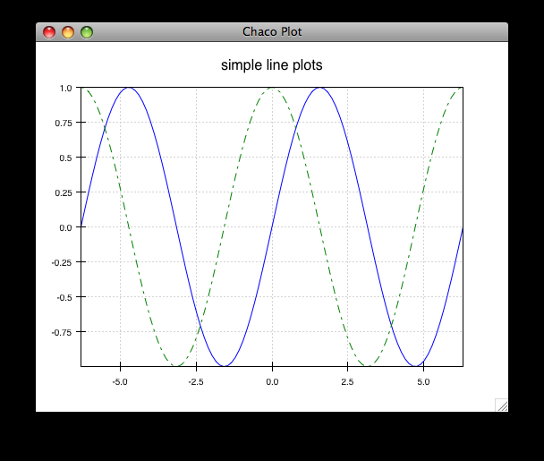

.. _quickstart:

##########
Quickstart
##########

+--------------------------------------+------------------------------------------+
|.. image::  ../images/simple_line.png |.. image::  ../images/scalar_function.png |
|   :height: 300 px                    |   :height: 300 px                        |
|   :align: center                     |   :align: center                         |
+--------------------------------------+------------------------------------------+

This section is meant to help users on well-supported platforms and common
Python environments get started using Chaco as quickly as possible.

Built-in Examples
=================

Chaco ships with several examples for testing your installation and to show you
what Chaco can do. Almost all of the examples are stand-alone files that you
can run individually, from any location. Depending on how you installed Chaco,
you may or may not have the examples already.

Location
--------

The examples are located in the :file:`examples/` subdirectory inside the root
of the Chaco source tree, next to :file:`docs/` and the :file:`chaco/`
directories. You can download the source code available on 
`Github <https://github.com/enthought/chaco>`_ or download a source
distribution from PyPi. If you don't want a local copy of the Chaco codebase,
you can browse the  
`examples on GitHub <https://github.com/enthought/chaco/tree/master/examples>`_.

In the :file:`examples/demo/` directory, examples are classified by themes and
located in separate directories.  Almost all of the Chaco examples are
standalone files that can be run individually. We will first show how to
execute them from the command line, and then we will show how to run Chaco in
an interactive way from IPython. This "shell" mode will be more familiar to
Matplotlib or MATLAB users.

.. note::
   Some of these examples can be visualized in our
   :ref:`annotated examples <examples>`.

First plots from the command line
---------------------------------

From the :file:`examples/demo` directory, run the ``simple_line`` example::

    python simple_line.py

This opens a plot of several Bessel functions with a legend.

.. image:: images/simple_line.png

You can interact with the plot in several ways:

.. Ctrl-Left and Ctrl-Right don't work in OS X?

* To pan the plot, hold down the left mouse button inside the plot area (but
  not on the legend) and drag the mouse.

* To zoom the plot:

  * Mouse wheel: scroll up to zoom in, and scroll down to zoom out (or the
    reverse you're on a version of OS X with 'natural scrolling').

  * Zoom box: Press :kbd:`z`, and then draw a box region to zoom in on.
    (There is no box-based zoom out.) Press :kbd:`Ctrl-Left` and
    :kbd:`Ctrl-Right` to go back and forward in your zoom box history.

  * Drag: hold down the right mouse button and drag the mouse up or down. Up
    zooms in, and down zooms out.

  * For any of the above, press :kbd:`Escape` to reset the zoom to the
    original view.

* To move the legend, hold down the right mouse button inside the legend and
  drag it around. Note that you can move the legend outside of the plot area.

* To exit the plot, click the "close window" button on the window frame or (on
  Mac) choose the Quit option on the Python menu.  Alternatively, can you press
  :kbd:`Ctrl-C` in the terminal.

You can run most of the examples in the the :file:`examples/demo/basic/`
directory and the :file:`examples/demo/shell/` directory.  The
:file:`examples/demo/advanced/` directory has some examples that require
additional data or packages. In particular,

* :file:`spectrum.py` requires that you have PyAudio installed and a working
  microphone.

* :file:`data_cube.py` needs to download about 7.3mb of data from the Internet
  the first time it is executed, so you must have a working Internet
  connection. Once the data is downloaded, you can save it so you can run the
  example offline in the future.

For detailed information about each built-in example, see the :ref:`examples`
section.

First plots from IPython
------------------------

While all of the Chaco examples can be launched from the command line using the
standard Python interpreter, if you have IPython installed, you can poke around
them in a more interactive fashion.

Chaco provides a subpackage, currently named the "Chaco Shell", for doing
command-line plotting like Matlab or Matplotlib.  The examples in the
:file:`examples/demo/shell/` directory use this subpackage, and they are
particularly amenable to exploration with IPython.

The first example we'll look at is the :file:`lines.py` example.  First, we'll
run it using the standard Python interpreter::

    python lines.py

This shows two overlapping line plots.

You can interact with this plot just as in the previous section.

Now close the plot, and start IPython with the ``--gui=qt`` [#guiqt]_ or
``--gui=wx`` option::

    ipython --gui=qt

This tells IPython to start a Qt or Wx mainloop in a background thread.  Now
run the previous example again::

    In [1]: run lines.py

This displays the plot window, but gives you another IPython prompt.  You can
now use various commands from the :mod:`chaco.shell` package to interact with
the plot.

Import the shell commands::

    In [2]: from chaco.shell import *

Set the X-axis title::

    In [3]: xtitle("X data")

Toggle the legend::

    In [4]: legend()

After running these commands, your plot looks like this:

.. image:: ../images/lines_final.png

The :func:`chaco_commands` function display a list of commands with brief
descriptions.

You can explore the Chaco object hierarchy, as well. The :mod:`chaco.shell`
commands are just convenience functions that wrap a rich object hierarchy that
comprise the actual plot. See the :ref:`tutorial_ipython` section for
information on all you can do with Chaco from within IPython.

Chaco plot embedded in a Traits application
===========================================

The previous section showed how Chaco can be used interactively similarly to
`Matlab` or Matplotlib's `pyplot` package.

Now, let's create, from scratch, the simplest possible Chaco plot which is
embedded inside a `Traits <http://docs.enthought.com/traits/>`_ application.
This will require more work but will represent the basis for a potential
large-scale, custom and powerful rich client application. this is really what
Chaco has been written for.

First, some imports to bring in necessary components::

    from chaco.api import ArrayPlotData, Plot
    from enable.component_editor import ComponentEditor

    from traits.api import HasTraits, Instance
    from traitsui.api import View, Item

The imports from :mod:`chaco` and :mod:`enable` support the creation of the
plot.  The imports from :mod:`traits` bring in components to embed the plot
inside a Traits application. (Refer to the 
`Traits documentation <https://docs.enthought.com/traits/>`_ for more details
about building an interactive application using Traits.) Now let's create a
Traits class with a view that contains only one element: a Chaco plot inside a
slightly customized window::

    class MyPlot(HasTraits):
        plot = Instance(Plot)
        traits_view = View(
            Item(
                'plot',
                editor=ComponentEditor(),
                show_label=False
            ),
            width=500,
            height=500,
            resizable=True,
            title="My line plot"
        )

A few options have been set to control the window containing the plot.  Now,
when the plot is created, we would like to pass in our data. Let's assume the
data is a set of points with coordinates contained in two NumPy arrays ``x``
and ``y``.  So, adding an ``__init__`` method to create the Plot object looks as
follows::

    class MyPlot(HasTraits):
        plot = Instance(Plot)
        traits_view = View(
            Item(
                'plot',
                editor=ComponentEditor(),
                show_label=False
            ),
            width=500,
            height=500,
            resizable=True,
            title="My line plot"
        )

        def __init__(self, x, y, *args, **kw):
            super(MyPlot, self).__init__(*args, **kw)
            plotdata = ArrayPlotData(x=x,y=y)
            plot = Plot(plotdata)
            plot.plot(("x","y"), type = "line", color = "blue")
            plot.title = "sin(x)*x**3"
            self.plot = plot

Since it inherits from HasTraits, the new class can use all the power of
Traits, and the call to super() in its ``__init__`` method makes sure this
object possesses the attributes and methods of its parent class.  Now let's use
our Traits object. Below, we generate some data, pass it to an instance of
MyPlot and call configure_traits to create the UI::

    import numpy as np
    x = np.linspace(-14,14,100)
    y = np.sin(x)*x**3
    lineplot = MyPlot(x,y)
    lineplot.configure_traits()

The result should look like

.. image:: ../images/mylineplot.png

This might look like a lot of code to visualize a function, but this is a
relatively simple basis on top of which we can build full-featured applications
with custom UIs and custom tools. For example, the Traits object allows you to
create controls for your plot at a very high level, add these controls to the
UI with very little work, and add listeners to update the plot when the data
changes.  Chaco also allows you to create custom tools to interact with the
plot and overlays that make these tools intuitive and visually appealing.

.. rubric:: Footnotes

.. [#guiqt] Starting from IPython 0.12, it is possible to use the Qt backend
    with ``--gui=qt``. Make sure that the environment variable ``QT_API``
    is set correctly, as described `here
    <http://ipython.org/ipython-doc/dev/interactive/reference.html?highlight=qt_api#pyqt-and-pyside>`_
