.. highlight:: python
   :linenothreshold: 10
   
.. _tutorial_1:

###############################
Interactive Plotting with Chaco
###############################

Overview
========

This tutorial is an introduction to Chaco. We're going to build several
mini-applications of increasing capability and complexity. Chaco was designed to
be used primarily by scientific programmers, and this tutorial requires only
basic familiarity with Python.

Knowledge of NumPy can be helpful for certain parts of the tutorial. Knowledge
of GUI programming concepts such as widgets, windows, and events are helpful
for the last portion of the tutorial, but it is not required.

This tutorial demonstrates using Chaco with Traits UI, so knowledge of the
Traits framework is also helpful. We don't use very many sophisticated aspects
of Traits or Traits UI, and it is entirely possible to pick it up as you go
through the tutorial. This tutorial applies to Enthought Tool Suite version 3.x.

It's also worth pointing out that you don't *have* to use Traits UI in order to
use Chaco --- you can integrate Chaco directly with Qt or wxPython --- but for
this tutorial, we use Traits UI to make things easier.

.. contents::

Goals
=====

By the end of this tutorial, you will have learned how to:

- create Chaco plots of various types
- arrange plots of data items in various layouts
- configure and interact with your plots using Traits UI
- create a custom plot overlay
- create a custom tool that interacts with the mouse

Introduction
============

Chaco is a *plotting application toolkit*. This means that it can build
both static plots and dynamic data visualizations that let you
interactively explore your data. Here are four basic examples of Chaco plots:

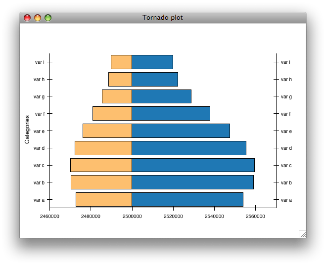

This plot shows a static "tornado plot" with a categorical Y axis and continuous
X axis.  The plot is resizable, but the user cannot interact or explore the data
in any way.

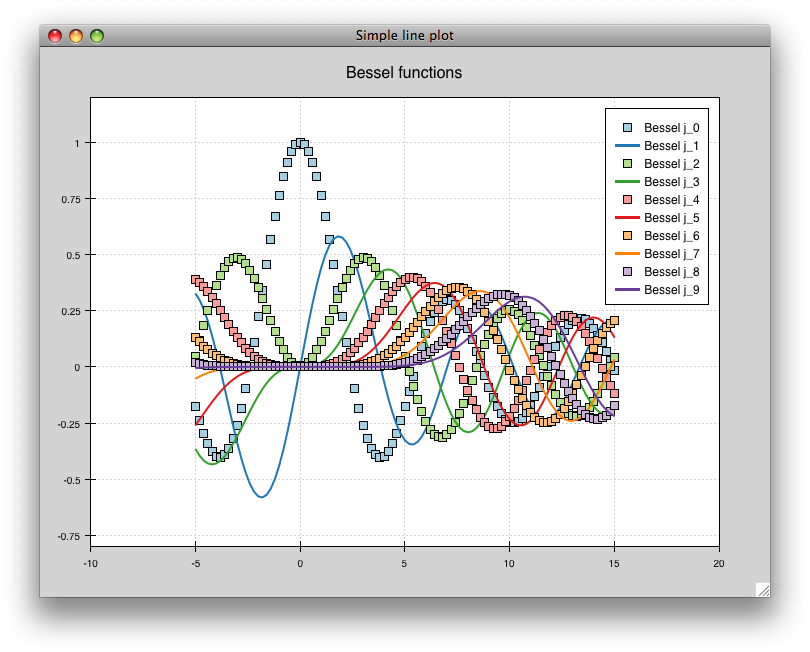

This is an overlaid composition of line and scatter plots with a legend. Unlike
the previous plot, the user can pan and zoom this plot, exploring the
relationship between data curves in areas that appear densely overlapping.
Furthermore, the user can move the legend to an arbitrary position on the plot,
and as they resize the plot, the legend maintains the same screen-space
separation relative to its closest corner.

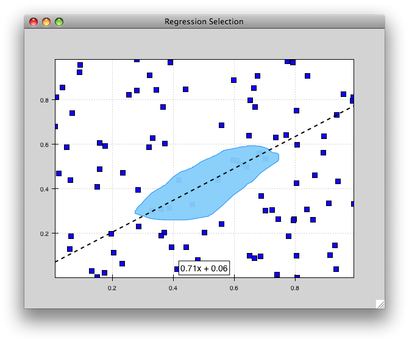

This example starts to demonstrate interacting with the dataset in an
exploratory way. Whereas interactivity in the previous example was limited to
basic pan and zoom (which are fairly common in most plotting libraries), this is
an example of a more advanced interaction that allows a level of data
exploration beyond the standard view manipuations.

With this example, the user can select a region of data space, and a simple
line fit is applied to the selected points. The equation of the line is
then displayed in a text label.

The lasso selection tool and regression overlay are both built in to Chaco,
but they serve an additional purpose of demonstrating how one can build complex
data-centric interactions and displays on top of the Chaco framework.

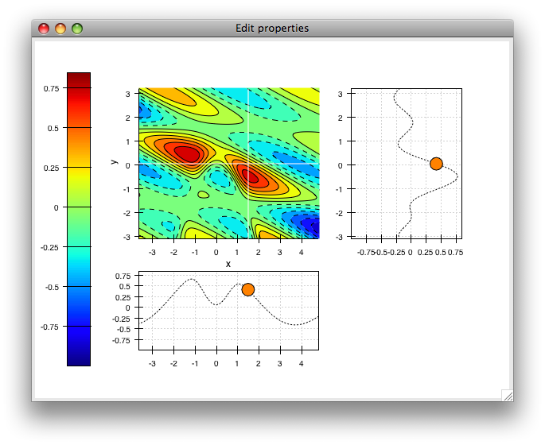

This is a much more complex demonstration of Chaco's capabilities.  The user
can view the cross sections of a 2-D scalar-valued function.  The cross sections
update in real time as the user moves the mouse, and the "bubble" on each line
plot represents the location of the cursor along that dimension.  By using
drop-down menus (not show here), the user can change plot attributes like the
colormap and the number of contour levels used in the center plot, as well as
the actual function being plotted.

Script-oriented Plotting
========================

We distinguish between "static" plots and "interactive visualizations"
because these different applications of a library affect the structure
of how the library is written, as well as the code you write to use the
library.

Here is a simple example of the "script-oriented" approach for creating
a static plot.  This is probably familiar to anyone who has used Gnuplot,
MATLAB, or Matplotlib::

    from numpy import *
    from enthought.chaco.shell import *

    x = linspace(-2*pi, 2*pi, 100)
    y = sin(x)

    plot(x, y, "r-")
    title("First plot")
    ytitle("sin(x)")
    show()

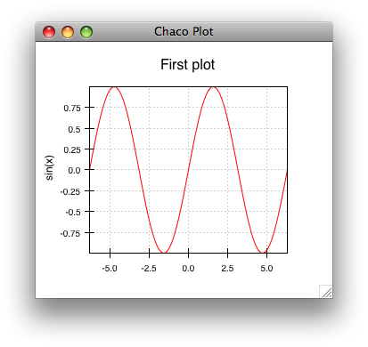

The basic structure of this example is that we generate some data, then we call
functions to plot the data and configure the plot. There is a global concept of
"the active plot", and the functions do high-level manipulations on it. The
generated plot is then usually saved to disk for inclusion in a journal article
or presentation slides.

Now, as it so happens, this particular example uses the `chaco.shell`
script plotting package, so when you run this script, the plot that Chaco opens
does have some basic interactivity. You can pan and zoom, and even move forwards
and backwards through your zoom history. But ultimately it's a pretty static
view into the data.

Application-oriented Plotting
=============================

The second approach to plotting can be thought of as "application-oriented", for
lack of a better term. There is definitely a bit more code, and the plot
initially doesn't look much different, but it sets us up to do more interesting
things, as you'll see later on::

    from enthought.traits.api import HasTraits, Instance
    from enthought.traits.ui.api import View, Item
    from enthought.chaco.api import Plot, ArrayPlotData
    from enthought.enable.component_editor import ComponentEditor
    from numpy import linspace, sin

    class LinePlot(HasTraits):
        plot = Instance(Plot)
        traits_view = View(
            Item('plot',editor=ComponentEditor(), show_label=False), 
            width=500, height=500, resizable=True, title="Chaco Plot")

        def __init__(self):
            super(LinePlot, self).__init__()
            x = linspace(-14, 14, 100)
            y = sin(x) * x**3
            plotdata = ArrayPlotData(x=x, y=y)
            plot = Plot(plotdata)
            plot.plot(("x", "y"), type="line", color="blue")
            plot.title = "sin(x) * x^3"
            self.plot = plot

    if __name__ == "__main__":
        LinePlot().configure_traits()

This produces a plot similar to the previous script-oriented code snippet:

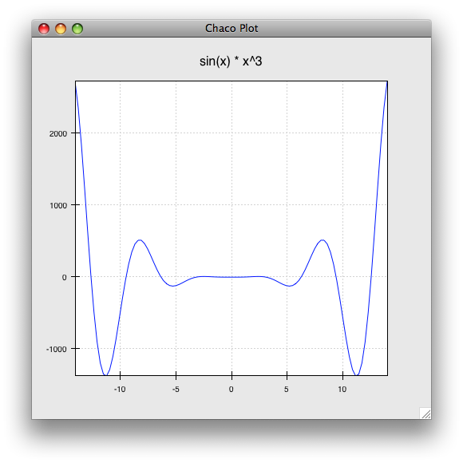

So, this is our first "real" Chaco plot. We'll walk through this code and
look at what each bit does.  This example serves as the basis for many of the
later examples.

Understanding the First Plot
============================

Let's start with the basics.  First, we declare a class to represent our
plot, called :class:`LinePlot`::

    class LinePlot(HasTraits):
        plot = Instance(Plot)

This class uses the Enthought Traits package, and all of our objects subclass
from :class:`HasTraits`.

Next, we declare a Traits UI View for this class::

    traits_view = View( 
            Item('plot',editor=ComponentEditor(), show_label=False), 
            width=500, height=500, resizable=True, title="Chaco Plot") 

Inside this view, we are placing a reference to the :attr:`plot` trait and
telling Traits UI to use the :class:`ComponentEditor` (imported from 
:mod:`enthought.enable.component_editor`) to display it. If the
trait were an Int or Str or Float, Traits could automatically pick an 
appropriate GUI element to display it. Since Traits UI doesn't natively know 
how to display Chaco components, we explicitly tell it what kind of editor to
use.

The other parameters in the :class:`View` constructor are pretty
self-explanatory, and the 
`Traits UI User's Guide <http://code.enthought.com/projects/traits/docs/html/TUIUG/index.html>`_ 
documents all the various properties
you can set here. For our purposes, this Traits View is sort of boilerplate. It
gets us a nice little window that we can resize. We'll be using something like
this View in most of the examples in the rest of the tutorial.

Now, let's look at the constructor, where the real work gets done::

    def __init__(self): 
        super(LinePlot, self).__init__()
        x = linspace(-14, 14, 100) 
        y = sin(x) * x**3 
        plotdata = ArrayPlotData(x=x, y=y) 

The first thing we do here is call the super-class's __init__ method, which
ensures that all the Traits machinery is properly set up. Then we create some
mock data, just like in the script-oriented approach. But rather than directly
calling some sort of plotting function to throw up a plot, we create this
:class:`ArrayPlotData` object and stick the data in there. The ArrayPlotData
object is a simple structure that associates a name with a NumPy array.

In a script-oriented approach to plotting, whenever you have to update the data
or tweak any part of the plot, you basically re-run the entire script.  Chaco's
model is based on having objects representing each of the little pieces of a
plot, and they all use Traits events to notify one another that some attribute
has changed.  So, the ArrayPlotData is an object that interfaces your
data with the rest of the objects in the plot.  In a later example we'll see
how we can use the ArrayPlotData to quickly swap data items in and
out, without affecting the rest of the plot.

The next line creates an actual :class:`Plot` object, and gives it the
ArrayPlotData instance we created previously::

    plot = Plot(plotdata)

Chaco's Plot object serves two roles: it is both a container of
renderers, which are the objects that do the actual task of transforming data
into lines and markers and colors on the screen, and it is a factory for
instantiating renderers. Once you get more familiar with Chaco, you can choose
to not use the Plot object, and instead directly create renderers and containers
manually. Nonetheless, the Plot object does a lot of nice housekeeping that is
useful in a large majority of use cases.

Next, we call the :meth:`plot` method on the Plot object we just created::

    plot.plot(("x", "y"), type="line", color="blue")

This creates a blue line plot of the data items named "x" and "y".  Note that
we are not passing in an actual array here; we are passing in the names of arrays
in the ArrayPlotData we created previously.

This method call creates a new renderer --- in this case a line renderer --- and
adds it to the Plot.

This may seem kind of redundant or roundabout to folks who are used to passing
in a pile of NumPy arrays to a plot function, but consider this:
ArrayPlotData objects can be shared between multiple Plots.  If you
want several different plots of the same data, you don't have to externally
keep track of which plots are holding on to identical copies of what data, and
then remember to shove in new data into every single one of those plots.  The
ArrayPlotData object acts almost like a symlink between consumers of data and
the actual data itself.

Next, we set a title on the plot::

    plot.title = "sin(x) * x^3"

And then we set our :attr:`plot` trait to the new plot::

    self.plot = plot

The last thing we do in this script is set up some code to run when the script
is executed::

    if __name__ == "__main__": 
        LinePlot().configure_traits() 

This one-liner instantiates a LinePlot object and calls its
:meth:`configure_traits` method.  This brings up a dialog with a traits editor for
the object, built up according to the View we created earlier.  In our
case, the editor just displays our :attr:`plot` attribute using the
ComponentEditor.

Scatter Plots
=============

We can use the same pattern to build a scatter plot::

    from enthought.traits.api import HasTraits, Instance
    from enthought.traits.ui.api import View, Item
    from enthought.chaco.api import Plot, ArrayPlotData
    from enthought.enable.component_editor import ComponentEditor
    from numpy import linspace, sin
    
    class ScatterPlot(HasTraits):
        plot = Instance(Plot)
        traits_view = View(
            Item('plot',editor=ComponentEditor(), show_label=False), 
            width=500, height=500, resizable=True, title="Chaco Plot")

        def __init__(self):
            super(ScatterPlot, self).__init__()
            x = linspace(-14, 14, 100)
            y = sin(x) * x**3
            plotdata = ArrayPlotData(x = x, y = y)
            plot = Plot(plotdata)
            plot.plot(("x", "y"), type="scatter", color="blue")
            plot.title = "sin(x) * x^3"
            self.plot = plot

    if __name__ == "__main__":
        ScatterPlot().configure_traits()

Note that we have only changed the *type* argument to the :meth:`plot.plot` call
and the name of the class from LinePlot to :class:`ScatterPlot`.  This
produces the following:

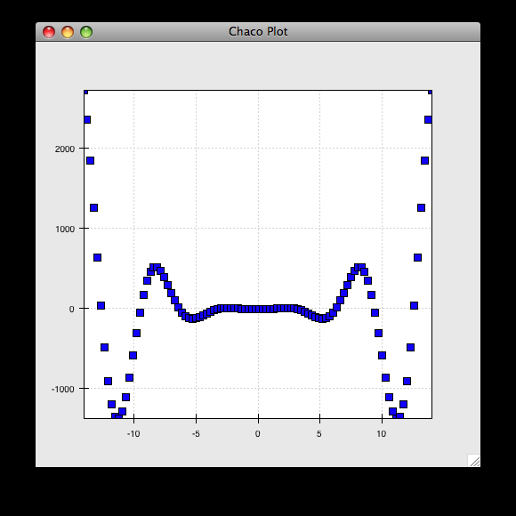

Image Plot
==========

Image plots can be created in a similar fashion::

    from enthought.traits.api import HasTraits, Instance
    from enthought.traits.ui.api import View, Item
    from enthought.chaco.api import Plot, ArrayPlotData, jet
    from enthought.enable.component_editor import ComponentEditor
    from numpy import exp, linspace, meshgrid
    
    class ImagePlot(HasTraits):
        plot = Instance(Plot)
        traits_view = View(
            Item('plot', editor=ComponentEditor(), show_label=False),
            width=500, height=500, resizable=True, title="Chaco Plot")
            
        def __init__(self):
            super(ImagePlot, self).__init__()
            x = linspace(0, 10, 50)
            y = linspace(0, 5, 50)
            xgrid, ygrid = meshgrid(x, y)
            z = exp(-(xgrid*xgrid+ygrid*ygrid)/100)
            plotdata = ArrayPlotData(imagedata = z)
            plot = Plot(plotdata)
            plot.img_plot("imagedata", xbounds=x, ybounds=y, colormap=jet)
            self.plot = plot
            
    if __name__ == "__main__":
        ImagePlot().configure_traits()

There are a few more steps to create the input Z data, and we also call a
different method on the Plot object --- :meth:`img_plot` instead of
:meth:`plot`.  The details of the method parameters are not that important
right now; this is just to demonstrate how we can apply the same basic pattern
from the "first plot" example above to do other kinds of plots.

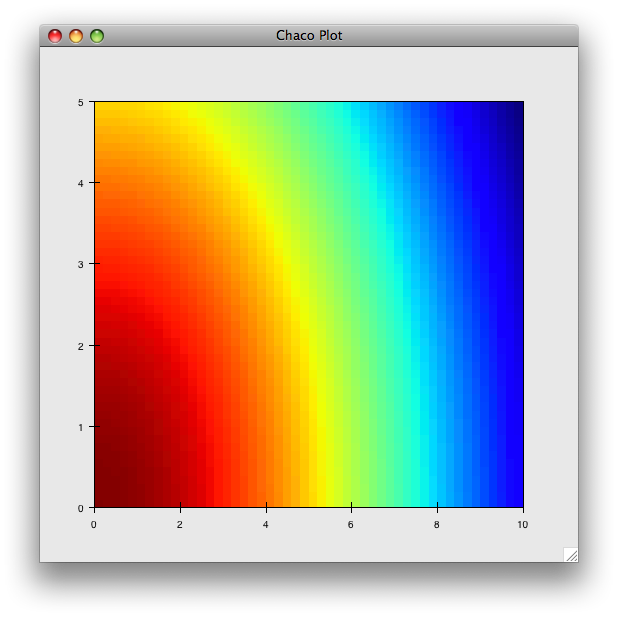

A Slight Modification
=====================

Earlier we said that the Plot object is both a container of renderers and a
factory (or generator) of renderers. This modification of the previous example
illustrates this point. We only create a single instance of Plot, but we call
its :meth:`plot()` method twice. Each call creates a new renderer and adds it to
the Plot object's list of renderers. Also notice that we are reusing the *x*
array from the ArrayPlotData::

    from enthought.traits.api import HasTraits, Instance
    from enthought.traits.ui.api import View, Item
    from enthought.chaco.api import Plot, ArrayPlotData
    from enthought.enable.component_editor import ComponentEditor
    from numpy import cos, linspace, sin

    class OverlappingPlot(HasTraits): 
        plot = Instance(Plot) 
        traits_view = View( 
            Item('plot',editor=ComponentEditor(), show_label=False), 
            width=500, height=500, resizable=True, title="Chaco Plot") 
        def __init__(self):
            super(OverlappingPlot).__init__()
            x = linspace(-14, 14, 100) 
            y = x/2 * sin(x) 
            y2 = cos(x) 
            plotdata = ArrayPlotData(x=x, y=y, y2=y2) 
            plot = Plot(plotdata) 
            plot.plot(("x", "y"), type="scatter", color="blue") 
            plot.plot(("x", "y2"), type="line", color="red") 
            self.plot = plot 
    if __name__ == "__main__": 
        OverlappingPlot().configure_traits()

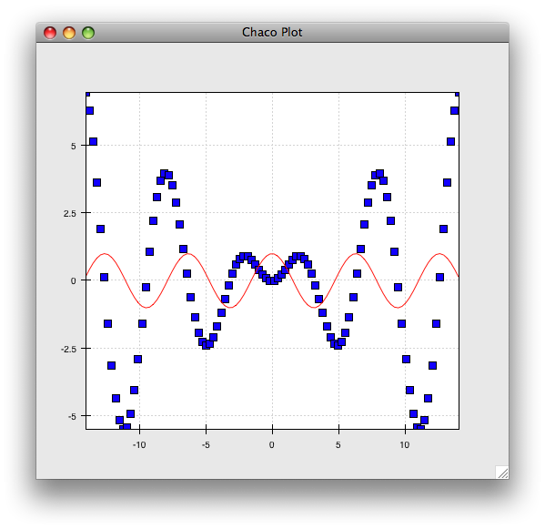

Container Overview
==================

So far we've only seen single plots, but frequently we need to plot data side
by side.  Chaco uses various subclasses of :class:`Container` to do layout.
Horizontal containers (:class:`HPlotContainer`) place components horizontally:

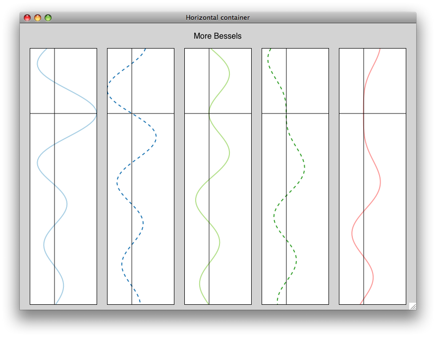

Vertical containers (:class:`VPlotContainer`) array component vertically:

.. image:: images/vplotcontainer.png

Grid container (:class:`GridPlotContainer`) lays plots out in a grid:

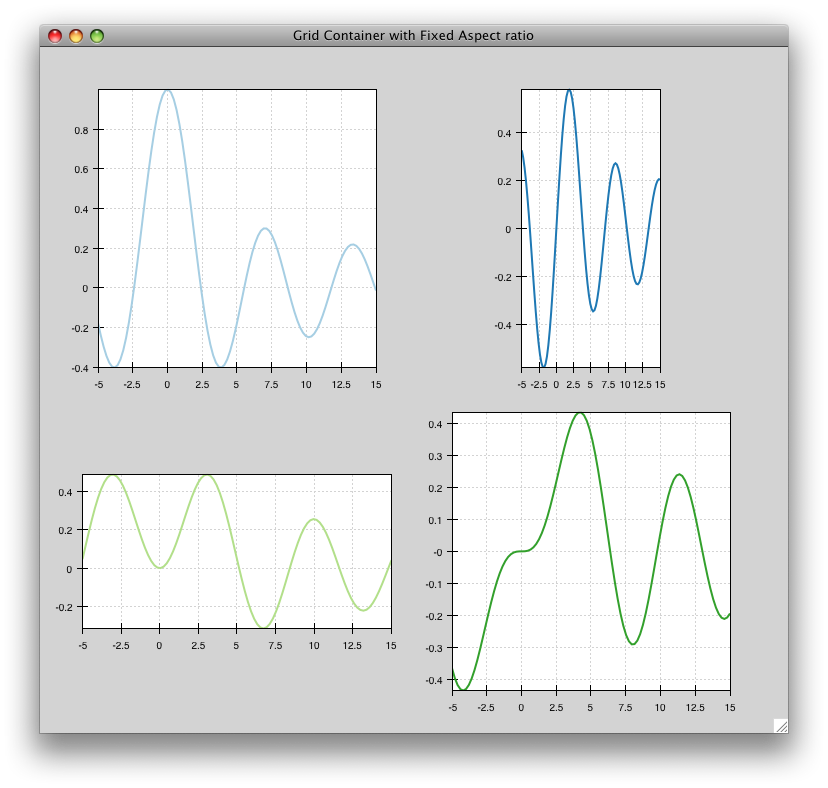

Overlay containers (:class:`OverlayPlotContainer`) just overlay plots on top of
each other:

You've actually already seen OverlayPlotContainer --- the Plot
class is actually a special subclass of OverlayPlotContainer.  All of
the plots inside this container appear to share the same X- and Y-axis, but this
is not a requirement of the container.  For instance, the following plot shows
plots sharing only the X-axis:

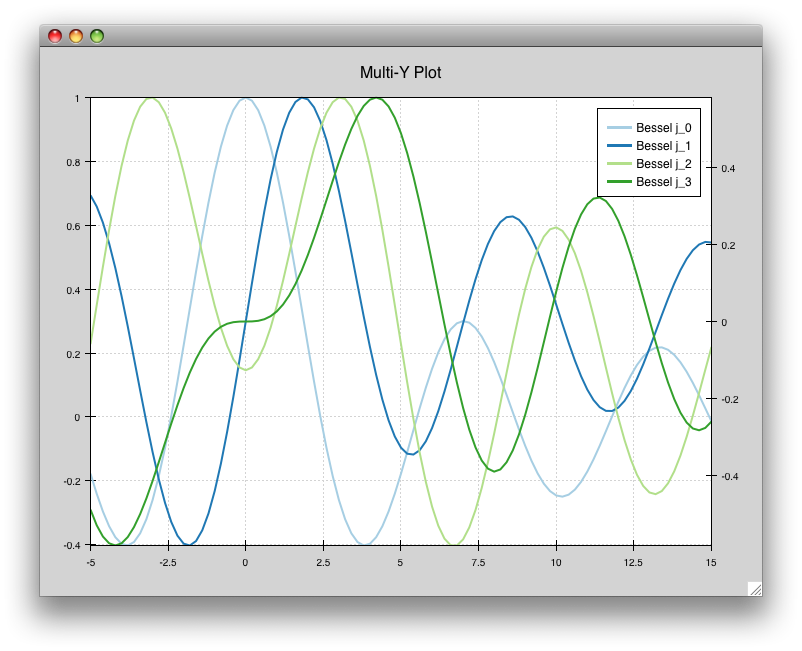

Using a Container
=================

Containers can have any Chaco component added to them.  The following code
creates a separate Plot instance for the scatter plot and the line
plot, and adds them both to the HPlotContainer object::

    from enthought.traits.api import HasTraits, Instance
    from enthought.traits.ui.api import View, Item
    from enthought.chaco.api import HPlotContainer, ArrayPlotData, Plot
    from enthought.enable.component_editor import ComponentEditor
    from numpy import linspace, sin
    
    class ContainerExample(HasTraits): 
        plot = Instance(HPlotContainer) 
        traits_view = View(Item('plot', editor=ComponentEditor(), show_label=False), 
                           width=1000, height=600, resizable=True, title="Chaco Plot") 
        def __init__(self): 
            super(ContainerExample, self).__init__()
            x = linspace(-14, 14, 100) 
            y = sin(x) * x**3 
            plotdata = ArrayPlotData(x=x, y=y) 
            scatter = Plot(plotdata) 
            scatter.plot(("x", "y"), type="scatter", color="blue") 
            line = Plot(plotdata) 
            line.plot(("x", "y"), type="line", color="blue") 
            container = HPlotContainer(scatter, line)
            self.plot = container

    if __name__ == "__main__": 
        ContainerExample().configure_traits()

This produces the following plot:

.. image:: images/container_example.png

There are many parameters you can configure on a container, like background
color, border thickness, spacing, and padding.  We insert some more
lines between lines 20 and 21 of the previous example to make the two plots
touch in the middle::

    container = HPlotContainer(scatter, line) 
    container.spacing = 0 
    scatter.padding_right = 0 
    line.padding_left = 0 
    line.y_axis.orientation = "right" 
    self.plot = container

Something to note here is that all Chaco components have both bounds and
padding (or margin).  In order to make our plots touch, we need to zero out the
padding on the appropriate side of each plot.  We also move the Y-axis for the
line plot (which is on the right hand side) to the right side.

This produces the following:

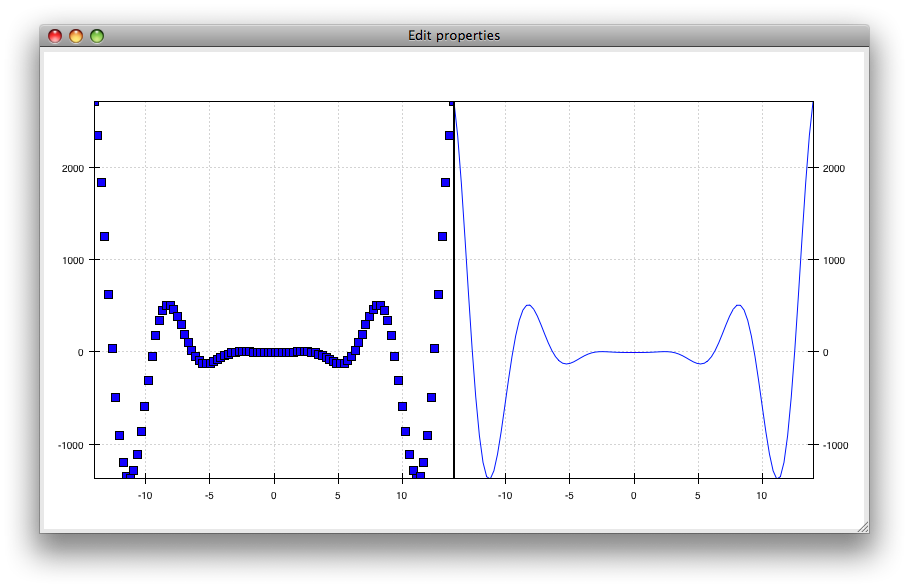

Editing Plot Traits
===================

So far, the stuff you've seen is pretty standard: building up a plot of some
sort and doing some layout on them.  Now we start taking advantage
of the underlying framework.

Chaco is written using Traits.  This means that all the graphical bits you
see --- and many of the bits you don't see --- are all objects with various
traits, generating events, and capable of responding to events.

We're going to modify our previous ScatterPlot example to demonstrate some
of these capabilities.  Here is the full listing of the modified code::

    from enthought.traits.api import HasTraits, Instance, Int
    from enthought.traits.ui.api import View, Group, Item
    from enthought.enable.api import ColorTrait
    from enthought.enable.component_editor import ComponentEditor
    from enthought.chaco.api import marker_trait, Plot, ArrayPlotData
    from numpy import linspace, sin

    class ScatterPlotTraits(HasTraits):
    
        plot = Instance(Plot)
        color = ColorTrait("blue")
        marker = marker_trait
        marker_size = Int(4)
    
        traits_view = View(
            Group(Item('color', label="Color", style="custom"),
                  Item('marker', label="Marker"),
                  Item('marker_size', label="Size"),
                  Item('plot', editor=ComponentEditor(), show_label=False),
                       orientation = "vertical"),
                  width=800, height=600, resizable=True, title="Chaco Plot")
    
        def __init__(self):
            super(ScatterPlotTraits, self).__init__()
            x = linspace(-14, 14, 100)
            y = sin(x) * x**3
            plotdata = ArrayPlotData(x = x, y = y)
            plot = Plot(plotdata)
    
            self.renderer = plot.plot(("x", "y"), type="scatter", color="blue")[0]
            self.plot = plot
    
        def _color_changed(self):
            self.renderer.color = self.color
    
        def _marker_changed(self):
            self.renderer.marker = self.marker
    
        def _marker_size_changed(self):
            self.renderer.marker_size = self.marker_size
    
    if __name__ == "__main__":
        ScatterPlotTraits().configure_traits()

Let's step through the changes.

First, we add traits for color, marker type, and marker size::

    class ScatterPlotTraits(HasTraits): 
        plot = Instance(Plot) 
        color = ColorTrait("blue") 
        marker = marker_trait 
        marker_size = Int(4) 

We also change our Traits UI View to include references to these
new traits.  We put them in a Traits UI :class:`Group` so that we can control
the layout in the dialog a little better --- here, we're setting the layout
orientation of the elements in the dialog to "vertical". ::

    traits_view = View( 
        Group( 
            Item('color', label="Color", style="custom"), 
            Item('marker', label="Marker"), 
            Item('marker_size', label="Size"), 
            Item('plot', editor=ComponentEditor(), show_label=False), 
                 orientation = "vertical" ), 
            width=500, height=500, resizable=True, 
            title="Chaco Plot")

Now we have to do something with those traits.  We modify the
constructor so that we grab a handle to the renderer that is created by
the call to :meth:`plot`::

    self.renderer = plot.plot(("x", "y"), type="scatter", color="blue")[0]

Recall that a Plot is a container for renderers and a factory for them. When
called, its :meth:`plot` method returns a list of the renderers that the call
created. In previous examples we've been just ignoring or discarding the return
value, since we had no use for it. In this case, however, we grab a
reference to that renderer so that we can modify its attributes in later
methods.

The :meth:`plot` method returns a list of renderers because for some values
of the *type* argument, it will create multiple renderers.  In our case here,
we are just doing a scatter plot, and this creates just a single renderer.

Next, we define some Traits event handlers.  These are specially-named
methods that are called whenever the value of a particular trait changes.  Here
is the handler for :attr:`color` trait::

    def _color_changed(self):
        self.renderer.color = self.color

This event handler is called whenever the value of :attr:`self.color` changes,
whether due to user interaction with a GUI, or due to code elsewhere. (The
Traits framework automatically calls this method because its name follows the
name template of :samp:`\_{traitname}_changed`.) Since this method is called
after the new value has already been updated, we can read out the new value just
by accessing :attr:`self.color`. We just copy the color to the scatter renderer.
You can see why we needed to hold on to the renderer in the constructor.

Now we do the same thing for the marker type and marker size traits::

    def _marker_changed(self):
        self.renderer.marker = self.marker

    def _marker_size_changed(self):
        self.renderer.marker_size = self.marker_size

Running the code produces an app that looks like this:

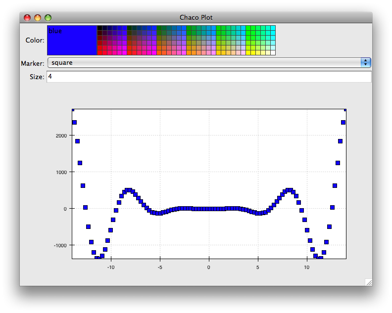

Depending on your platform, the color editor/swatch at the top may look different.
This is how it looks on Mac OS X.  All of the controls here are "live".  If you
modify them, the plot updates.

