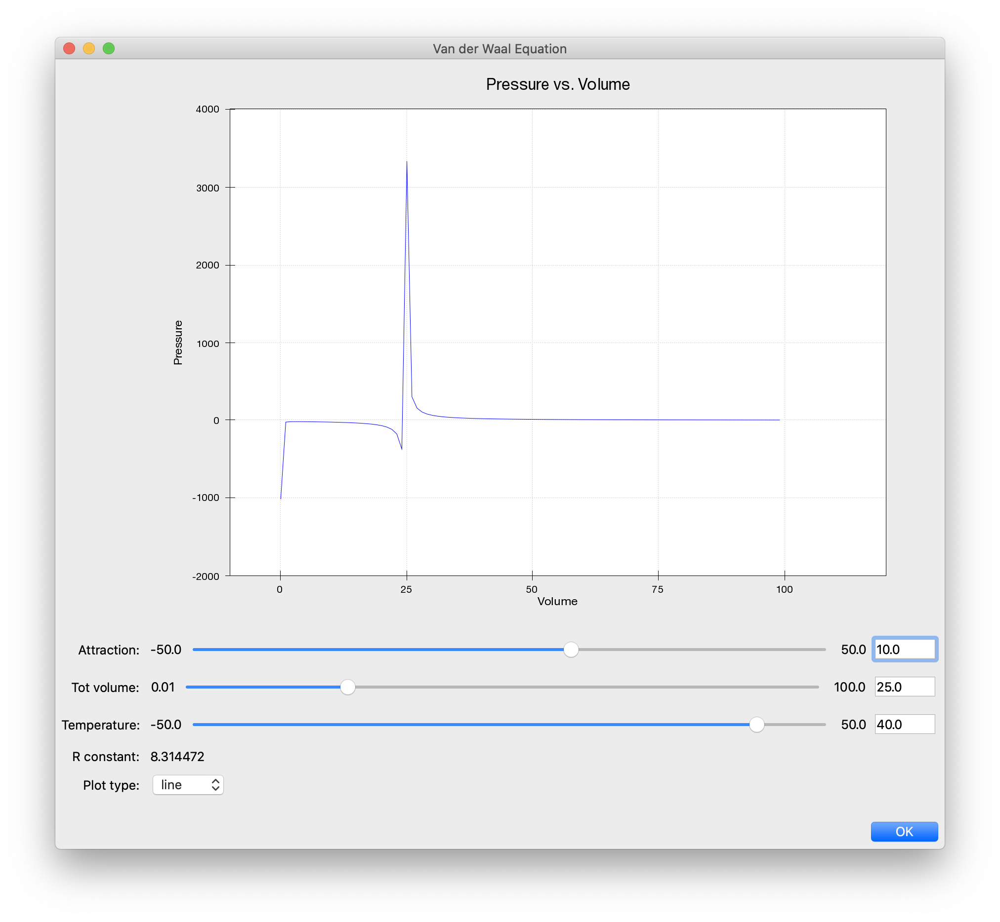

.. _tutorial_2:

######################################################
Modeling Van der Waal's Equation With Chaco and Traits
######################################################

Overview
========

This tutorial walks through the creation of an example program that plots a
scientific equation.  In particular, we will model `Van Der Waal's Equation
<http://en.wikipedia.org/wiki/Van_der_Waals_equation>`_, which is a
modification to the ideal gas law that takes into account the nonzero size of
molecules and the attraction to each other that they experience.

Development Setup
=================

In review, Traits is a manifest typing and reactive programming package for
Python. It also provides UI features that will be used to create a simple GUI.
The Traits and Traits UI user manuals are good resources for learning about the
packages and can be found on the 
`Traits Wiki <https://svn.enthought.com/enthought/wiki/Traits>`_. The wiki 
includes features, technical notes, cookbooks, FAQ and more.

You must have Chaco and its dependencies installed:

* Traits
* TraitsGUI
* Enable

Writing the Program
===================

First, define a Traits class and the elements necessary need to model
the task.  The following Traits class is made for the Van Der Waal
equation, whose variables can be viewed on 
`this wiki page <http://en.wikipedia.org/wiki/Van_der_Waals_equation>`_.  The
:attr:`volume` and :attr:`pressure` attributes hold lists of our X- and 
Y-coordinates, respectively, and are defined as arrays. The attributes 
:attr:`attraction` and :attr:`totVolume` are  input parameters specified by the
user.  The type of the variables dictates their appearance in the GUI.  For
example, :attr:`attraction` and :attr:`totVolume` are defined as Ranges, so they
show up as slider bars.  Likewise, :attr:`plot_type` is shown as a drop-down
list, since it is defined as an Enum.

::

    # We'll also import a few things to be used later.
    from traits.api \
        import HasTraits, Array, Range, Float, Enum, on_trait_change, Property
    from traitsui.api import View, Item 
    from chaco.chaco_plot_editor import ChacoPlotItem
    from numpy import arange
    
    class Data(HasTraits):
        volume = Array
        pressure = Array
        attraction = Range(low=-50.0,high=50.0,value=0.0)
        totVolume = Range(low=.01,high=100.0,value=0.01)
        temperature = Range(low=-50.0,high=50.0,value=50.0)
        r_constant= Float(8.314472)
        plot_type = Enum("line", "scatter")
    
    ....    

Creating the View
=================

The main GUI window is created by defining a Traits :class:`View` instance.
This View contains all of the GUI elements, including the plot.  To
link a variable with a widget element on the GUI, we create a Traits
:class:`Item` instance with the same name as the variable and pass it as an
argument of the Traits View instance declaration.  The 
`Traits UI User Guide <https://svn.enthought.com/svn/enthought/Traits/tags/traits_2.0.1b1/docs/Traits%20UI%20User%20Guide.pdf>`_
discusses the View and Item objects in depth. In order to
embed a Chaco plot into a Traits View, you need to import the
:class:`ChacoPlotItem` class, which can be passed as a parameter to View just
like the Item objects. The first two arguments to ChacoPlotItem are the
lists of X- and Y-coordinates for the graph.  The attributes :attr:`volume` and
:attr:`pressure` hold the lists of X- and Y-coordinates, and therefore are the
first two arguments to Chaco2PlotItem.  Other parameters have been
provided to the plot for additional customization::

    class Data(HasTraits):
        ....
    
        traits_view = View(ChacoPlotItem("volume", "pressure",
                                   type_trait="plot_type",
                                   resizable=True,
                                   x_label="Volume",
                                   y_label="Pressure",
                                   x_bounds=(-10,120),
                                   x_auto=False,
                                   y_bounds=(-2000,4000),
                                   y_auto=False,
                                   color="blue",
                                   bgcolor="white",
                                   border_visible=True,
                                   border_width=1,
                                   title='Pressure vs. Volume',
                                   padding_bg_color="lightgray"),
                           Item(name='attraction'),
                           Item(name='totVolume'),
                           Item(name='temperature'),   
                           Item(name='r_constant', style='readonly'),
                           Item(name='plot_type'),
                           resizable = True,
                           buttons = ["OK"],
                           title='Van der Waal Equation',
                           width=900, height=800)
    ....

    
Updating the Plot
=================

The power of Traits and Chaco enables the plot to update itself
whenever the X- or Y-arrays are changed.  So, we need a function to
re-calculate the X- and Y-coordinate lists whenever the input
parameters are changed by the user moving the sliders in the GUI.

The :attr:`volume` attribute is the independent variable and :attr:`pressure` is
the dependent variable. The relationship between pressure and volume, as derived
from the equation found on the wiki page, is::
 
               r_constant * Temperature       attraction
   Pressure =  ------------------------   -   ----------
                  Volume - totVolume          Volume**2

Next, there are two programing tasks to complete:

1. Define trait listener methods for your input parameters. These
   methods are automatically called whenever the parameters are
   changed, since it will be time to recalculate the :attr:`pressure` array.

2. Write a calculation method that updates your lists of X- and
   Y-coordinates for your plot.

The following is the code for these two needs::

    # Re-calculate when attraction, totVolume, or temperature are changed.
    @on_trait_change('attraction, totVolume, temperature')
    def calc(self):
        """ Update the data based on the numbers specified by the user. """
        self.volume = arange(.1, 100)
        self.pressure = ((self.r_constant*self.temperature) 
		         /(self.volume - self.totVolume)   
                        -(self.attraction/(self.volume*self.volume)))
        return

The :func:`calc` function computes the :attr:`pressure` array using the current
values of the independent variables.  Meanwhile, the
:func:`@on_trait_change` decorator (provided by Traits) tells Python to call
:func:`calc` whenever any of the attributes :attr:`attraction`, 
:attr:`totVolume`, or :attr:`temperature` changes.

Testing your Program
====================

The application is complete, and can be tested by instantiating a copy
of the class and then creating the view by calling the
:meth:`configure_traits` method on the class.  For a simple test, run these
lines from an interpreter or a separate module::

    from vanderwaals import Data
    viewer = Data()
    viewer.calc()            # Must calculate the initial (x,y) lists
    viewer.configure_traits()

Clicking and dragging on the sliders in the GUI dynamically updates the pressure
data array, and causes the plot to update, showing the new values.

Screenshots
===========

Here is what the program looks like:

But it could be better....
==========================

It seems inconvenient to have to call a calculation function manually
before we call :meth:`configure_traits`.  Also, the pressure equation depends on
the values of other variables. It would be nice to make the
relationship between the dependant and independent variables clearer.
There is another way we could define our variables that is easier for
the user to understand, and provides better source documentation.

Since our X-values remain constant in this example, it is wasteful to
keep recreating the :attr:`volume` array.  The Y-array, :attr:`pressure`, is the
single array that needs to be updated when the independent variables
change. So, instead of defining :attr:`pressure` as an :class:`Array`, we define
it as a :class:`Property`. Property is a Traits type that allows you to define
a variable whose value is recalculated whenever it is requested. In
addition, when the *depends_on* argument of a Property constructor is
set to list of traits in your :class:`HasTraits` class, the property's trait
events fire whenever any of the dependent trait's change events
fire. This means that the :attr:`pressure` attribute fires a trait change
whenever our *depends_on* traits are changed. Meanwhile, the Chaco plot
is automatically listening to the :attr:`pressure` attribute, so the plot
display gets the new value of :attr:`pressure` whenever someone changes
the input parameters!

When the value of a Property trait is requested, the
:samp:`\_get_{trait_name}` method is called to calculate and return its
current value. So we define use the :meth:`_get_pressure` method as our new
calculation method.  It is important to note that this implementation
does have a weakness.  Since we are calculating new pressures each
time someone changes the value of the input variables, this could slow
down the program if the calculation is long.  When the user drags a
slider widget, each stopping point along the slider requests a
recompute.

For the new implementation, these are the necessary changes:

1. Define the Y-coordinate array variable as a Property instead of an
   Array.
2. Perform the calculations in the :samp:`\_get_{trait_name}` method for the 
   Y-coordinate array variable, which is :meth:`_get_pressure` in this 
   example.
3. Define the :samp:`\_{trait}_default` method to set the initial value of
   the X-coordinate array, so :meth:`\_get_pressure` does not have to keep 
   recalculating it.
4. Remove the previous :func:`@on_trait_change` decorator and calculation 
   method.

The new pieces of code to add to the Data class are::

    class Data(HasTraits):
        ...
        pressure = Property(Array, depends_on=['temperature', 
		   		               'attraction', 
 					       'totVolume'])
        ...
    
        def _volume_default(self):
          return arange(.1, 100)
    
        # Pressure is recalculated whenever one of the elements the property 
        # depends on changes.  No need to use @on_trait_change.
        def _get_pressure(self):
          return ((self.r_constant*self.temperature)
                  /(self.volume - self.totVolume) 
                 -(self.attraction/(self.volume*self.volume)))

You now no longer have to call an inconvenient calculation function
before the first call to :meth:`configure_traits`!  

Source Code
===========

The final version on the program, `vanderwaals.py` ::

    from traits.api \
        import HasTraits, Array, Range, Float, Enum, on_trait_change, Property
    from traitsui.api import View, Item
    from chaco.chaco_plot_editor import ChacoPlotItem
    from numpy import arange
    
    class Data(HasTraits):
        volume = Array
        pressure = Property(Array, depends_on=['temperature', 'attraction', 
     				           'totVolume'])
        attraction = Range(low=-50.0,high=50.0,value=0.0)
        totVolume = Range(low=.01,high=100.0,value=0.01)
        temperature = Range(low=-50.0,high=50.0,value=50.0)
        r_constant= Float(8.314472)
        plot_type = Enum("line", "scatter")
    
        traits_view = View(ChacoPlotItem("volume", "pressure",
                                   type_trait="plot_type",
                                   resizable=True,
                                   x_label="Volume",
                                   y_label="Pressure",
                                   x_bounds=(-10,120),
                                   x_auto=False,
                                   y_bounds=(-2000,4000),
                                   y_auto=False,
                                   color="blue",
                                   bgcolor="white",
                                   border_visible=True,
                                   border_width=1,
                                   title='Pressure vs. Volume',
                                   padding_bg_color="lightgray"),
                           Item(name='attraction'),
                           Item(name='totVolume'),
                           Item(name='temperature'),   
                           Item(name='r_constant', style='readonly'),
                           Item(name='plot_type'),
                           resizable = True,
                           buttons = ["OK"],
                           title='Van der Waal Equation',
                           width=900, height=800)
    
    
        def _volume_default(self):
            """ Default handler for volume Trait Array. """
            return arange(.1, 100)
    
        def _get_pressure(self):
            """Recalculate when one a trait the property depends on changes."""
            return ((self.r_constant*self.temperature)
                  /(self.volume - self.totVolume) 
                 -(self.attraction/(self.volume*self.volume)))
    
    if __name__ == '__main__':
        viewer = Data()
        viewer.configure_traits()
