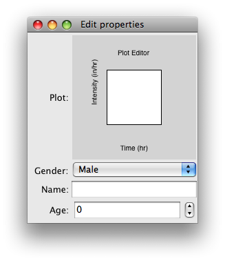

.. _tutorial_hyetograph:

########################################################
Creating an interactive Hyetograph with Chaco and Traits
########################################################

Overview
========

The perfect rainstorm (not to be confused with The Perfect Storm) has
a rainfall pattern that can be mathematically modelled.  The rain
starts light, gets harder halfway though the storm, gets lighter
again, and eventually stops.  Plots of the rainfall intensity in
relation to time are called hyetographs.

This tutorial builds a simple application that takes a tiny database
of coefficients, and along with user selected values, displays
hyetographs.  The user provides the duration of the storm, the year of
the storm, and one of four counties in Texas.  Then using a slider
specifying the Curve Number (determined based on the permeability of
the soil) a plot shows the intensity vs. time hyetograph plots.

Development Setup
=================

To run this demo you must have Chaco and its dependencies installed:

* Traits
* TraitsGUI
* Enable

Why use Traits for this application?
====================================

1. **Event notification** Every time that a trait is changed it sends
   out notifications.  This means when a trait is changed in places
   such as the UI you are able to then notify other traits or
   functions of this change.

2. **Typing** Within traits you are allowed to define trats as certain
   types.  Say you have a trait named Name, you can then define it to
   be a string, since names usually dont include numbers or symbols.
   Then when you viauallize it using traits ui, it will interprit the
   data as a string.

3. **UI-Generation** After setting up your traits and performing all
   the calculations on them you are able to create a UI from these
   traits very easily.

Importing the necessary functions
=================================

In This tutorial we will be using numpy, traits, traitsui, and chaco2.
If you do not already have the specific eggs listed above on your
machine you will need to get them.

In calling your function you want to specify where the function is and
then import it like the following example::

    # From the enthought.taits.api library this is importing the Int type 
    from enthought.traits.api import Int

For now it is important to note that currently since we just started
the program that there are no function being called and thus we will
update all of them when we add them to the application.

Trait Definitions
=================

The way this app is created only requires one class and the one class
holds the traits, traitsui, chaco, and calculations together.  The
HasTraits function is used so it also needs to be imported.  Thus at
the top of the file you should add the following::

    from enthought.traits.api import HasTraits

And then to create a class named Viewer you would write the following
after the imports::

    class Viewer(HasTraits):

Within this class we will now define all the traits that are used in
the global variables used in the UI.  These traits are set to equal
their type as you should notice in the following type assignments::

    timeline = Array
    intensity = Array
    nrcs = Array
    duration=Int(12,desc='In Hours')
    year_storm=Enum(2,10,25,100)
    county=Enum('Brazos', 'Dallas', 'El Paso', 'Harris')
    tc=Float
    curve_number=Range(70,100)
    plot_type = Enum('line', 'scatter')

**Note**

1. The naming convention with traits types is very straight forward,
   an Array is an array, an Int is an integer a Enum is a list, a
   Range is a range

2. Types are capitalized

3. You can leave the default value (such as whats done in the Arrays)
   or you can assign an initial value as is done in duration

4. You can also add a description as is done in duration.  This
   description is not visible except for when viewing the trait in
   traitsui, and then you only see the description when your mouse is
   over the variable.

5. These Traits should be nested within your viewer Class

For more information regarding traits types page 9 of the following
link will point you in the right direction.
 
HTTP://svn.enthought.com/enthought/browser/branches/enthought.traits_2.0/doc/Traits2_UM.pdf?format=raw

It is now time to update the imports again due to the fact you have
just added a bunch of functions that are not defined within your code,
so they must be imported

Your newly updated Imports should look like the following::

    #Importing the traits api
    from enthought.traits.api import HasTraits, Int, Str, Range, Float, Array, Enum, HasTraits,

Setting up the User Interface (UI)
==================================

1. When building a UI you will need to import a few of the functions
   in the traitsui library.  By inserting the following code at the
   top of your program you will now be able to import the traits ui
   functions View, Group, and Item::

    #Importing the traits ui api
    from enthought.traits.ui.api import View, Item, Group

2. You now have the basic tools for building a UI with traits however,
   for this application you are missing the Chaco2 import still... So
   import the following and you will be set to go::

    #Importing Chaco2
    from enthought.chaco2.chaco2_plot_editor import Chaco2PlotItem

3. Building the UI is a fairly easy task that I found easiest to pick
   up from examples so here is a simple example program that shows the
   general layout of the UI setup and the Chaco2 plot addition and
   incorporates the ideas talked about above::

    from enthought.traits.api import HasTraits, String, Enum, Range, Array
    
    from enthought.traits.ui.api import View, Item, Group
    
    from enthought.chaco2.chaco2_plot_editor import Chaco2PlotItem
    
    class Example(HasTraits):
        gender = Enum('Male','Female')
        name = String()
        year = Range(1,5)
        position = Array
        time = Array
    
        view1 = View(Chaco2PlotItem("position", "time",
                                    resizable=True,
                                    x_label="Time (hr)",
                                    y_label="Intensity (in/hr)",
                                    color="blue",
                                    bgcolor="white",
                                    border_visible=True,
                                    border_width=1,
                                    padding_bg_color="lightgray"),
                            Item(name = 'gender'),
                            Item(name = 'name'),
                            Item(name = 'year'))
        
    f=Example()
    f.configure_traits()

4. From this example you should be able to see that within the View
   you have Groups, and within those Groups you have Items.  You can
   display your traits by merely performing a Item(name = 'gender')
   and importing the Chaco2 plot was really easy.  (You should also
   note that this example included a configure_traits which has not
   been discussed yet in this tutorial but it initiates the UI)

Here is the implementation I used in creating my Engineering problem::

    # This displays the HyetoGraph
    
        view1 = View(Item("plot_type"),Chaco2PlotItem("timeline", "intensity",
                                    type_trait="plot_type",
                                    resizable=True,
                                    x_label="Time (hr)",
                                    y_label="Intensity (in/hr)",
                                    color="blue",
                                    bgcolor="white",
                                    border_visible=True,
                                    border_width=1,
                                    padding_bg_color="lightgray"),
                            Item(name = 'duration'),
                            Item(name = 'year_storm'),
                            Item(name = 'county'),
    
    
     # This displays the HyetoGraph after infiltration using the nrcs curve number method
    
                     Chaco2PlotItem("timeline", "nrcs",
                                    type_trait="plot_type",
                                    resizable=True,
                                    x_label="Time",
                                    y_label="Intensity",
                                    color="blue",
                                    bgcolor="white",
                                    border_visible=True,
                                    border_width=1,
                                    padding_bg_color="lightgray"),
                            Item("curve_number"),
                    resizable = True,
                    width=800, height=1200)

**Note:**

1. First you should notice that there are actually two Chaco 2 plots;
   one is intensity versus time and the other is nrcs versus time

2. Second you should notice that the default browser screen is given
   as well as the option to resize.

3. The Traits are split up so 3 of them are displayed below the first
   plot and only 1 is displayed below the second

.. image:: images/tutorial_hyetograph_nodata.png

Performing the calculations
===========================

You have now set up the UI for the small application, however you
still are missing any calculations.  Currently in the UI if you change
the traits within the GUI it means nothing because there hooked up to
nothing and theres nothing looking at any of the event notifications.
My calculations are semi long, and use mostly fairly simple python
algorithms based on my traits.  The following are my two calculation
functions that I have set to a modify the Data, in Array form.::

    
    # The Hyetograph calculations
        def Calculations(self):
    
    # Assigning A, B, and C values based on year storm and county
            year2 = [65,8,.806,54,8.3,.791,24,9.5,.797,68,7.9,.800]
            year10 = [80,8.5,.763,78,8.7,.777,42,12.0,.795,81,7.7,.753]
            year25 = [89,8.5,.754,90,8.7,.774,60,12.0,.843,81,7.7,.724]
            year100 = [96,8.0,.730,106,8.3,.762,65,9.5,.825,91,7.9,.706]
            if self.year_storm == 2:
                year=year2
            elif self.year_storm == 10:
                year=year10
            elif self.year_storm == 25:
                year=year25
            else:
                year=year100
            if  self.county == 'Brazos':
                value=0
            elif  self.county == 'Dallas':
                value=3
            elif  self.county == 'El Paso':
                value=6
            else:
                value=9
            a = year[value]
            b = year[value+1]
            c = year[value+2]
            
            self.timeline=range(2,self.duration+1, 2)
            intensity=a/(self.timeline*60 + b)**c
            cumdepth=intensity*self.timeline
    
            temp=cumdepth[0]
            result=[]
            for i in cumdepth[1:]:
                result.append(i-temp)
                temp=i
            result.insert(0,cumdepth[0])
    
    # Implemention of the Alternating block method 
            result.reverse()
            switch = True
            o=[]
            e=[]
            for i in result:
                if switch:
                    o.append(i)
                else:
                    e.append(i)
                switch = not switch
            e.reverse()
            result=o+e
            self.intensity = result
    
    # Implemention of the NRCS mehtod finding the actual run off based on
    # how permiable the ground is. 
        
        def Calculations2(self):
            s=1000/self.curve_number-10
            a = self.intensity - .2*s
    
    # This should check for negative values and return them as zero runoff
    # because theres no such thing as negative run off.
            vr=(a)**2/(self.intensity+.8*s)
            for i in range(0,len(a)):
                if a[i]<=0:
                    vr[i]=0   
            self.nrcs=vr

Recalculating when event notification occurs
============================================

When traits are changed in the UI currently nothing occurs, so is a
need for a few static traits handlers.  In traits there are two ways
of event notification, statically whenever any variable is changed and
the function is within the same class, and dynamically which occurs
when some one specifies they want to be notified when something is
changed.  To do this we Create a new function that when notified of a
change re-runs the function within it.  This was done via::

    def _duration_changed(self):
        self.Calculations()
        self.Calculations2()

**Note**

1. When the duration trait is changed in the UI this function is
   triggered, and re-evaluates both Calculations, and Calculations2

2. So when someone changes the duration from 12 hours to 24 hours this
   should effect both of the plots since it recalculates both of the
   functions.  It is also necessary to perform trigger functions for
   both the county, year_storm, and curve_number traits.

Triggering the Display
======================

In order to display the function you must perform a configure_traits command, however you need it to call the class and calculations functions from within the class as well.  This can be done with the following command.

f=Viewer()
f.Calculations()
f.Calculations2()
f.Configure_Calculations

This performs the calculations needed for the Arrays used to plot, and then triggers the UI

This is the final Step and if you now run the program, you should get an application that resembles the following picture.

.. image:: images/tutorial_hyetograph_final.png

Source Code
===========

The final version of the program, `hyetograph.py`::

    from enthought.traits.api \
        import HasTraits, Int, Range, Array, Enum, on_trait_change
    from enthought.traits.ui.api import View, Item
    from enthought.chaco.chaco_plot_editor import ChacoPlotItem
    
    
    class Hyetograph(HasTraits):
        """ Creates a simple hyetograph demo. """
        timeline = Array
        intensity = Array
        nrcs = Array
        duration = Int(12, desc='In Hours')
        year_storm = Enum(2, 10, 25, 100)
        county = Enum('Brazos', 'Dallas', 'El Paso', 'Harris')
        curve_number = Range(70, 100)
        plot_type = Enum('line', 'scatter')
        
        view1 = View(Item('plot_type'),
                     ChacoPlotItem('timeline', 'intensity',
                                   type_trait='plot_type',
                                   resizable=True,
                                   x_label='Time (hr)',
                                   y_label='Intensity (in/hr)',
                                   color='blue',
                                   bgcolor='white',
                                   border_visible=True,
                                   border_width=1,
                                   padding_bg_color='lightgray'),
                     Item(name='duration'),
                     Item(name='year_storm'),
                     Item(name='county'),
    
                     # After infiltration using the nrcs curve number method.
                     ChacoPlotItem('timeline', 'nrcs',
                                    type_trait='plot_type',
                                    resizable=True,
                                    x_label='Time',
                                    y_label='Intensity',
                                    color='blue',
                                    bgcolor='white',
                                    border_visible=True,
                                    border_width=1,
                                    padding_bg_color='lightgray'),
                    Item('curve_number'),
                    resizable = True,
                    width=800, height=800)
    
    
        def calculate_intensity(self):
            """ The Hyetograph calculations. """
            # Assigning A, B, and C values based on year, storm, and county
            counties = {'Brazos': 0, 'Dallas': 3, 'El Paso': 6, 'Harris': 9}
            years = {
                2 : [65, 8, .806, 54, 8.3, .791, 24, 9.5, .797, 68, 7.9, .800],
                10: [80, 8.5, .763, 78, 8.7, .777, 42, 12., .795,81, 7.7, .753],
                25: [89, 8.5, .754, 90, 8.7, .774, 60, 12.,.843, 81, 7.7, .724],
                100: [96, 8., .730, 106, 8.3, .762, 65, 9.5, .825, 91, 7.9, .706]
            }
            year = years[self.year_storm]
            value = counties[self.county]
            a, b, c = year[value], year[value+1], year[value+2]
            
            self.timeline=range(2, self.duration + 1, 2)
            intensity=a / (self.timeline * 60 + b)**c
            cumdepth=intensity * self.timeline
    
            temp=cumdepth[0]
            result=[]
            for i in cumdepth[1:]:
                result.append(i-temp)
                temp=i
            result.insert(0,cumdepth[0])
    
            # Alternating block method implementation. 
            result.reverse()
            switch = True
            o, e = [], []
            for i in result:
                if switch:
                    o.append(i)
                else:
                    e.append(i)
                switch = not switch
            e.reverse()
            result = o + e
            self.intensity = result
            
    
        def calculate_runoff(self):
            """ NRCS method to get run-off based on permeability of ground. """ 
            s = (1000 / self.curve_number) - 10
            a = self.intensity - (.2 * s)
            vr = a**2 / (self.intensity + (.8 * s))
            # There's no such thing as negative run-off.
            for i in range(0, len(a)):
                if a[i] <= 0:
                    vr[i] = 0   
            self.nrcs = vr
    
    
        @on_trait_change('duration, year_storm, county, curve_number')
        def _perform_calculations(self):
            self.calculate_intensity()
            self.calculate_runoff()
    
    
        def start(self):
            self._perform_calculations()
            self.configure_traits()
            
    
    f=Hyetograph()
    f.start()
