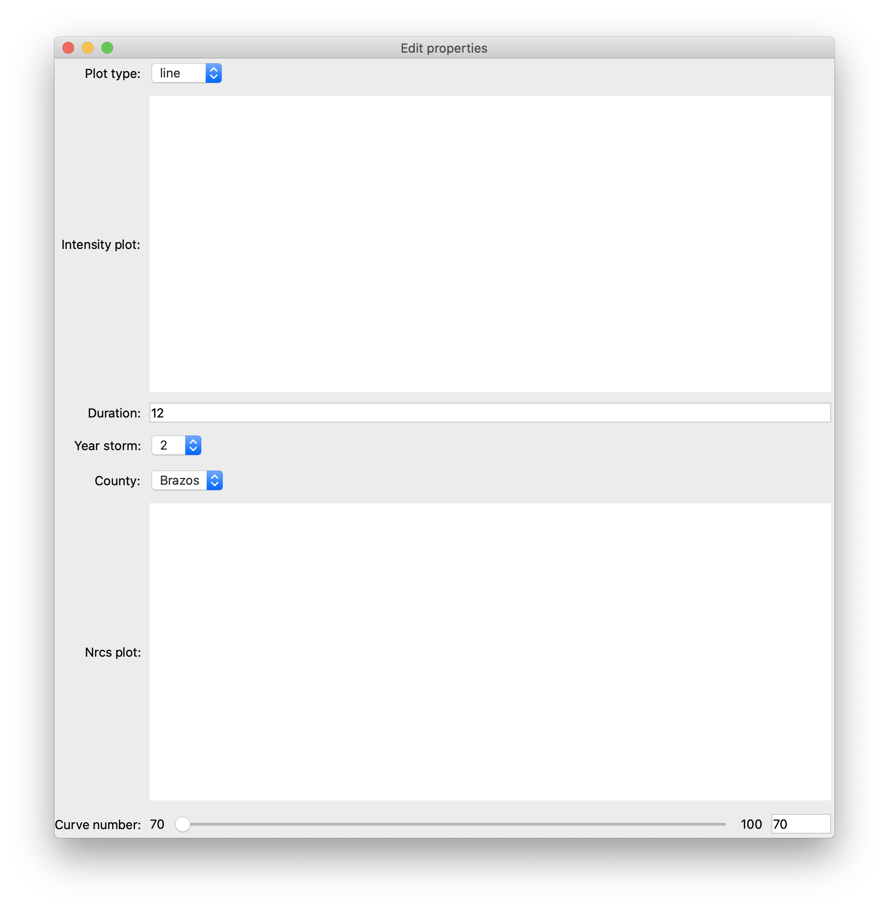

:orphan:

.. _tutorial_hyetograph:

########################################################
Creating an interactive Hyetograph with Chaco and Traits
########################################################

Overview
========

The perfect rainstorm (not to be confused with The Perfect Storm) has
a rainfall pattern that can be mathematically modelled.  The rain
starts light, progressively gets heavier until halfway though the
storm, gets lighter again, and eventually stops.  Plots of the
rainfall intensity in relation to time are called hyetographs.

This tutorial builds a small application that takes a tiny database of
coefficients, and along with user selected values, displays
hyetographs.  The user provides the duration of the storm, the year of
the storm, and one of four counties in Texas.  Then using a slider
specifying the Curve Number (determined based on the permeability of
the soil) a plot shows the intensity vs. time hyetograph plots.

Importing the necessary functions
=================================

In this example we will be using numpy, traits, traitsui, and chaco.
The following code snippet imports all the names that will be used for our
application, and defines our tiny database of coefficients.

::

    from chaco.api import ArrayPlotData, Plot
    from enable.api import ComponentEditor
    from traits.api import (
        HasTraits,
        Instance,
        Int,
        Range,
        Array,
        Enum,
        observe,
    )
    from traitsui.api import Item, View

    COUNTIES = {'Brazos': 0, 'Dallas': 3, 'El Paso': 6, 'Harris': 9}
    YEARS = {
        2: [65, 8, .806, 54, 8.3, .791, 24, 9.5, .797, 68, 7.9, .800],
        10: [80, 8.5, .763, 78, 8.7, .777, 42, 12., .795, 81, 7.7, .753],
        25: [89, 8.5, .754, 90, 8.7, .774, 60, 12., .843, 81, 7.7, .724],
        100: [96, 8., .730, 106, 8.3, .762, 65, 9.5, .825, 91, 7.9, .706]
    }

Trait Definitions
=================

This application only requires one class that will contain the Traits
and mathematical calculations together.  Classes that contain Traits
must inherit from the :class:`HasTraits` class or one of its subclasses.
Python's multiple inheritance allows for mixing HasTraits objects with other
class hierarchies if needed.

Within this class we define all the variables using Traits types
which will later be used in the UI.

::

    class Hyetograph(HasTraits):
        """ Creates a simple hyetograph demo. """

        timeline = Array()

        intensity = Array()

        nrcs = Array()

        duration = Int(12, desc='In Hours')

        year_storm = Enum(2, 10, 25, 100)

        county = Enum('Brazos', 'Dallas', 'El Paso', 'Harris')

        curve_number = Range(70, 100)

        plot_type = Enum('line', 'scatter')

        intensity_plot = Instance(Plot)

        nrcs_plot = Instance(Plot)

        ...
    
The above code snippet shows a number of Traits features,

1. Traits are explicitly typed.

2. The naming convention with traits is that types are capitalized.

3. An Array is an array, an Int is an integer, an Enum is a single
   value from a list of options, and a Range is a value between
   two numbers.

4. All traits get a default value, such as whats done in the
   Arrays, or they can be assigned an initial value as is done in
   the duration trait.

5. Descriptions can be added to traits, such as is done in
   duration.  This description is not visible except when viewing
   the trait in a TraitsUI view, and then the description is seen
   when the mouse hovers over the variable.

6. Traits are always contained within the class definition, and
   each instance of the class will have a unique copy of the traits.

The `Traits API Reference 
<http://docs.enthought.com/traits/traits_api_reference/trait_types.html>`_
contains more information about the standard Trait types; specifically, see the
:mod:`trait_types` module.

Setting up the User Interface (UI)
==================================

:class:`HasTraits` classes will automatically generate a view that contains an
editable entry for each trait within the class.  But a user-defined
view usually looks better, so we'll use View and Items to change the
default class view.  Changing the default UI is done by creating a
trait on the class that is of the View type.  Multiple View traits can
be defined and used, with the one named ``traits_view`` being used as
the default.

Continuing with our application, here is the View definition. ::

    class Hyetograph(HasTraits):

        ...

        traits_view = View(
            Item('plot_type'),
            Item("intensity_plot", editor=ComponentEditor()),
            Item(name='duration'),
            Item(name='year_storm'),
            Item(name='county'),
            Item("nrcs_plot", editor=ComponentEditor()),
            Item('curve_number'),
            resizable=True,
            width=800,
            height=800,
        )

Views generally contain Item objects and named parameters.  Views can
also contain Groups of Items as well as many other types of layout
features not covered here.  By default, Item objects take a string of
the trait to edit.  For example, the ``Item(name='county')`` will
create a pull-down menu in the UI showing the four valid counties that
the user can select from.

There are three important observations to be seen in the above view
definition. First, there are two Chaco plots embedded in the
view.  This is done by explicitly specifying the Item's editor to be a
:class:`ComponentEditor`. The top plot is the intensity versus time and the
bottom is nrcs versus time. Second, default window will be sized at 800 by 800
pixels, but the option ``resizable = True`` will allow the user to
change the size of the window.  And third, the traits are split up so
3 of them are displayed below the first plot and only 1 is displayed
below the second.  Here is a snapshot of what our application will
display.  The plots are empty because we have yet to populate the data
traits or intialize the plot traits.

Performing the Hyetograph Calculations
======================================

The UI for the application is complete, however there is no data.
Changing the traits within the GUI by moving the sliders and typing in
numbers does nothing because they're hooked up to nothing and there
are no listeners on the trait event notifications.  First, we need to actually
set up the plots by defining methods to provide their defaults.

::

    def _intensity_plot_default(self):
        intensity_plot = Plot(ArrayPlotData(x=self.timeline, y=self.intensity))
        intensity_plot.x_axis.title = "Time (hr)"
        intensity_plot.y_axis.title = "Intensity (in/hr)"
        intensity_plot.plot(
            ("x", "y"), type=self.plot_type, name=self.plot_type, color="blue"
        )
        return intensity_plot

    def _nrcs_plot_default(self):
        nrcs_plot = Plot(ArrayPlotData(x=self.timeline, y=self.nrcs))
        nrcs_plot.x_axis.title = "Time"
        nrcs_plot.y_axis.title = "Intensity"
        nrcs_plot.plot(
            ("x", "y"), type=self.plot_type, name=self.plot_type, color="blue"
        )
        return nrcs_plot

Here we have created an :class:`ArrayPlotData` instance to hold the data to be
plotted and we use that to create a :class:`Plot` instance. We configure some
properties of the plot, and finally call the :meth:`plot` method to create the
appropriate renderer for the plot. However, at this point we still have not
actually specified any values for the data. So, we'll add some hyetograph
calculations that modify the :attr:`intensity` and :attr:`nrcs` Array traits.

::

    def calculate_intensity(self):
        """ The Hyetograph calculations. """
        # Assigning A, B, and C values based on year, storm, and county
        year = YEARS[self.year_storm]
        value = COUNTIES[self.county]
        a, b, c = year[value], year[value+1], year[value+2]

        self.timeline = [i for i in range(2, self.duration + 1, 2)]
        intensity = a / (self.timeline * 60 + b)**c
        cumulative_depth = intensity * self.timeline

        temp = cumulative_depth[0]
        result = []
        for i in cumulative_depth[1:]:
            result.append(i-temp)
            temp = i
        result.insert(0, cumulative_depth[0])

        # Alternating block method implementation.
        result.reverse()
        switch = True
        o, e = [], []
        for i in result:
            if switch:
                o.append(i)
            else:
                e.append(i)
            switch = not switch
        e.reverse()
        result = o + e
        self.intensity = result

    def calculate_runoff(self):
        """ NRCS method to get run-off based on permeability of ground. """
        s = (1000 / self.curve_number) - 10
        a = self.intensity - (.2 * s)
        vr = a**2 / (self.intensity + (.8 * s))
        # There's no such thing as negative run-off.
        for i in range(0, len(a)):
            if a[i] <= 0:
                vr[i] = 0
        self.nrcs = vr

In the calculation functions, the traits are treated just like normal
attributes.  Behind the scenes, Traits will automatically cast
compatible types such as ints to Floats, but will raise an exception
if, for example, the user tries to pass a string to a Dict trait.

Recalculating when event notification occurs
============================================

Calling the calculation functions will update the data, but nothing is
going to change in the GUI.  The next step is to link the data to the
GUI using a Traits static handler.  Static handlers are declared
either with a decorator or through a function name that follows a
specific convention.  Alternatively, a dynamic handler is set up by
calling a function at runtime, providing for on-the-fly event
processing.  Below is a function that calls the two calculation
functions.  The interesting line is the decorator,
``@observe`` that tells Traits to call the function whenever
any of the values within the list of traits change. ::

    @observe('duration, year_storm, county, curve_number')
    def _perform_calculations(self, event=None):
        self.calculate_intensity()
        self.calculate_runoff()
        self.intensity_plot.data.set_data("y", self.intensity)
        self.nrcs_plot.data.set_data("y", self.nrcs)

So now when the application is run, when any of the four listed traits change,
the calculation functions are automatically called and the data changes. Then
the 2 plots will be updated to use this new data. These traits will
automatically change when the user adjusts the widgets in the UI.  So when the
user changes the :attr:`duration` in the UI from 12 hours to 24 hours this will
automatically effect both of the plots since the listeners force a
recalculation of both of the functions.

Furthermore, we also want the user to be able to select a :attr:`plot_type`
and have the plots update accordingly.  To do so, we need to define a seperate
method to make this adjustment that listens to the :attr:`plot_type` trait.
The code for this is as follows:

::

    @observe("plot_type")
    def _update_polt_type(self, event):
        old_plot_type, new_plot_type = event.old, event.new

        self.intensity_plot.delplot(old_plot_type)
        self.nrcs_plot.delplot(old_plot_type)
        self.intensity_plot.plot(
            ("x", "y"), type=new_plot_type, name=new_plot_type, color="blue"
        )
        self.nrcs_plot.plot(
            ("x", "y"), type=new_plot_type, name=new_plot_type, color="blue"
        )
        self.intensity_plot.invalidate_and_redraw()
        self.nrcs_plot.invalidate_and_redraw()

Previously when creating plot renderers for our plots, we assigned their names
to simply match the :attr:`plot_type` trait.  This way we can easily
delete the old plot and then create a new on of the correct type. Finally, we
call :meth:`invalidate_and_redraw` on the plots to ensur the UI gets refreshed. 

Showing the Display
===================

In order to start the GUI application an instance of the class must be
instantiated, and then a :meth:`configure_traits` call is done.  However we
must first call the data calculation functions from within the class
to initialize the data arrays.  Here's the last piece of the program. ::

        def start(self):
            self._perform_calculations()
            self.configure_traits()
            
    
    if __name__ == "__main__":
        hyetograph = Hyetograph()
        hyetograph.start()

:meth:`start` performs the calculations needed for the Arrays used to plot,
and then triggers the UI.  The application is complete, and if you now
run the program, you should get a running application that resembles
the following image,

.. image:: images/tutorial_hyetograph_final.png

Congratulations!

Source Code
===========

The final version of the program,
`hyetograph.py <https://github.com/enthought/chaco/blob/master/examples/demo/hyetograph.py>`_. 

.. literalinclude:: /../../chaco/examples/demo/hyetograph.py
   :language: python
