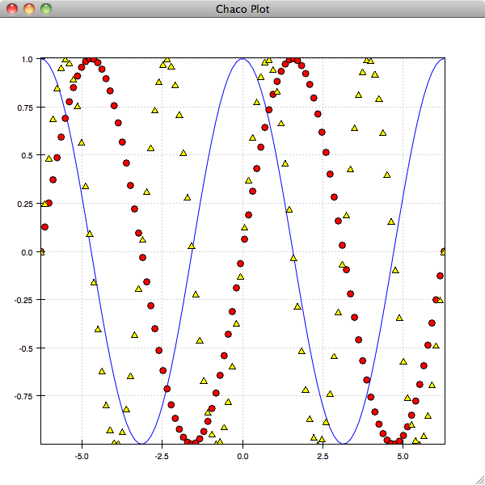

.. _tutorial_ipython:

############################
Exploring Chaco with IPython
############################

Chaco has an interactive plotting mode similar to, but currently more limited
than matplotlib's.  This plotting mode is also available as an Envisage plugin,
and so can be made available within end-user applications that feature an
Envisage-based Python prompt.

Basic Usage
===========

To get started, you need to run iPython with the ``-wthread`` option enabled,
so that the iPython and wx event loops interact correctly::

    ipython -wthread

You could instead start in ``-pylab`` mode if you prefer, which has the advantage of
pre-loading numpy and some other useful libraries.
Once you have the iPython prompt, you can accesss the Chaco shell mode commands
via::

    In [1]: from enthought.chaco.shell import *

We'll start by creating some data that we want to plot::

    In [2]: from numpy import *
    In [3]: x = linspace(-2*pi,2*pi, 100)
    In [4]: y = sin(x)
    In [5]: plot(x, y)

.. image:: images/ipython_basic.png

If you experiment with the plot, you'll see that it has the standard
Chaco pan and zoom tools enabled.  As with Matplotlib, you can specify
options for the display of the plot as additional arguments and keyword
arguments to the plot command.  The most important of these is is the
format string argument, which resembles the Matplotlib format strings::

    In [6]: plot(x, y, 'g:')

This creates a green, dotted line plot of the data.  You could instead
create a red scatter plot of the data with circles for markers using::

    In [7]: plot(x, y, 'ro')

You'll notice that each of these plot commands replaces the current plot
with the new plot.  If you want to overlay the plots, you need to instruct
Chaco to ``hold()`` the plots::

    In [8]: hold()
    In [9]: plot(x, cos(x), 'b-')
    In [10]: plot(x, sin(2*x), 'y^')

Calling ``hold()`` again will toggle back to the previous
behaviour::

    In [11]: hold()

You can also plot multiple curves with one plot command.  The following
single plot call is equivalent to the above three::

    In [12]: plot(x, y, 'ro', x, cos(x), 'b-', x, sin(2*x), 'y^')

Types of Plots
==============

The Chaco shell interface supports a subset of the standard Chaco plots.
You can do line, scatter, image, pseudocolor, and contour plots.

To illustrate some of these different plot types, let's create a couple
of 2D gaussians and plot them::

    In [13]: x1 = random.normal(-0.5, 1., 100)
    In [14]: y1 = random.normal(-1.25, 0.5, 100)
    In [15]: x2 = random.normal(0 ,0.25, 50)
    In [16]: y2 = random.normal(0, 0.5, 50)
    In [17]: plot(x1, y1, 'ro', x2, y2, 'go')
    
We'll now create a kernel density estimator for the combined data set,
and plot that::
    
    In [18]: x = concatenate((x1, x2))
    In [19]: y = concatenate((y1, y2))
    In [20]: dataset = array([x, y])
    In [21]: import scipy.stats
    In [22]: kde = scipy.stats.gaussian_kde(dataset)

Now that we have the distribution, we sample it at a bunch of points on a grid::

    In [23]: xs = linspace(-4, 4, 100)
    In [24]: ys = linspace(-4, 4, 100)
    In [25]: xpoints, ypoints = meshgrid(xs, ys)
    In [26]: points = array([xpoints.flatten(), ypoints.flatten()])
    In [27]: z = kde(points)
    In [28]: z.shape = (100, 100)

Finally, we can plot the contours.  For grid-based plots like contours and images,
we need to supply the x- and y-coordinates of the edges of the pixels, rather than
the centers::

    In [29]: xedges = linspace(-4.06125, 4.06125, 101)
    In [30]: yedges = linspace(-4.06125, 4.06125, 101)
    In [31]: hold()
    In [32]: contour(xedges, yedges, z)

.. image:: images/ipython_kde.png

    
